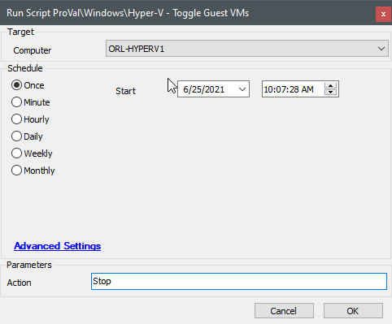
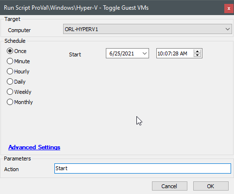

## Summary

This script allows for the shutdown or startup of VMs on the target Hyper-V host based on previous runs of the script.

**Time Saved by Automation:** 5 Minutes

## Sample Run

## Dependencies

[Toggle-VMGuests](/docs/63bb684c-e259-46a2-8630-95847705fe6a)

## Variables

#### User Parameters

| Name    | Example | Required | Description                                                                                     |
|---------|---------|----------|-------------------------------------------------------------------------------------------------|
| Action  | Start   | True     | This parameter determines if the VMs will be started or stopped. Can only be set to "Start" or "Stop". |

## Process

Please see [Toggle-VMGuests](/docs/63bb684c-e259-46a2-8630-95847705fe6a) for information on how this script processes the VMs.

## Output

- Outputs logs to the script log.
- Outputs logs to log/data files in the script directory.

