## Summary

This script is an Automate implementation of the [Add-WifiProfile](/docs/6e1f420f-5a5a-49e1-a7cc-943e258d2ae5) and [Remove-WifiProfile](/docs/d9f38912-7b4a-4da1-a880-210aae4fbb02) agnostic scripts.

The script can both remove and add Wi-Fi profiles on the targeted machines. To initiate removal, the names of the desired Wi-Fi profiles should be supplied to the script parameter named `Profiles_To_Remove`. Conversely, for adding profiles, the respective profile names should be provided to the `Profiles_To_Add` parameter.

It is important to note that the addition of profiles can also be managed through the Client/Location level EDFs, as further elucidated in this document.

**Note:** Run the [Get Wifi Profile](/docs/d97282c0-4d81-46f9-b821-d553c2d8a596) script with the `Set_Environment` set to `1` to create the system properties and EDFs used by this script.

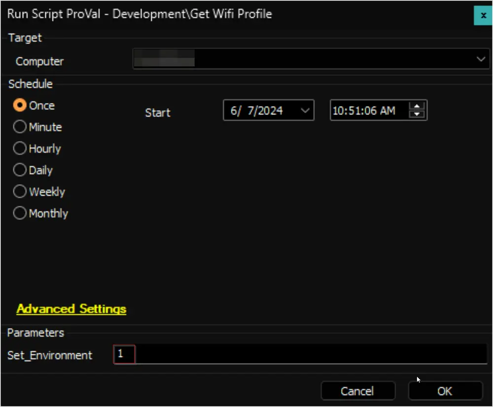

## Sample Run

- The Wi-Fi Profile/SSID to remove from the computer should be provided within the `Profiles_To_Remove` parameter. Each SSID should be enclosed in double quotes and separated by a comma. If there is a comma (,) in the SSID, it should be replaced by a double semi-colon (;;).
  - Example 1: To remove a single Wifi Profile  
    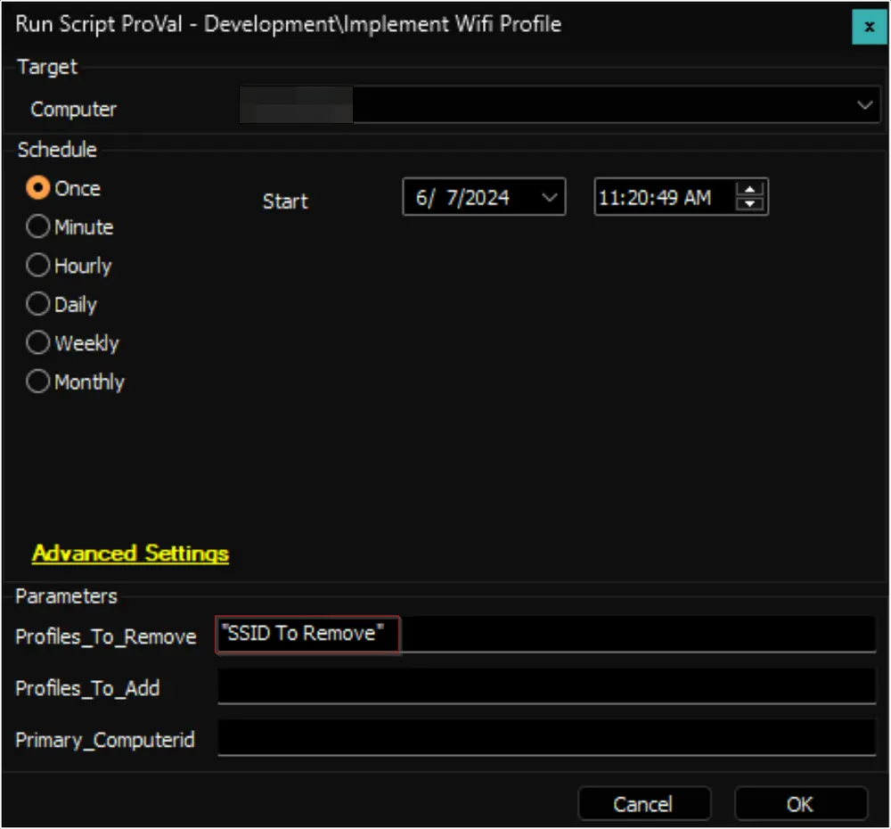
  - Example 2: To remove multiple Wi-Fi Profiles  
    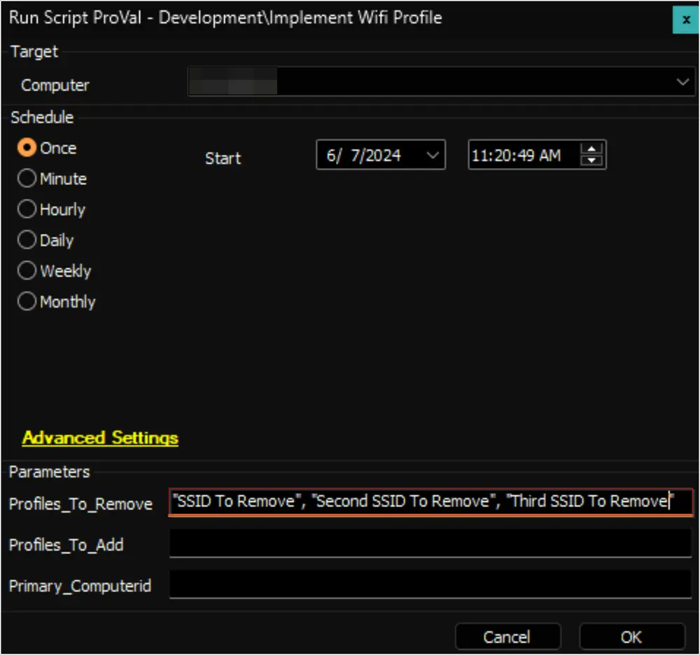
  - Example 3: If there is a comma in the Wi-Fi Profile Name, e.g., `SSID with a , Comma` or `SSID , with multiple , Commas`  
    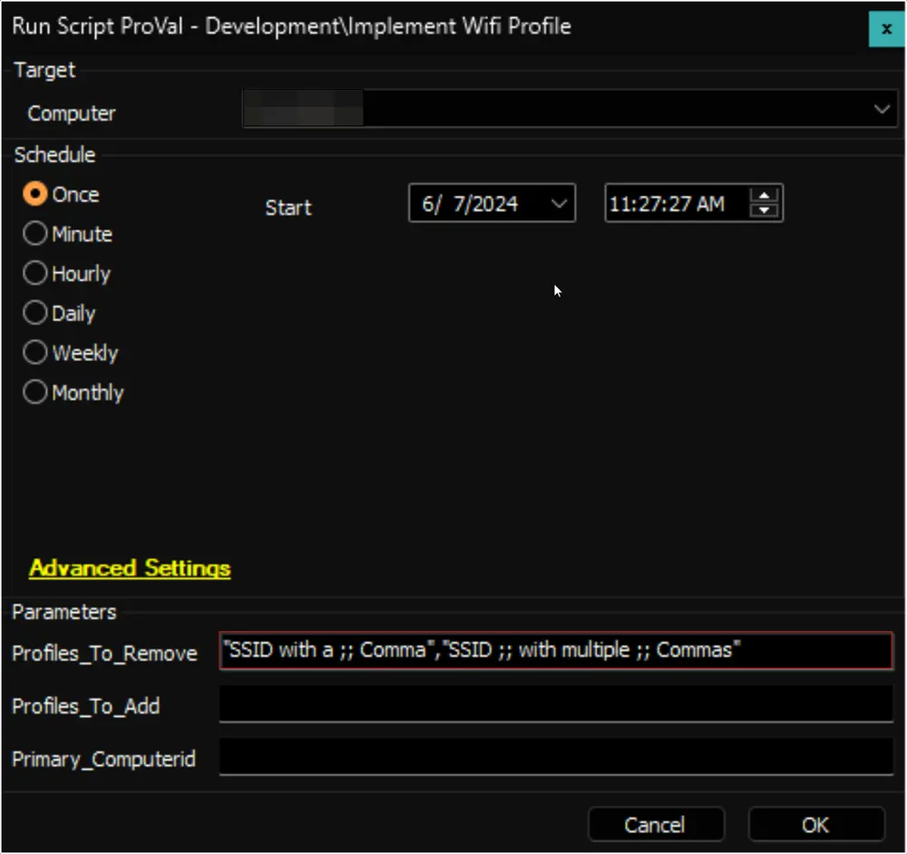

- The Wi-Fi Profile/SSID to be added from the computer should be provided within the `Profiles_To_Add` parameter. Each SSID should be enclosed in single quotes and separated by commas. Additionally, along with the names of the profiles, the `Primary_Computerid` parameter should be set to specify the computer ID from which the profile information is to be copied. While adding an SSID with a single quotation in the name itself, a backslash should be added before the quotation. The complete name should always be enclosed between the single quotations.  
  For example:  
  To add `Bob's Wifi`, it should be passed as `'Bob//\'s Wifi'`.  
  To add `Bob's Wifi`, `HR's Wifi`, and `Wifi Network X`, it should be passed as `'Bob//\'s Wifi', 'HR's Wifi', 'Wifi Network X'`.  
  - Example 1: To add a single Wifi Profile  
    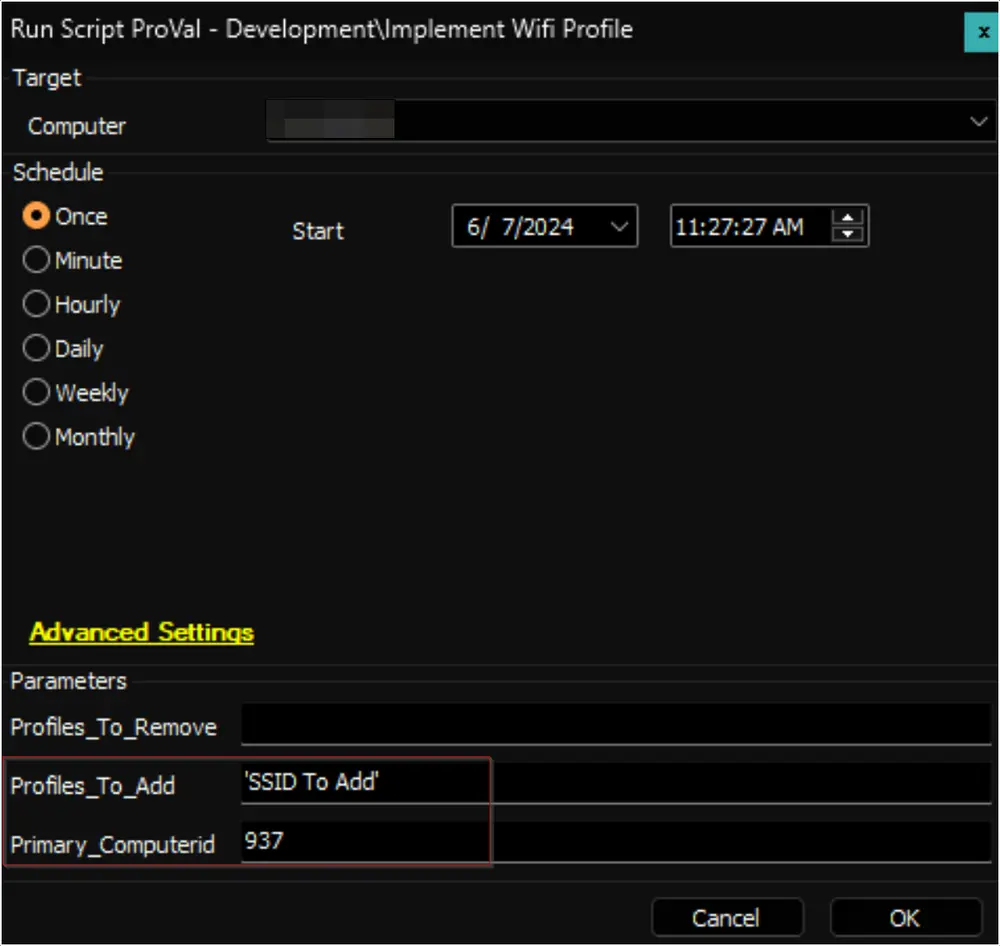
  - Example 2: To add multiple Wifi Profiles  
    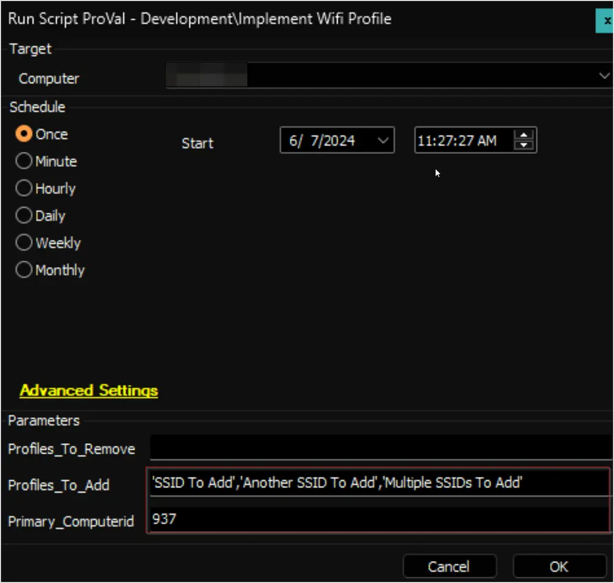

## Dependencies

- [Script - Get Wifi Profile](/docs/d97282c0-4d81-46f9-b821-d553c2d8a596)
- [Solution - Implement Wifi Profile](/docs/1b38dbb7-848f-4605-b8c9-80e7ebf069d3)

## Variables

| Name                | Description                                                                                          |
|---------------------|------------------------------------------------------------------------------------------------------|
| ProjectName         | Add-WifiProfile, Remove-WifiProfile                                                                  |
| WorkingDirectory     | C:/ProgramData/_Automation/Script/Add-WifiProfile, C:/ProgramData/_Automation/Script/Remove-WifiProfile |
| PS1Log              | C:/ProgramData/_Automation/Script/Add-WifiProfile/Add-WifiProfile-log.txt, C:/ProgramData/_Automation/Script/Remove-WifiProfile/Remove-WifiProfile-log.txt |
| PS1ErrorLog         | C:/ProgramData/_Automation/Script/Add-WifiProfile/Add-WifiProfile-error.txt, C:/ProgramData/_Automation/Script/Remove-WifiProfile/Remove-WifiProfile-error.txt |

### User Parameters

| Name                | Example                            | Required | Description                                                                                                                                                                                                                                               |
|---------------------|------------------------------------|----------|-----------------------------------------------------------------------------------------------------------------------------------------------------------------------------------------------------------------------------------------------------------|
| Profiles_To_Remove   | "SSID To Remove", "Suspicious Network" | False    | SSID(s) of the unwanted/malicious Wi-Fi Profile(s) to remove from the end machine. Check the `Sample Run` section of the article for further details. If left blank, the script will just audit the Wi-Fi Profiles.                                       |
| Profiles_To_Add      | 'SSID To Add', 'Another'           | False    | SSID(s) of the Wi-Fi Profile(s) to add to the end machine. Check the **Sample Run** section of the article for further details. If left blank, the script will fallback to the location-level EDF `Wifi Profiles To Add` and then to the client-level EDF `Wifi Profiles To Add`. |
| Primary_Computerid   | 294                                | True (if `Profiles_To_Add` parameter is used) | ID of the computer to fetch the information of the profiles to add.                                                                                                                                                                                |

### System Properties

| Name                | Example                                          | Required | Description                                                                                                                                                                                                                                               |
|---------------------|--------------------------------------------------|----------|-----------------------------------------------------------------------------------------------------------------------------------------------------------------------------------------------------------------------------------------------------------|
| Safe_Wifi_Networks   | "Safe Network", "Another Safe Network", "Safe Network With a ;; Comma" | False    | Stores the list of globally whitelisted/safe Wi-Fi profiles. The script will not accidentally remove the profile(s) if they are mentioned here. Each Name/SSID should be enclosed in double quotes and separated by a comma. If there is a comma (,) in the Wi-Fi Profile Name, it should be replaced by double semi-colon (;;). e.g., the way `"Safe Network with a , comma"` is saved in the screenshot. |

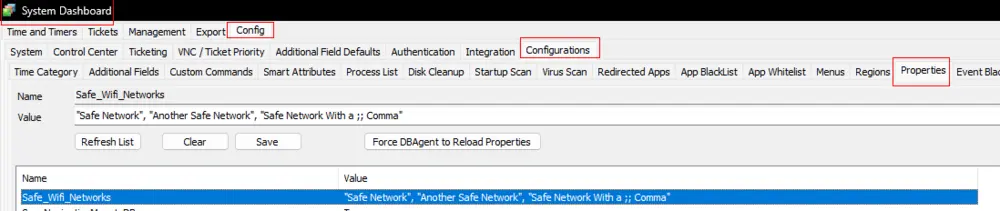

## Client-Level EDFs

| Name                | Example                                          | Required | Description                                                                                                                                                                                                                                               |
|---------------------|--------------------------------------------------|----------|-----------------------------------------------------------------------------------------------------------------------------------------------------------------------------------------------------------------------------------------------------------|
| Safe Wifi Networks   | "Client Level Safe Network", "Trusted Network", "Safest", "SSID with a ;; Comma" | False    | In addition to defining globally safe/whitelisted Wi-Fi profiles/networks, this EDF provides an option to define additional client-level safe/whitelisted Wi-Fi profiles as well. The profiles/SSIDs stored here will not be removed from the machine, even if someone passes that name to the `Profiles_To_Remove` parameter. The syntax for storing the Name(s) in the EDF is the same as the system property. Each Name should be enclosed in double quotes and separated by a comma. If there is a comma (,) in the Wi-Fi Profile Name, it should be replaced by double semi-colon (;;). e.g., the way `"SSID with a , comma"` is saved like this `"SSID with a ;; comma"` |
| Primary ComputerID   | Computer Name (Computerid)                       | True (if Client-level EDF `Wifi Profiles To Add` is set) | To store the name and ID of the computer to fetch the information of the Wi-Fi profiles to add to the end machines of the client. It's a dropdown field with the `Name (Computerid)` of the computers of the client. 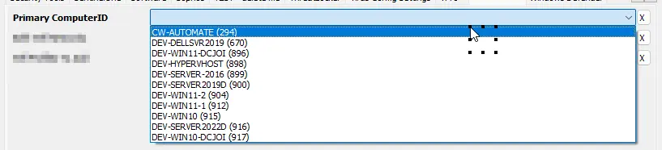 |
| Wifi Profiles To Add  | 'SSID1', 'SSID2', 'SSID3'                       | False    | SSID or Name of the Wi-Fi Profile(s) to add to the end machines of the client. These Wi-Fi Profiles should be available on the computer selected in the `Primary ComputerID` EDF. Each SSID should be enclosed in single quotes and separated by commas. While adding an SSID with a single quotation in the name itself, a backslash should be added before the quotation. The complete name should always be enclosed between the single quotations. For example: To add `Bob's Wifi` in the EDF, it should be set as `'Bob//\'s Wifi'`. To add `Bob's Wifi`, `HR's Wifi`, and `Wifi Network X` in the EDF, it should be set as `'Bob//\'s Wifi', 'HR's Wifi', 'Wifi Network X'`. 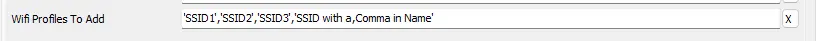 |

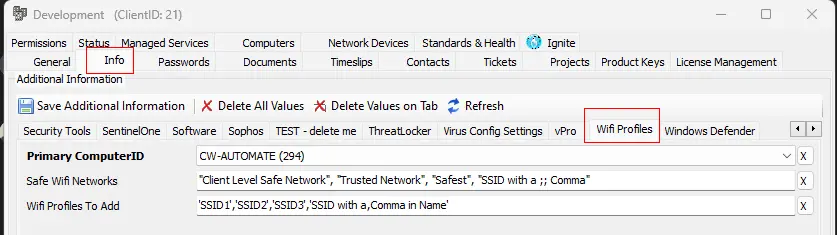

### Location-Level EDFs

| Name                | Example                                          | Required | Description                                                                                                                                                                                                                                               |
|---------------------|--------------------------------------------------|----------|-----------------------------------------------------------------------------------------------------------------------------------------------------------------------------------------------------------------------------------------------------------|
| Primary ComputerID   | Computer Name (Computerid)                       | True (if Location-level EDF `Wifi Profiles To Add` is set) | To override the information stored in the client-level EDF `Primary ComputerID`. 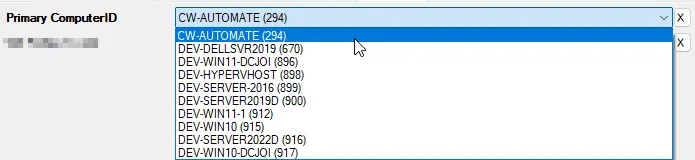                                                                                                                      |
| Wifi Profiles To Add  | 'SSID1', 'SSID2', 'SSID3'                       | False    | To override the information stored in the client-level EDF `Wifi Profiles To Add`. 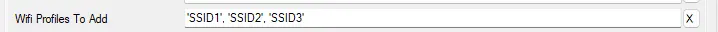                                                                                                                  |

Location-Level EDFs can be used to override the Client-Level EDFs. The syntax used to store data in the location-level EDF `Wifi Profiles To Add` is the same as that of the client-level EDF `Wifi Profiles To Add`.

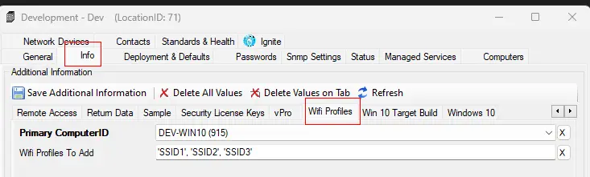

## Computer-Level EDFs

| Name                | Example                                          | Required | Description                                                                                                                                                                                                                                               |
|---------------------|--------------------------------------------------|----------|-----------------------------------------------------------------------------------------------------------------------------------------------------------------------------------------------------------------------------------------------------------|
| Exclude From Wifi Profile Addition | Check Box                                   | False    | This EDF has no effect on the script but can be used to exclude the computer from the [CWM - Automate - Internal Monitor - Add - Wifi Profiles](/docs/51eaeefd-b300-4f9a-be28-fa01e6e83b5e) monitor set detections.                              |

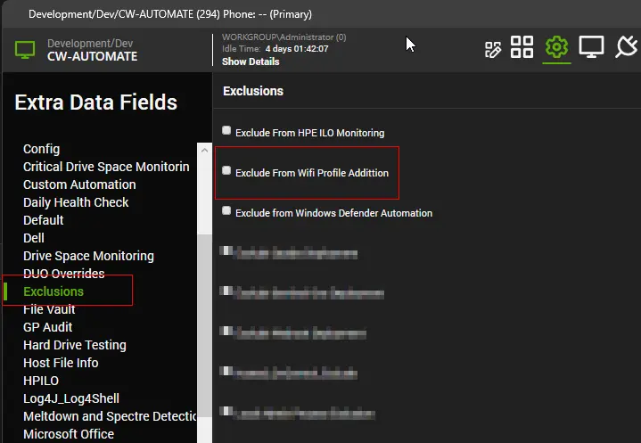

## Output

- Script Log
- Dataview