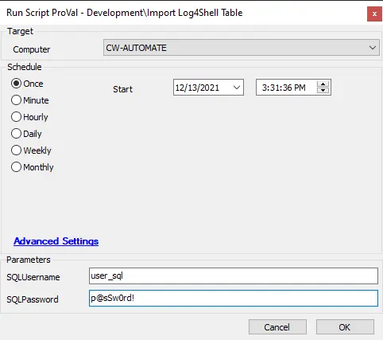

## Summary

This document installs and populates a table in MySQL with a list of potential Log4Shell affected software. On-prem partners must enter a MySQL username and password. Hosted partners will need to set the Hosted parameter to 1. Hosted partners may not have the most up-to-date data compared to on-prem.

## Sample Run

## Dependencies

- [SEC - Endpoint Protection - Agnostic - Import-Log4JTable](/docs/a9db2857-d76e-4c63-8916-80ed141dc5b5)
- Must be run on the Automate database server.
- PowerShell v5
- `mysql.exe` located in any subdirectory of `$env:ProgramFiles/MySQL`

#### User Parameters

| Name         | Example    | Required | Description                                                                                               |
|--------------|------------|----------|-----------------------------------------------------------------------------------------------------------|
| SQLUsername   | user_sql   | True     | The username of a SQL user with access to CREATE TABLE and INSERT on the labtech database. Not needed when hosted. |
| SQLPassword   | P@ssw0Rd   | True     | The password of a SQL user with access to CREATE TABLE and INSERT on the labtech database. Not needed when hosted. |
| Hosted        | 1          | False    | Use for hosted partners only. Set to 1 and run against any machine to import a hard-coded version of the table. This will not be frequently updated. |

## Process

See [SEC - Endpoint Protection - Agnostic - Import-Log4JTable](/docs/a9db2857-d76e-4c63-8916-80ed141dc5b5) for process information.

## Output

- Script log
- Local file on computer
- Dataview
- Custom Table
