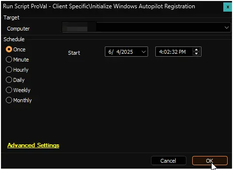

## Summary

Automates Windows Autopilot registration by deploying and executing the Get-WindowsAutopilotInfo script with Azure AD application credentials.  
The script collects device information and uploads it to Microsoft Intune (Autopilot service).  
It installs the latest Get-WindowsAutopilotInfo PowerShell module from the PowerShell Gallery and runs it using the specified Azure AD credentials (AppId, TenantId, AppSecret) for authentication.

## References

- [Tutorial: Register an app with Microsoft Entra ID](https://learn.microsoft.com/en-us/power-apps/developer/data-platform/walkthrough-register-app-azure-active-directory)
- [Register devices with Windows Autopilot](https://learn.microsoft.com/en-us/autopilot/add-devices#directly-upload-the-hardware-hash-to-an-mdm-service)
- [Get-WindowsAutoPilotInfo](https://www.powershellgallery.com/packages/Get-WindowsAutopilotInfo)

## Requirements

- PowerShell v5+
- Microsoft Entra App Id `(Application (client) ID)`, Tenant Id `(Directory (tenant) ID)`, and App Secret `(Client Secret ID Value)` with the following permissions assigned:  
  - DeviceManagementServiceConfig.ReadWrite.All  
  - DeviceManagementManagedDevices.ReadWrite.All  
  - Device.ReadWrite.All  
  - Group.ReadWrite.All  
  - GroupMember.ReadWrite.All

## File Hash

**File Path:** `C:\ProgramData\_automation\Script\Initialize-WindowsAutopilotRegistration\Initialize-WindowsAutopilotRegistration.ps1`  
**File Hash (Sha256):** `96A578FE452AB96F9E132FDDFBB492421D8EC7583B5AB12281A7C7F50C508F13`  
**File Hash (MD5):** `D0BA87292EE63DE91C97631B5E798739`  

## Sample Run

## Client-Level EDFs

| Name                    | Required | Type | Section           | Masked | Encrypted | Description                                                                                   |
|-------------------------|----------|------|-------------------|--------|-----------|-----------------------------------------------------------------------------------------------|
| `Application [client] ID`   | True     | Text | Intune Enrollment | True   | True      | The Application (client) ID of the Azure AD app used for authentication.                      |
| `Client Secret ID Value`    | True     | Text | Intune Enrollment | True   | True      | The client secret value generated for the Azure AD app, used for secure authentication.        |
| `Directory [tenant] ID`     | True     | Text | Intune Enrollment | True   | True      | The Directory (tenant) ID of the Azure AD tenant where the app is registered.                 |

## Output

- Script Logs
