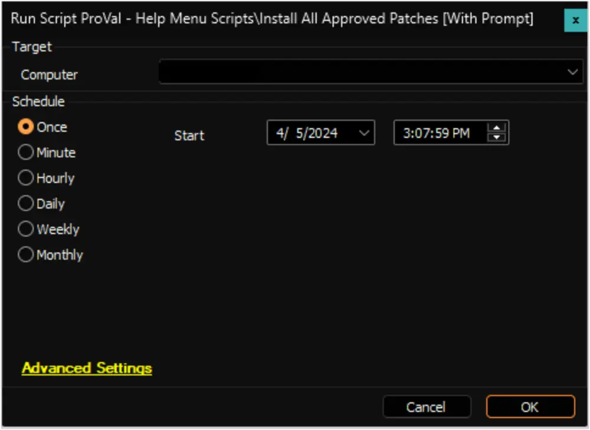
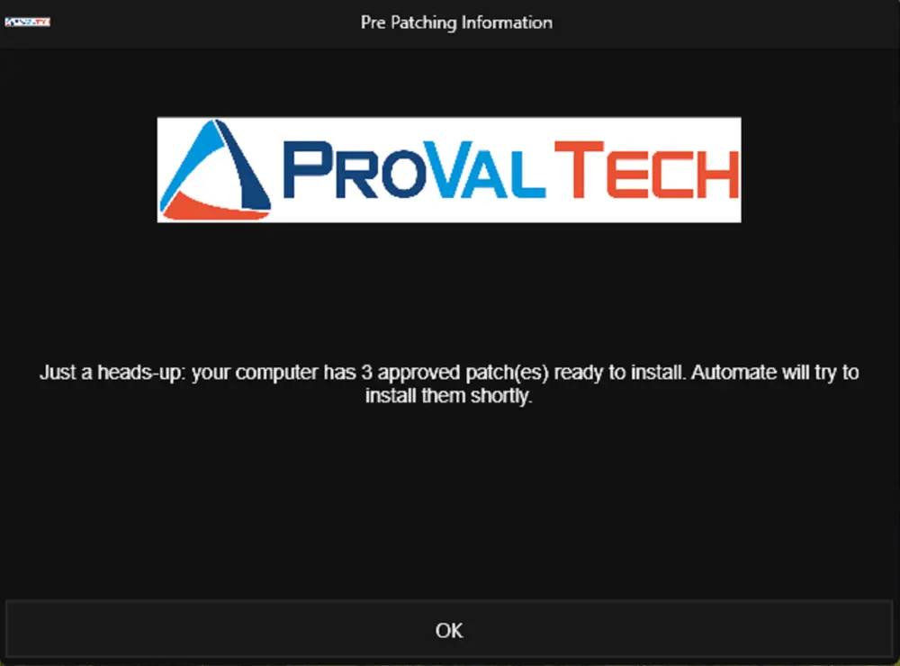
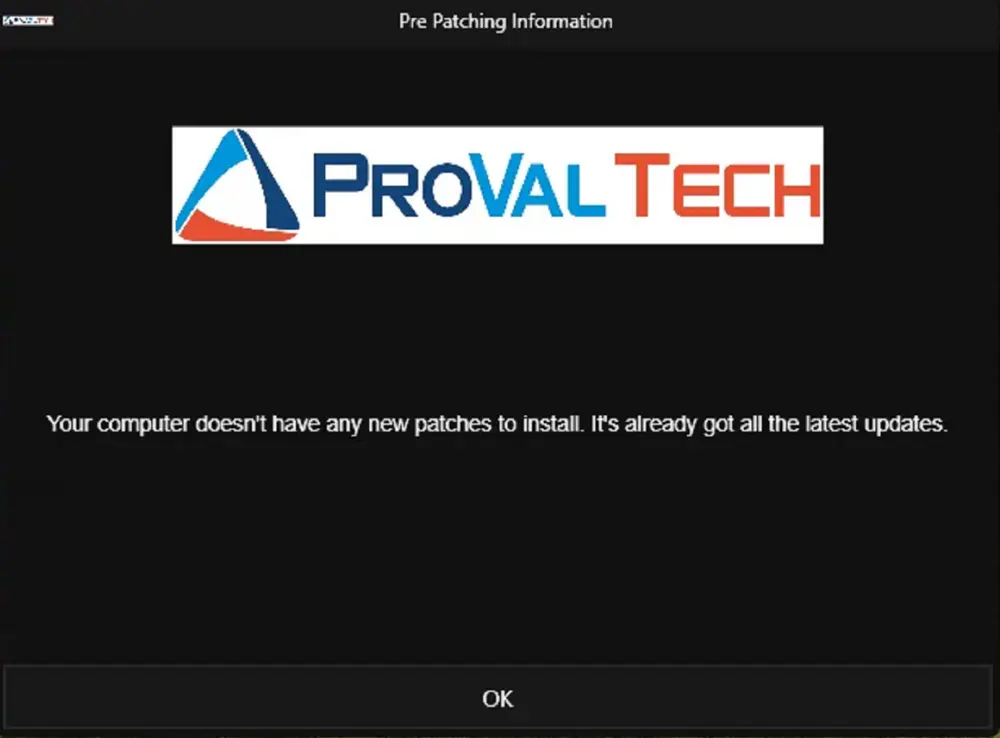
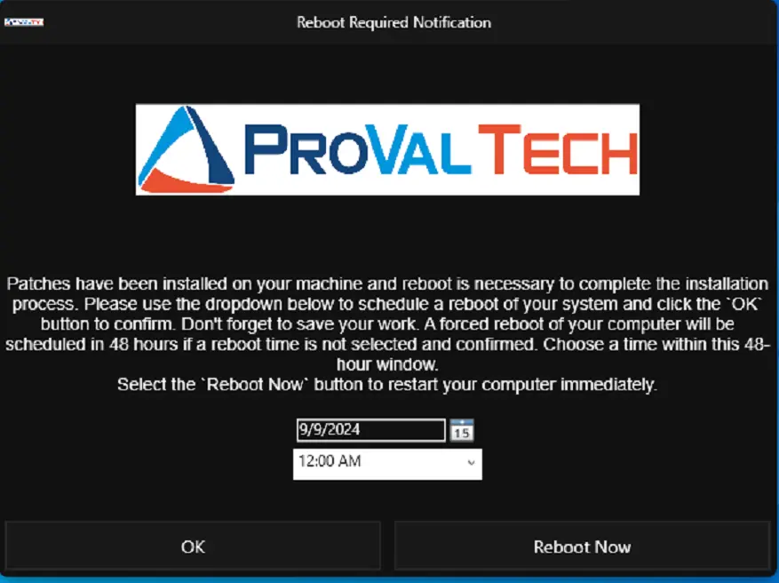
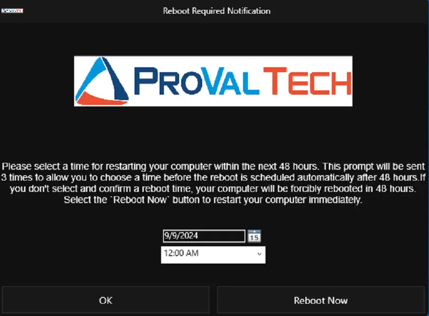
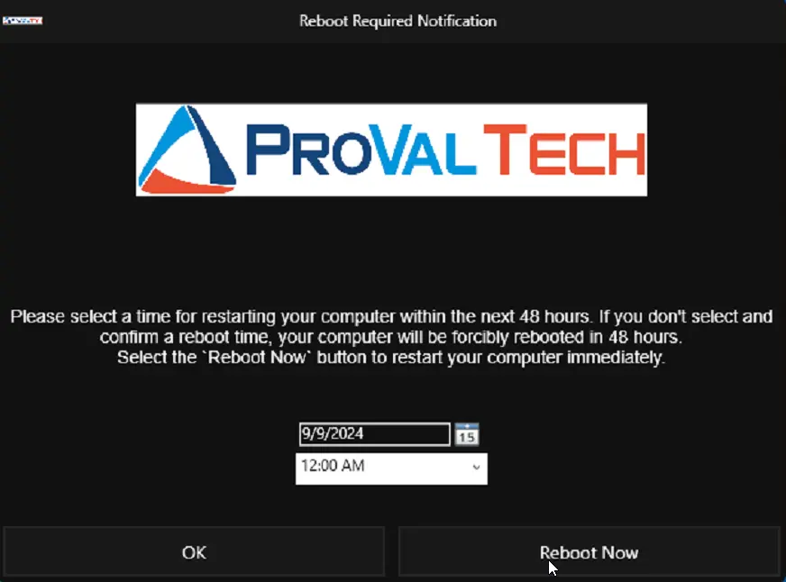
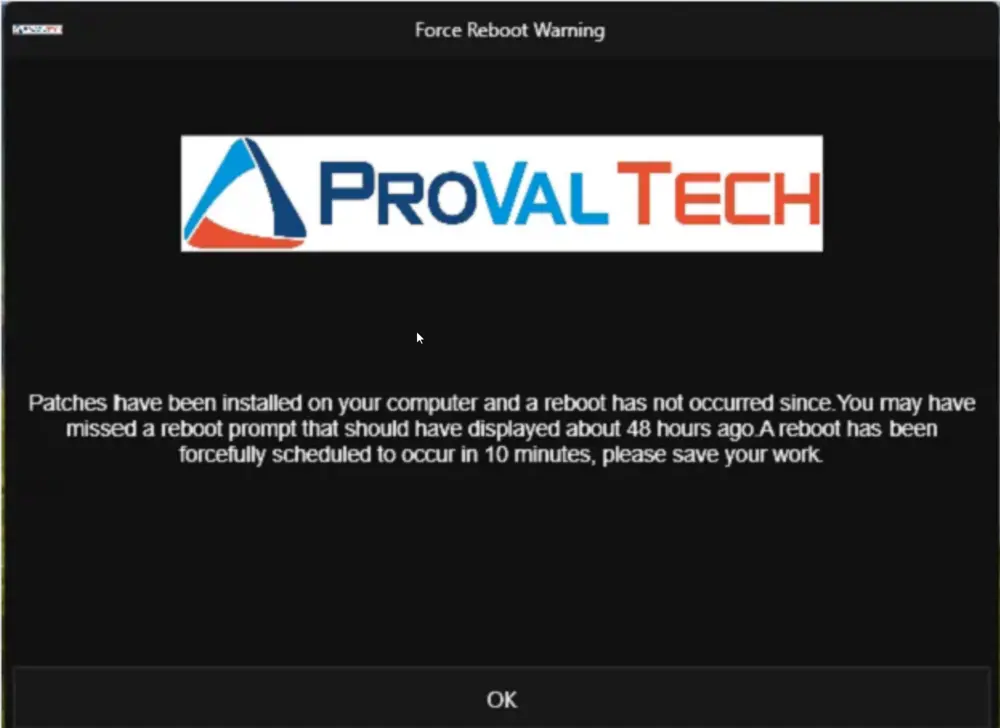
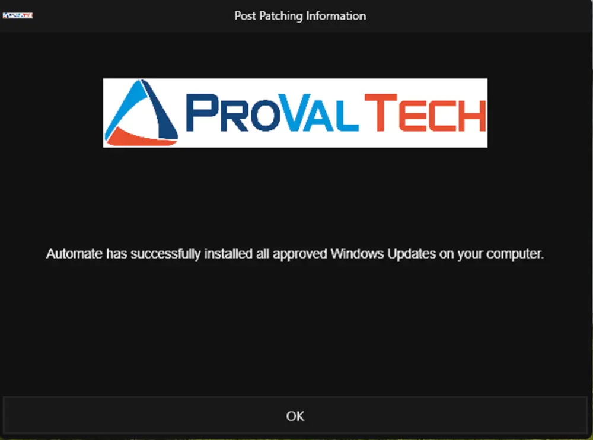
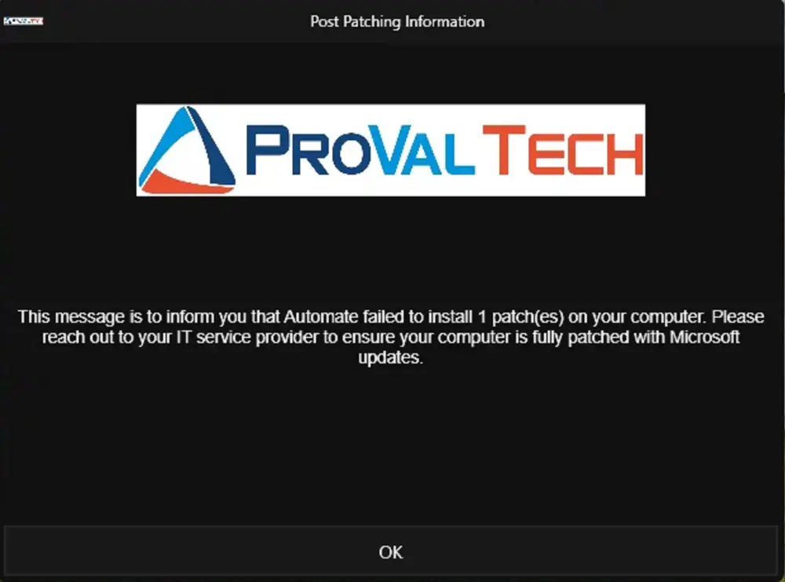
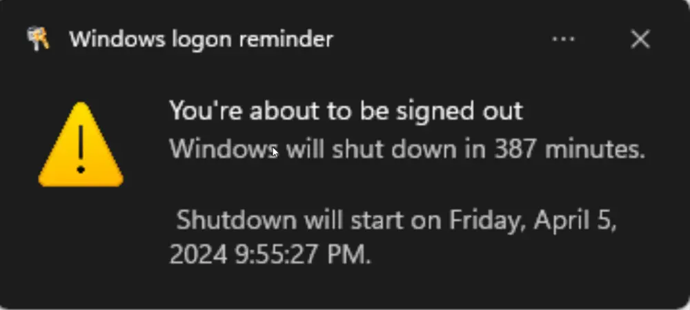

## Summary

This script is designed to handle the installation of all pending approved patches on the machine. If the user is not logged in, it will proceed to reboot the machine. However, if the user is logged in, it will provide a popup message with options to select a specific time for rebooting, ranging from within the next 48 hours. 

If the user chooses a time beyond the 48-hour window, the prompt will repeat up to three times, encouraging the user to select a time within the next 48 hours. If no time is selected after four attempts, the script will schedule the restart after 48 hours. 

Additionally, the script will display the number of available patches before installing them and inform the user of any patches that failed to install via a popup message. Furthermore, if the script schedules a restart after 48 hours due to user inactivity or failure to select a time, it will send another popup message before forcibly restarting the computer. 

While the script can be executed from Automate, it is recommended to utilize it from the [Tray Menu](https://docs.connectwise.com/ConnectWise_Automate_Documentation/060/020/010#:~:text=setting%20this%20value.-,Tray%20Menus,-The%C2%A0Tray%20Menus) within an agent template for a better user experience.

**Note:**  
- The logo displayed in the sample prompts is for exemplary purposes only. The prompter will fetch and display the logo from the concerned Automate environment.
- The machine will be restarted immediately if the user selects the `Reboot Now` button for a `Post Patch Reboot Confirmation` prompt.

## Sample Run

## Dependencies

[CWM - Automate - Script - Prompter](/docs/d8a124df-ea81-4194-82fc-a082c7a036d8)

## Prompts

#### Pre-Patch Installation Prompt

**CASE 1:** If the approved production patches are available on the computer to install  

**CASE 2:** If there are no patches available to install. The script will exit if there are no approved production patches missing on the computer.  

#### Post Patch Reboot Confirmation

**First Prompt:**  

**Second Prompt:** This prompt will only be sent if the user fails to select a convenient time in the first prompt between the next 48 hours to restart the computer.  

**Final Prompt:** The script will be scheduled to restart the computer after 48 hours if the user fails to select a convenient time between the next 48 hours to restart their computer.  

#### Pre Reboot Prompt

This prompt will be sent solely if an automatic restart is scheduled after 48 hours.  

## Post Reboot Prompt

**CASE 1:** If the patch job was successful and there are no approved production patches left to install.  

**CASE 2:** If Automate fails to install any patch(es).  

#### Windows Reboot Schedule Notification

A pop-up message will appear at the bottom right corner of the screen to remind the end user of the scheduled reboot.  

## Output

- Script Log
- Prompt on End Machine
