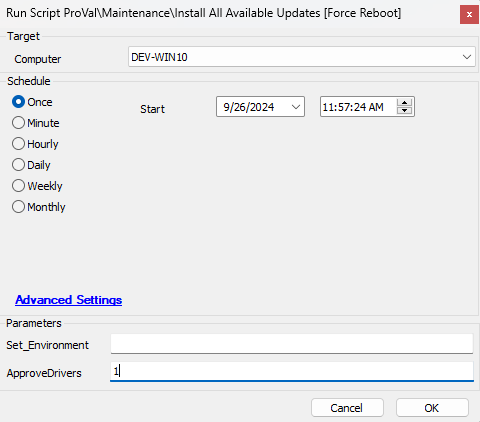
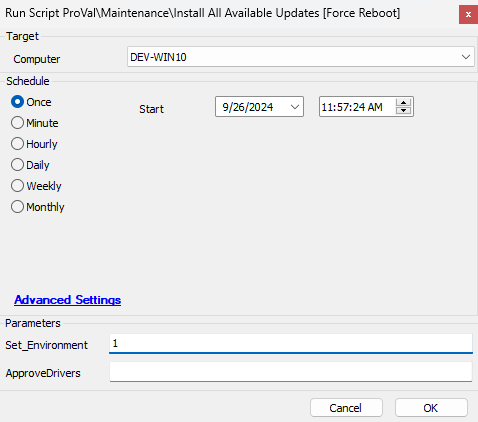
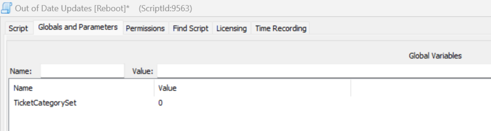
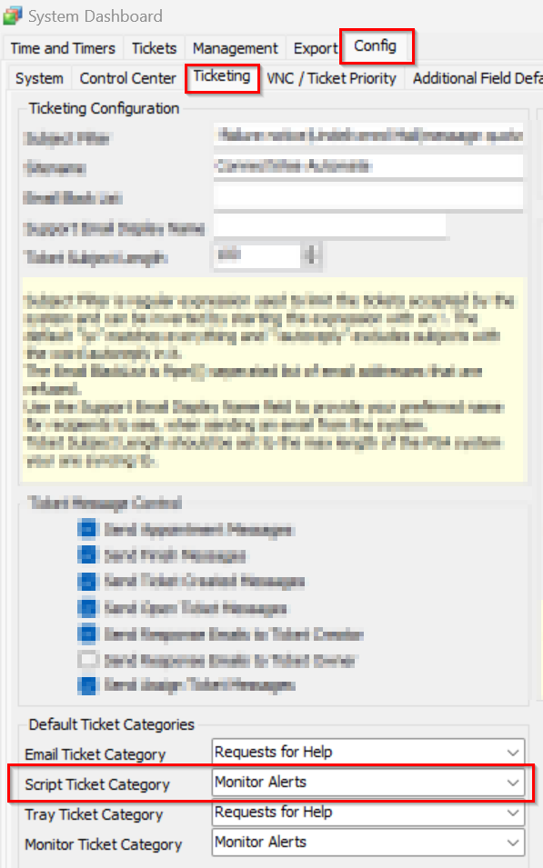

## Summary

This script checks for Windows updates using PowerShell and installs all available updates, including drivers, if the user parameter is set to 1. It will forcibly reboot the system after installing the patches and is intended to be used as a PC staging script to ensure a new machine is fully up to date with Windows updates.

## Sample Run



## Implementation

- Import the script from the `ProSync Client` plugin.
- During the initial execution, run the script against a Windows computer with the script parameter `Set_Environment` configured as `1`. This action will import the necessary System Properties required for solution management.

  

- Configure the necessary values within the system properties, as elaborated in the System Properties section of the document.

## Global Parameter

| Name                   | Example | Required | Description                                                                                                                                                       |
|------------------------|---------|----------|-------------------------------------------------------------------------------------------------------------------------------------------------------------------|
| TicketCategorySet      | 166     | False    | If this is set, then the ticket will be created for the specific board as required. If it is set to 0, then the ticket will be created for the default board. |

## User Parameter

| Name            | Example | Required | Description                                                                                                                                                             |
|-----------------|---------|----------|-------------------------------------------------------------------------------------------------------------------------------------------------------------------------|
| ApproveDrivers   | 1       | False    | If set to 1, the driver's patches will be pushed for installation along with the Windows updates.                                                                        |
| Set_Environment  | 1       | False    | If set to 1, the script will only create the system properties. Note: This should be used only once during the script import to set up the property in the environment. Once the property is created, it will be required that the property value be provided by the client. |

## System Properties

| Name                                   | Default | Required | Description                                                                                                           |
|----------------------------------------|---------|----------|-----------------------------------------------------------------------------------------------------------------------|
| Out_of_Date_CU-EmailAlerts             | 0       | False    | Configure it to 1 to activate Email Alerts in conjunction with the tickets.                                          |
| Out_of_Date_Update-EmailAddress        | 0       | False    | Out_of_Date_CU-EmailAlerts must be set to 1 to specify the email address for triggering error reports via email. Multiple email addresses can be provided, separated by a ";". Example: [abc@test.com](mailto:abc@test.com);[xyz@test.com](mailto:xyz@test.com) |
| Out_of_Date_CU-Autofix_for_Servers    | 0       | False    | Assign a value of 1 to enable a fix for servers; by default, the script will not perform any action on the servers. |

## Script States

| Name                          | Example    | Description                                                                                       |
|-------------------------------|------------|---------------------------------------------------------------------------------------------------|
| Out_of_Date_Update_Stage      | Validation  | This helps prevent duplicate executions of the script for the same computers.                     |

## Output

- Script Log
- Ticket
- Email (if enabled)

## Ticketing

**Subject:**  `Windows Updates Installation status on %clientname%/%COMPUTERNAME%`

**Possible Ticket Summary/Comment:**

**Initial Summary/Comment for the servers/computer Patch completed:**
```
The WUA Settings validation has been performed. The results are:
@ScriptResult@
The computer has successfully received and installed the latest updates using the automated process:
%shellresult%
The WUA Settings validation has been performed too. The results are:
@ScriptResult@
The server has successfully received and installed the latest updates through the automated process.
%shellresult%
```

**Initial Summary/Comment for all machines when no updates are detected:**
```
The WUA Settings validation has been performed too. The results are:
@ScriptResult@
Automation tried to conduct basic troubleshooting, but it still doesn't display any new updates for installation.
Please manually inspect the computer.
```

**After attempting to install the Windows update failure:**
Automated troubleshooting was initiated in an attempt to install the new Windows updates for the computer:
```
%shellresult%
However, the installation process failed.
Output of the installation command:
@InstallResult@
The WUA Settings validation has been performed too. The results are:
@ScriptResult@
Manual inspection of the computer is required to address the issue.
```

## Ticket Category

The ticket category for the tickets generated by the script can be set at the following levels:

- Set the ticket category in the global parameter so that the ticket will be created in the specific board.

  

- If the ticket category is not set from the global parameter, then the ticket will be generated under the default script ticket category.

  


