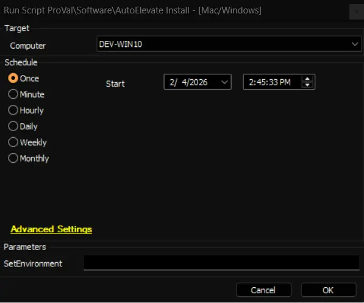
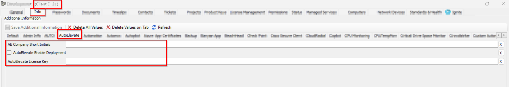
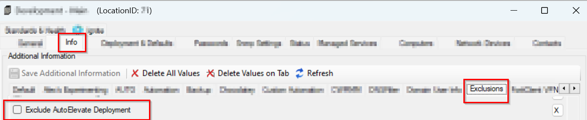
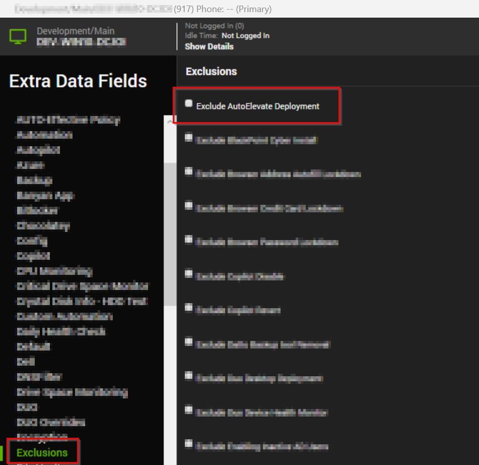

## Summary

It installs the AutoElevate to both MAC and Windows OS.  
**You must have the license key copied into the `Company` > `Info` screen for the script to successfully work.**  

Script downloads and installs the AutoElevate agent and license key.
This script was updated by Todd Jones of AutoElevate on 11/6/2019 to reflect the new MSI download location on Amazon
It was modified by ProVal to set the deployment and automation with ticket handling and EDFs deployment.

## Dependencies

- [Solution - AutoElevate Deployment](/docs/db76a502-1c00-4105-9458-a0530ddf5fe0)

## Sample Run

- **First Run:** Run the script initially with the SetEnvironment = 1, to import all the required EDFs in the client's environment

- **Regular Execution**

## User Parameters

| Name           | Example                                | Required | Description                                                |
|----------------|----------------------------------------|----------|------------------------------------------------------------|
| SetEnvironment   | 1    | False     | Run the script initially with the SetEnvironment = 1, to import all the required EDFs in the client's environment |

## EDF

| Name | Level | Section  |Type | Editable | Description |
| ----------- | --------- | ------- | ------- | ----- | -------------------------------------------- |
| `AutoElevate License Key` | Client | AutoElevate | Text | True | Provide the AutoElevate purchased license for the deployment.  |
| `AE Company Short Initials` | Client | AutoElevate | Text | True | ENTER 2 or 3 Character Initials for this client that will show up in the Technicians Mobile App  |
| `AutoElevate Enable Deployment` | Client | AutoElevate | Checkbox | True | This checkbox will enable the AutoElevate Deployment for the endpoints of the client.  |
| `Exclude AutoElevate Deployment` | Location | Exclusions | Checkbox | True | This checkbox will exclude the AutoElevate deployment on the location's endpoints.  |
| `Exclude AutoElevate Deployment` | Computer | Exclusions | Checkbox | True | This checkbox will exclude the AutoElevate deployment on the endpoint. |

## Process

The script performs the AutoElevate installation on both MAC and Windows OS.
It downloads the msi or sh file from "https://autoelevate-installers.s3.us-east-2.amazonaws.com/current" and then deploys it using the license key provided in the EDF `AutoElevate License Key`.

## Output

- Script log