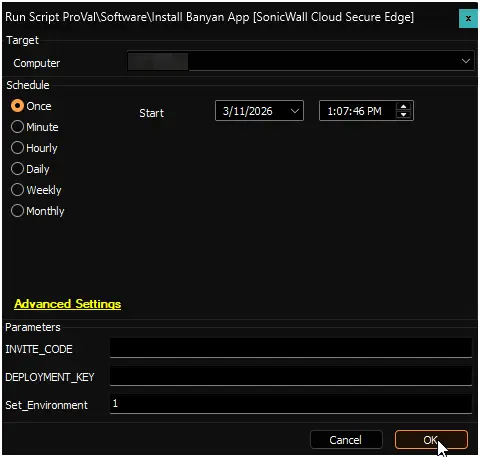
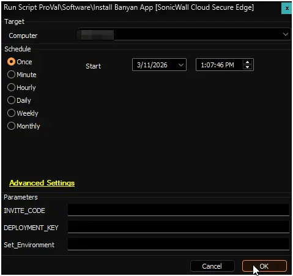
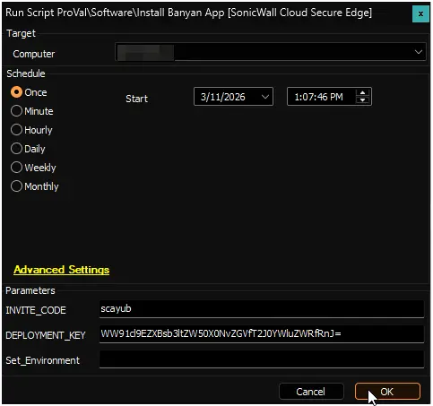

## Summary

Automates installation of the **SonicWall Cloud Security Edge App** (previously *Banyan App*) on end-user devices (Windows, macOS, Linux).

**Notes:**

- `INVITE_CODE` and `DEPLOYMENT_KEY` are required for installation.
- Codes may come from client-level EDFs or be supplied at runtime. Runtime parameters override EDF values.
- The script can run standalone or as a deployment script from the [Install Banyan App [SonicWall Cloud Secure Edge]](/docs/5d2830db-272e-4f60-8b18-54bf53a7dbed) internal monitor.
- In the Banyan Command Center, go to Settings > App Deployment and record your organization’s Invite Code and Deployment Key.

**References:**

- [https://github.com/banyansecurity/sonciwall-cse-app-installer/tree/main](https://github.com/banyansecurity/sonicwall-cse-app-installer/tree/main)
- [https://docs.banyansecurity.io/docs/manage-users-and-devices/device-managers/distribute-desktopapp/](https://docs.banyansecurity.io/docs/manage-users-and-devices/device-managers/distribute-desktopapp/)

## Sample run

**First run:** execute the script with `Set_Environment=1` to create the EDFs required by the solution.

**Regular run:** run the script with no parameters if the EDFs already contain the required codes.

**Alternate run:** supply `INVITE_CODE` and `DEPLOYMENT_KEY` at runtime if they are not stored in EDFs.

## Dependencies

- [Solution - Banyan App Deployment](/docs/f220b4c0-75f4-478d-860f-3e41a91ab6f0)

## Variables

| Name             | OS       | Value |
|------------------|----------|-------|
| ProjectName      | Windows  | sonicwall-cse-windows |
| WorkingDirectory | Windows  | C:\ProgramData\_Automation\Script\sonicwall-cse-windows |
| ScriptPath       | Windows  | C:\ProgramData\_Automation\Script\sonicwall-cse-windows.ps1 |
| DownloadUrl      | Windows  | [https://raw.githubusercontent.com/ProVal-Tech/sonicwall-cse-app-installer/refs/heads/main/sonicwall-cse-windows.ps1](https://raw.githubusercontent.com/ProVal-Tech/sonicwall-cse-app-installer/refs/heads/main/sonicwall-cse-windows.ps1) |
| ProjectName      | macOS    | sonicwall-cse-macos |
| WorkingDirectory | macOS    | /tmp/ |
| ScriptPath       | macOS    | /tmp/sonicwall-cse-macos.sh |
| DownloadUrl      | macOS    | [https://raw.githubusercontent.com/ProVal-Tech/sonicwall-cse-app-installer/refs/heads/main/sonicwall-cse-macos.sh](https://raw.githubusercontent.com/ProVal-Tech/sonicwall-cse-app-installer/refs/heads/main/sonicwall-cse-macos.sh) |
| ProjectName      | Linux    | sonicwall-cse-linux |
| WorkingDirectory | Linux    | /tmp/ |
| ScriptPath       | Linux    | /tmp/sonicwall-cse-linux.sh |
| DownloadUrl      | Linux    | [https://raw.githubusercontent.com/ProVal-Tech/sonicwall-cse-app-installer/refs/heads/main/sonicwall-cse-linux.sh](https://raw.githubusercontent.com/ProVal-Tech/sonicwall-cse-app-installer/refs/heads/main/sonicwall-cse-linux.sh) |

## User parameters

| Name | Example | Required | Description |
|------|---------|----------|-------------|
| INVITE_CODE | `scayub` | Required if not present in EDF | Invite Code from the Banyan admin console |
| DEPLOYMENT_KEY | `WW91cl9EZXBsb3ltZW50X0NvZGVfT2J0YWluZWRfRnJ=` | Required if not present in EDF | Deployment Key from the Banyan admin console |
| Set_Environment | 1 | Required for first run | Set to 1 on first run to create the EDFs used by the solution |

## EDF (Client-level values)

| Name | Example | Level | Section | Type | Options | Required | Description |
|------|---------|-------|---------|------|---------|----------|-------------|
| Install Banyan App | Windows | Client | Banyan App | Dropdown | None, All, Windows, Windows Workstation, Windows Workstations and Mac, Windows Server, Mac, Windows and Mac | True (to enable automation) | Choose OS targets for auto-deployment |
| Exclude Banyan App Deployment | — | Location | Exclusions | Checkbox | — | False | Exclude this location from auto-deployment |
| Exclude Banyan App Deployment | — | Computer | Exclusions | Checkbox | — | False | Exclude this computer from auto-deployment |
| Banyan App INVITE_CODE | `scayub` | Client | Banyan App | Textbox | — | True (for automation) | Invite Code from admin console |
| Banyan App DEPLOYMENT_KEY | `WW91cl9EZXBsb3ltZW50X0NvZGVfT2J0YWluZWRfRnJ=` | Client | Banyan App | Textbox | — | True (for automation) | Deployment Key from admin console |

## Output

- Script log
- Installed SonicWall Cloud Secure Edge (new software)

## Changelog

### 2026-03-09

- **Rebranding Update:** Renamed script to **"Install Banyan App [SonicWall Cloud Secure Edge]"** to align with recent product rebranding.
- **Logic Enhancement:** Updated script internal logic to reflect the transition from Banyan App to **SonicWall Cloud Security Edge App**.
- **Source Migration:** Updated the download source to the new GitHub repository: [sonicwall-cse-app-installer](https://github.com/ProVal-Tech/sonicwall-cse-app-installer).

### 2025-12-02

- We were using the Banyan's official script and due to bug (https://github.com/banyansecurity/app-installer/issues/37) in their own script, it was not working. We forked their repository and applied the bug fix. The CWA script now downloads the agnostic from our own repo.

### 2025-10-10

- Initial version of the document
