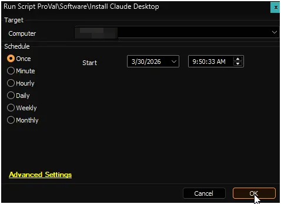

## Summary

Installs Claude Desktop for the currently logged-in user context using a downloaded installer and a temporary scheduled task.

### Workflow

1. Confirms an interactive user session exists.
2. Creates a working directory under ProgramData and grants broad access needed by scheduled task execution.
3. Downloads the Claude installer executable from Anthropic.
4. Enables trusted app sideloading via AppModelUnlock registry settings if needed (we need this to install the application).
5. Enables the `VirtualMachinePlatform` optional Windows feature (we need this feature to use cowork).
6. Creates and runs a short-lived scheduled task to launch the installer silently.
7. Polls for Claude package installation, then removes the temporary scheduled task.

> **Note:** *A user must be logged-in to install the application*

## Sample Run

## Output

- Script Log

## Changelog

### 2026-03-30

- Initial version of the document.
