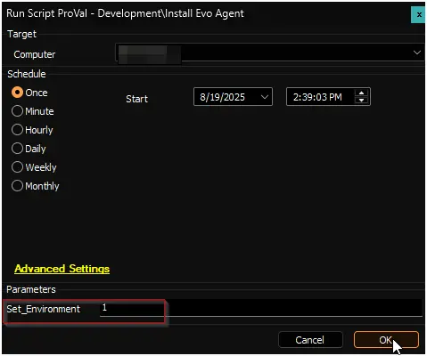
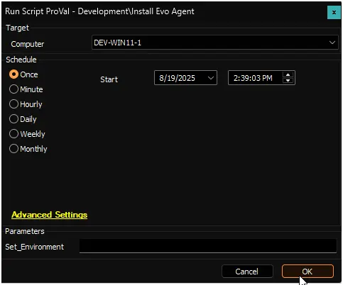
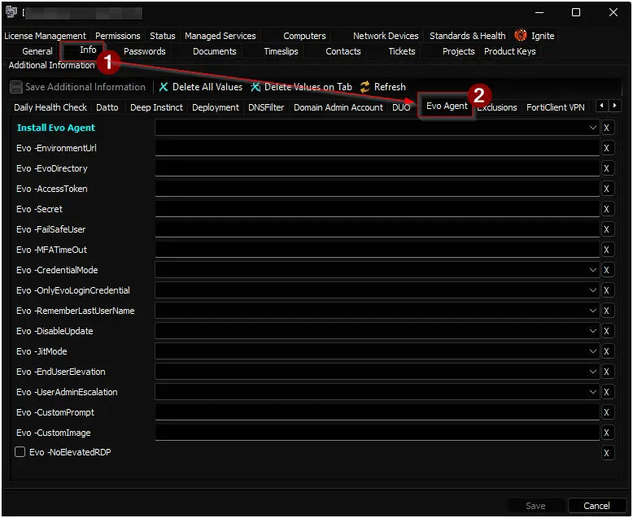

## Summary

This script is a CW Automate adaptation of the PowerShell script [InstallEvoAgent](https://github.com/evosecurity/EvoWindowsAgentDeploymentScripts/blob/master/InstallEvoAgent.ps1). It installs the Evo Credential Provider on a Windows machine using parameters configured in the client-level EDFs. Details about these EDFs are provided later in this document.

## Sample Run

**First Run:**  
Run or debug the script on any online Windows machine with the `Set_Environment` parameter set to `1` to generate the necessary EDFs.  

**Regular Run:**  

## Dependencies

- [InstallEvoAgent](https://github.com/evosecurity/EvoWindowsAgentDeploymentScripts/blob/master/InstallEvoAgent.ps1)
- [Evo Agent Deployment](/docs/8a0815ff-2351-4eb6-a199-b0682fb03564)

## Variables

| Name | Value |
| ---- | ----- |
| ProjectName | `InstallEvoAgent` |
| WorkingDirectory | `C:\ProgramData\_automation\script\InstallEvoAgent` |
| ScriptUrl | `https://raw.githubusercontent.com/evosecurity/EvoWindowsAgentDeploymentScripts/refs/heads/master/InstallEvoAgent.ps1` |
| PS1Path | `C:\ProgramData\_automation\script\InstallEvoAgent\InstallEvoAgent.ps1` |
| SoftwareName | `Evo Agent` |

## EDFs

| Name | Example | Level | Section | Type | Accepted Values | Required | Description |
|------|---------|-------|---------|------|----------------|----------|-------------|
| Install Evo Agent | Windows Servers and Workstations | Client | Evo Agent | DropDown | Windows Servers and Workstations, Windows Workstations, Windows Servers, Disabled | false | Select OS to enable Evo Agent auto installation. |
| Evo -EnvironmentUrl | `https://yourorg.evosecurity.com` | Client | Evo Agent | Text | | true | Evo portal base URL (e.g., `https://yourorg.evosecurity.com`). |
| Evo -EvoDirectory | YourEvoDirectory | Client | Evo Agent | Text | | true | Your Evo organization/directory name. |
| Evo -AccessToken | [your token] | Client | Evo Agent | Text | | true | Evo API access token. |
| Evo -Secret | [your secret] | Client | Evo Agent | Text | | true | Evo API secret. |
| Evo -FailSafeUser | backupUser | Client | Evo Agent | Text | | false | Optional username to use as a fallback if Evo login fails. |
| Evo -MFATimeOut | 0 | Client | Evo Agent | Text | | false | Optional grace period to not require MFA for an unlock (minutes from last MFA prompt). Default: 0. |
| Evo -CredentialMode | SecureAndElevatedLogin | Client | Evo Agent | DropDown | SecureLogin, ElevatedLogin, SecureAndElevatedLogin | false | Installer defaults to SecureAndElevatedLogin on a new installation or uses previous value on upgrade. |
| Evo -OnlyEvoLoginCredential | 0 | Client | Evo Agent | DropDown | 0, 1 | false | If set, Evo becomes the only credential provider. Default: 0. |
| Evo -RememberLastUserName | 1 | Client | Evo Agent | DropDown | 0, 1 | false | Optional flag to remember the last username used. Default: 1. |
| Evo -DisableUpdate | 0 | Client | Evo Agent | DropDown | 0, 1 | false | Optional flag to disable auto updates. Default: 0. |
| Evo -JitMode | 0 | Client | Evo Agent | DropDown | 0, 1 | false | Optional flag to enable Just-In-Time admin accounts. Default: 0. |
| Evo -EndUserElevation | 0 | Client | Evo Agent | DropDown | 0, 1 | false | Optional flag to enable end-user elevation. Default: 0. |
| Evo -UserAdminEscalation | 0 | Client | Evo Agent | DropDown | 0, 1 | false | Prompt admins with end-user elevation prompt instead of UAC. Default: 0. |
| Evo -CustomPrompt | Custom Login Text | Client | Evo Agent | Text | | false | Optional string to customize the login prompt. |
| Evo -CustomImage | C:\images\login.png | Client | Evo Agent | Text | | false | Optional path to custom login image (URL or local file path). |
| Evo -NoElevatedRDP | | Client | Evo Agent | Checkbox | | false | Optional flag to disable elevation for RDP sessions when Evo is the sole login agent. |
| Exclude - Install Evo Agent | | Location | Exclusions | Checkbox | | false | Flag to exclude the location from auto-deployment. |
| Exclude - Install Evo Agent | | Computer | Exclusions | Checkbox | | false | Flag to exclude the endpoint from auto-deployment. |

## Output

- Script Logs
