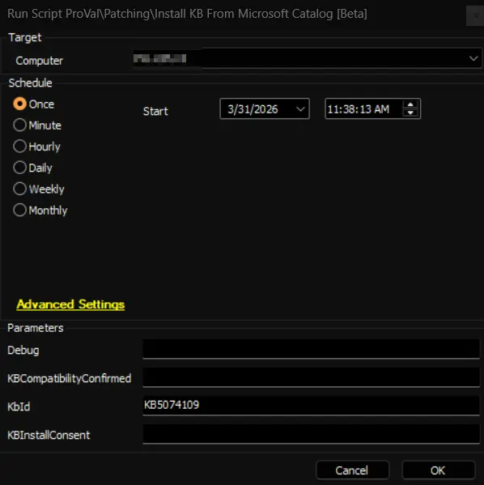
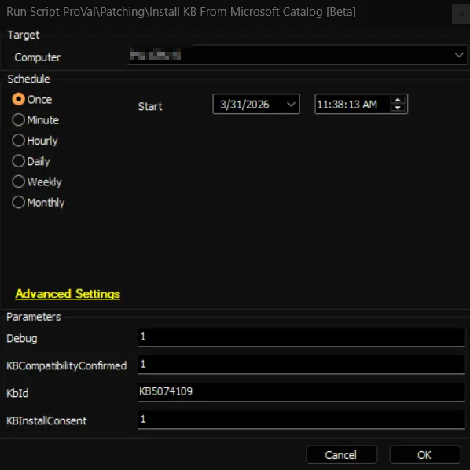

## Summary

This Automate script locates a specific Microsoft KB update, checks that it applies to the target machine, and either reports matching update packages or (with explicit consent) downloads and installs the chosen package. When run, the script first validates the provided KB identifier and then inspects the target system’s Windows edition, version, build and architecture to find compatible catalog entries. It also checks the update's details for any newer "superseding" updates and will report those to you.

By default the integration runs in safe listing mode: it reports matching catalog entries, direct download URLs, and any supersedence information without downloading or installing anything. If you explicitly confirm compatibility and provide install consent in Automate, the integration moves into installation mode: it prepares the system (resets Windows Update components if necessary), downloads the selected file using BITS, and runs the correct installer for the package type (.msu → wusa.exe, .cab → dism.exe, .exe → installer). The integration returns structured results (exit code, friendly status, reboot requirement, and install log path) and removes the downloaded file after installation.

**NOTE:** This process does not automatically reboot the machine. Instead, it enables the reboot flag after the patch is successfully installed and a reboot is necessary.

## File Hash

- **File Path:** `C:\ProgramData\_automation\Script\Install-KBIDFromMicrosoftCatalog\Install-KBIDFromMicrosoftCatalog.ps1`  
- **File Hash (Sha256):** `4E01F0806F8E3B99E2A929F31E7925A526A4F474A80026063696F120E68CCA0D`  
- **File Hash (MD5):** `761C42B34F7673EE135FB93C2FB96E70`   

## Sample Run

### Example 1

Queries the catalog for KB5074109, matches it to the current OS, and displays:
    - Update title
    - Compatible products
    - File size
    - Download URL
    WITHOUT downloading or installing anything.

### Example 2

Searches for KB5074109, verifies it matches this machine (architecture, OS version, build),
    downloads it, installs it using wusa.exe or dism.exe, shows the exit code, and reports whether
    a reboot is needed. The -debug flag outputs detailed information about each step.

## User Parameters

| Name | Example | Required | Description |
| ---- | ------- | -------- | ----------- |
| KbId | `KB5074109` | Yes | KB identifier to target. Accepts the KB number with or without the `KB` prefix. Automate validates the value looks like a proper KB before passing it to the job. If missing or invalid the integration will report "KbId Not Provided" and will not attempt installation. |
| KBCompatibilityConfirmed | `1` | No (required for Install) | Safety flag indicating you have confirmed the update is compatible with the target machine. Accepted truthy values: `1`, `Yes`, `True`. This flag alone does not enable installation — it must be set together with `KBInstallConsent`. |
| KBInstallConsent | `1` | No (required for Install) | Consent flag indicating you approve installation on the target machine. Accepted truthy values: `1`, `Yes`, `True`. Both this and `KBCompatibilityConfirmed` must be truthy to allow the integration to perform an install; otherwise the integration will default to `List` mode. |
| Debug | `1` | No | When truthy (`1`, `Yes`, or `True`) the job runs in debug/information mode and emits detailed diagnostics about OS detection, catalog parsing and filtering decisions, supersedence checks, download progress, and installation steps. Leave unset for minimal output. |

**Notes:**

- Both `KBCompatibilityConfirmed` and `KBInstallConsent` must be set to a truthy value to enable actual installation; otherwise the Automate job will run in safe `List` mode and only show what would be installed.
- The Automate layer validates and formats parameters and enforces the safe default of listing unless explicit compatibility + consent are supplied; the integration still performs machine-level applicability checks before any install.

## Output

- Script Logs
