## Summary

This script is an Automate implementation of the agnostic script [Install-Microsoft365](../../powershell/Install-Microsoft365.md). It can be used to install Microsoft 365 Apps for Business or any Microsoft 365 product that supports XML Configuration. Additionally, it will remove the existing version of Microsoft 365 (Microsoft Office) based on the Update and Upgrade settings in the configuration file.

It is advisable to restart the computer after installation. Setting the `Reboot` parameter to `1` will initiate an automatic restart.  

**Note:** This script does not support changing editions between installed Click-To-Run versions (e.g., from Business to Enterprise or Enterprise to Professional). However, it supports upgrading from MSI versions (Office 2013, 2010, 2016) to Microsoft 365 Apps Click-To-Run versions.

## Creating an .XML configuration file

### Step 1: Access the Office Customization Tool

Open your web browser and navigate to the [Office Customization Tool](https://config.office.com/deploymentsettings).

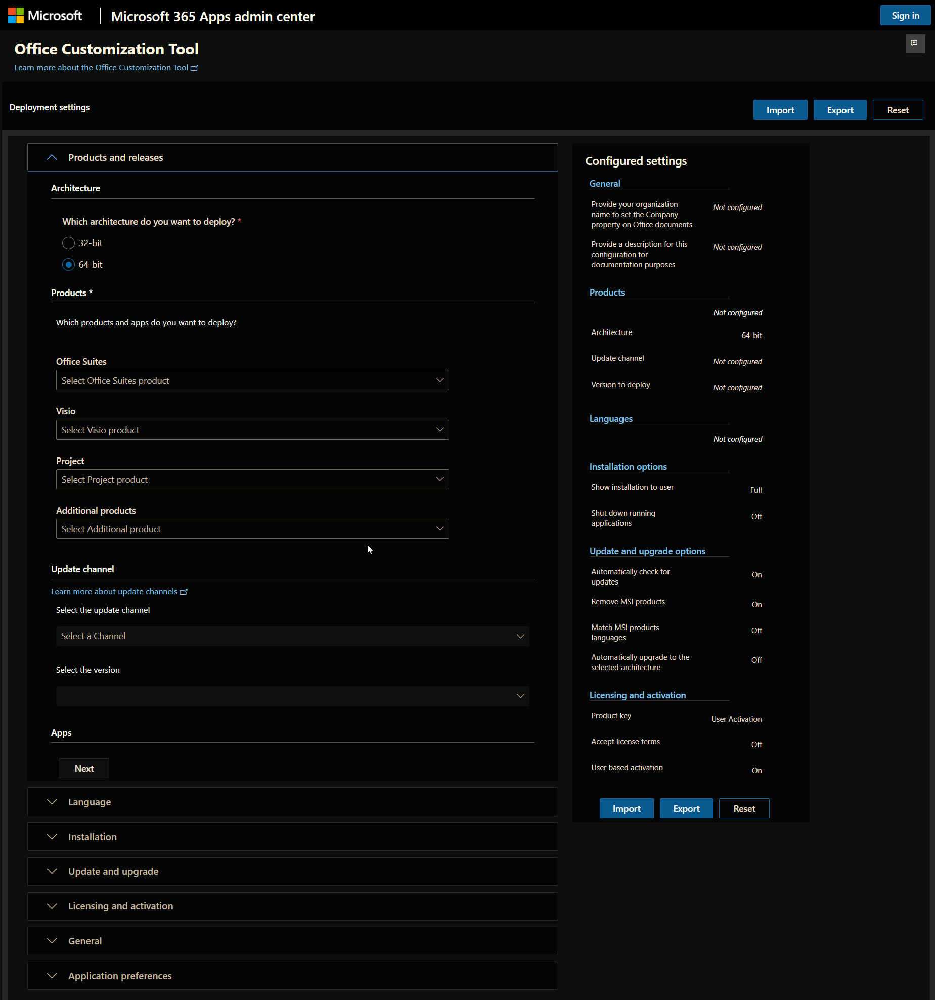

### Step 2: Configure the Products and Releases

**Architecture:** Select the required architecture to deploy.

**Products:** Select the `Office Suites` you want to install (e.g., Microsoft 365 Apps for enterprise). Select any additional products like `Visio`, `Project`, or `Additional Products` if required.

**Update Channel:** This option will be enabled after selecting the `Office Suites`. Change the `update channel` if required. By default, it will be set to the `Current Channel`.

**Apps:** Review the selected applications and deselect any if not needed.

### Step 3: Languages

**Primary Language:** Choose the languages you want to include in the installation. Additional languages can be selected if required.

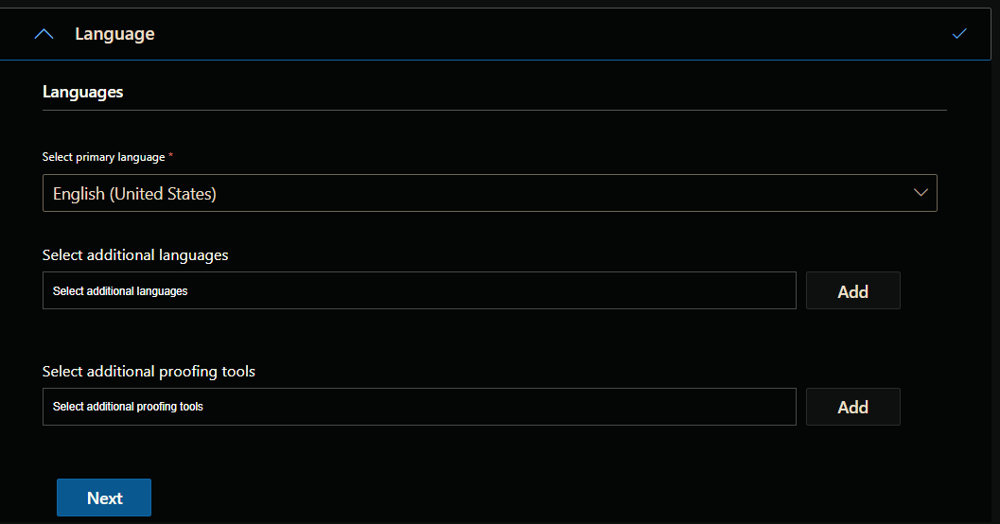

### Step 4: Configure Installation Options

**Installation Options:** Specify the installation path, whether to display the installation experience to users, and other preferences. Leave it untouched if not required.

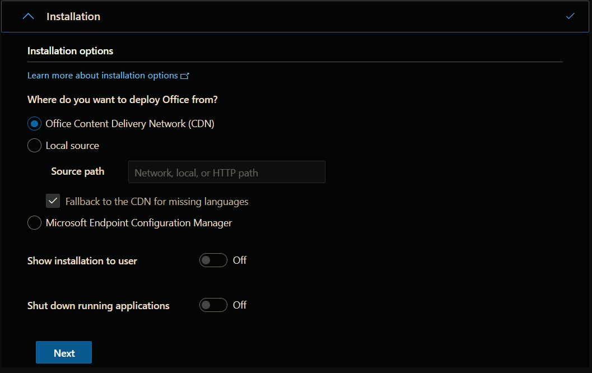

### Step 5: Configure Update and Upgrade Options

**Upgrade Options:** Select the `Uninstall any MSI versions of Office, including Visio and Project` option to remove existing MSI versions. Deselect the individual components to leave behind.

Additional information can be found in the [MSICondition attribute documentation](https://learn.microsoft.com/en-us/microsoft-365-apps/deploy/office-deployment-tool-configuration-options#msicondition-attribute-part-of-product-element) and the [MSICondition and RemoveMSI implementation guide (youtube video)](https://youtu.be/7zHi6MRveRc).

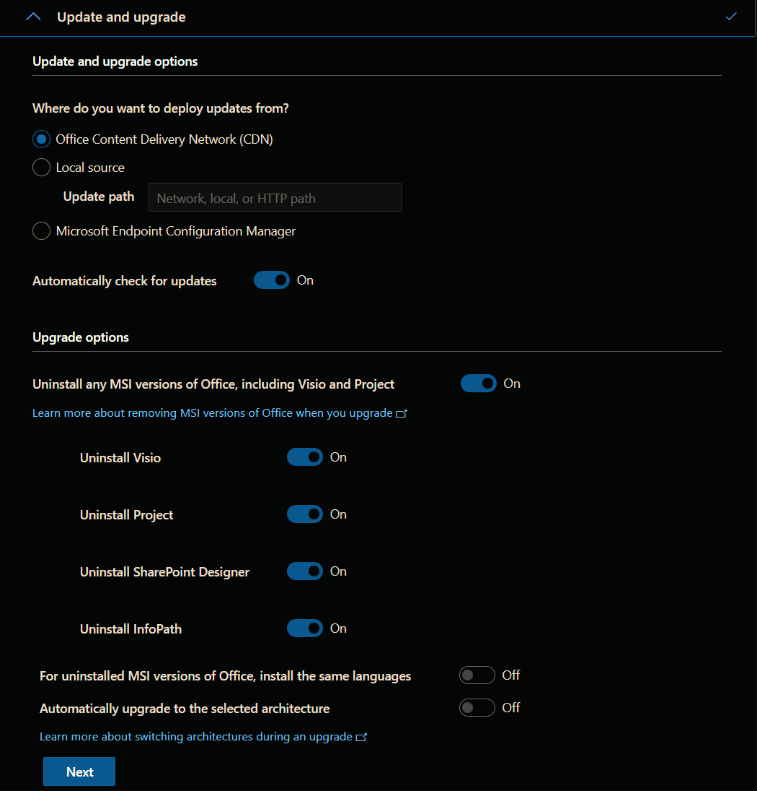

### Step 6: Configure Licensing and Activation Options

**Automatically accept the license terms:** It is suggested to enable this feature.

**Product activation:** Select the appropriate product activation option.

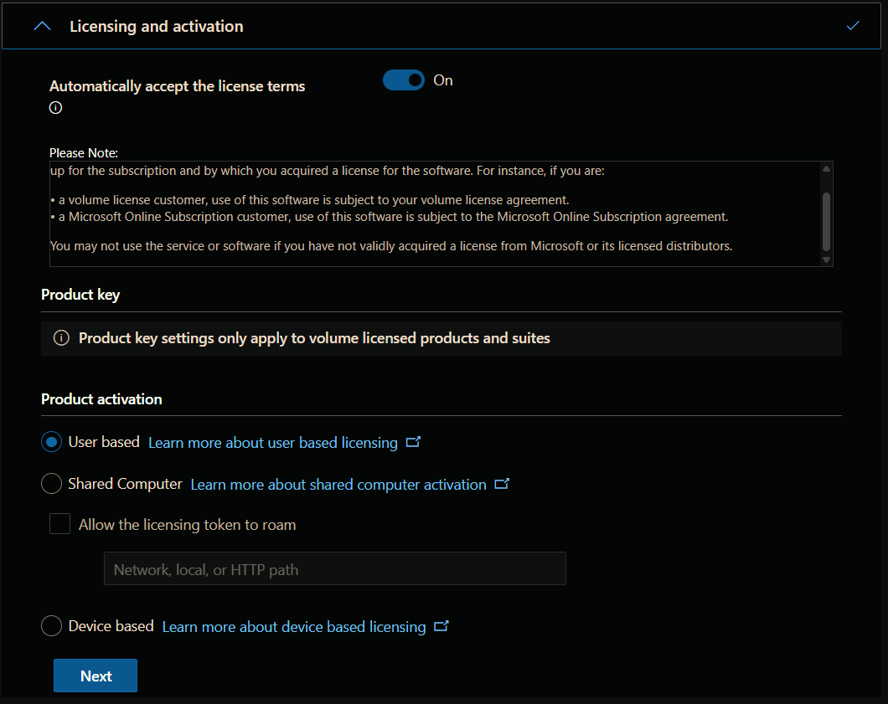

### Step 7: General Settings

**General:** Configure the general settings if required.

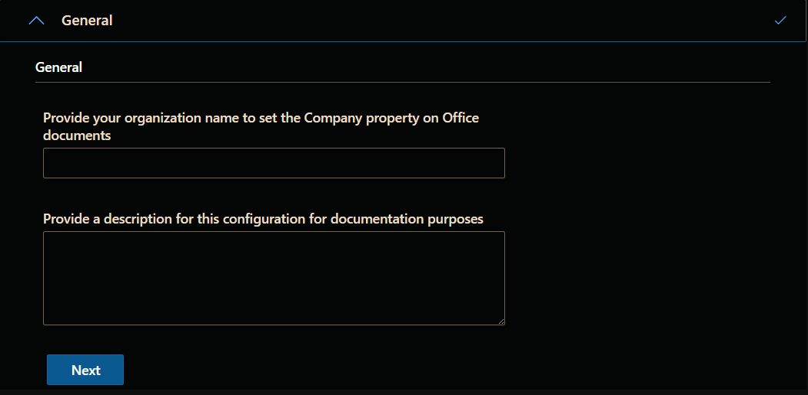

### Step 8: Configure Application Preferences

**Application Preferences:** Configure specific settings for each application, such as default file locations and user preferences.

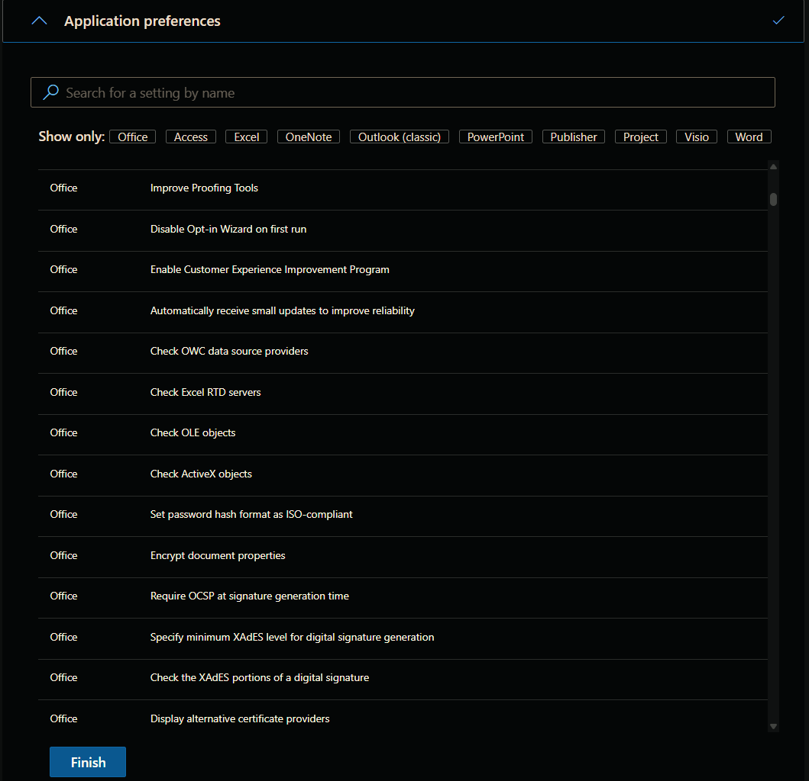

### Step 9: Review Configured Settings

**Review:** Check all the settings you have configured to ensure they meet your requirements.

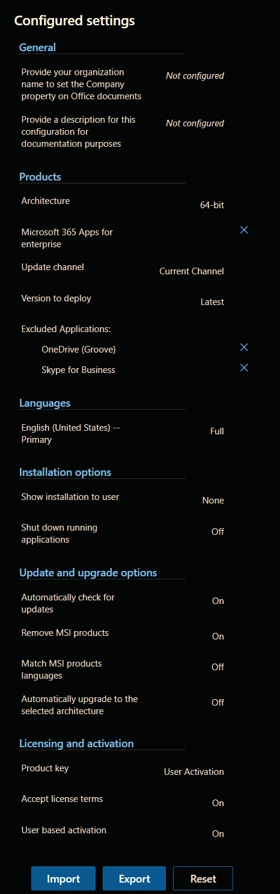

### Step 10: Export

**Export:** Click on the Export button to generate the .XML configuration file.

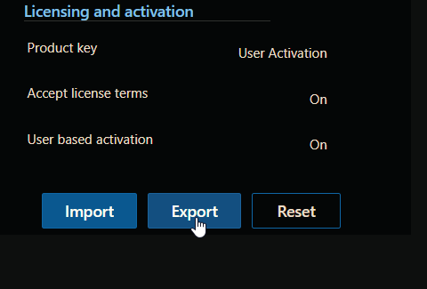

**Default File Format:** Choose either `Keep Current Settings` or `Office Open XML formats` options for the default file format. It is recommended to use the `Keep Current Settings` option.

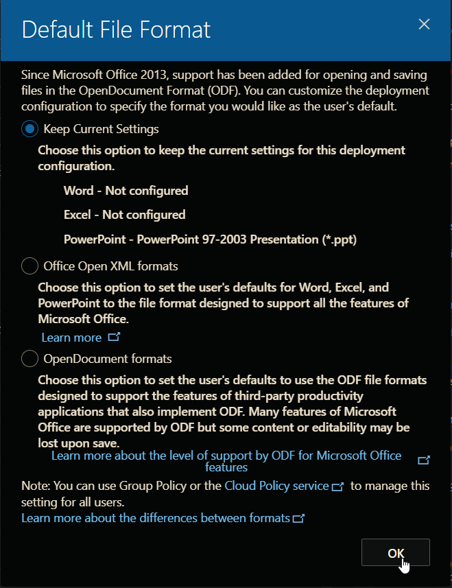

**Export configuration to XML:** Accept the license agreement, set an appropriate file name, and click the `Export` button to export the configuration file. *Do not use any special characters or spaces in the file name.*

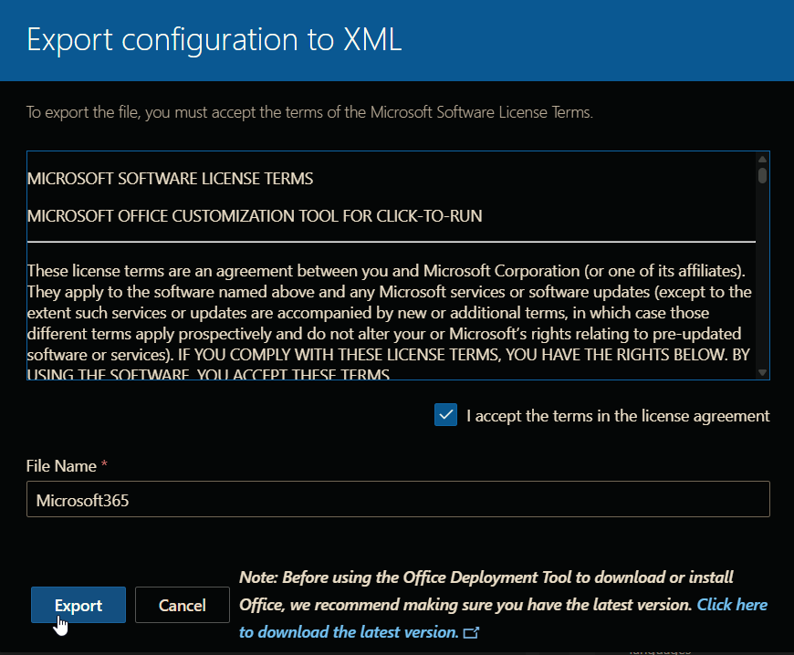

### Note

*Refer to this URL for more information about the Office Configuration Tool: [https://go.microsoft.com/fwlink/?linkid=854077](https://go.microsoft.com/fwlink/?linkid=854077)*

## Saving the Configuration File

It is recommended to save the configuration file on LTShare (WebDav for the hosted partners) at `LTShare\Transfer\configs\Microsoft365` as `<FileName>.xml`.

If the `Microsoft365` directory does not exist in `LTShare\Transfer\configs`, create the directory and place the downloaded XML file.

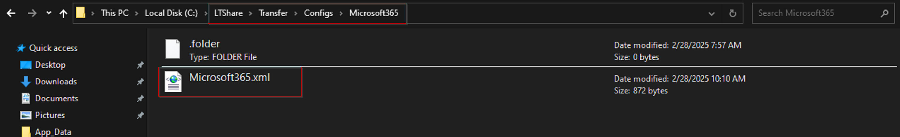

**Notes:**

- *The configuration file can be saved anywhere; the script just needs a public download URL of the file to download it.*
- *The script can be executed without setting the `XMLPath` parameter after saving the configuration file as `Microsoft365.XML` at `LTShare\Transfer\configs\Microsoft365`.*

## File Hash

**File Path:** `C:\ProgramData\_automation\Script\Install-Microsoft365\Install-Microsoft365-AI.ps1`

**File Hash (Sha256):** `5F04E51D602D9B513124590C066C0D218164ACDF1D485B2A633367154E587BE3`

**File Hash (MD5):** `74457BD545A59D8CD5CB910C887640F1`

## Sample Run

**Example 1:** The configuration file is saved as `Microsoft365.XML` in the `LTShare\Transfer\configs\Microsoft365` directory:

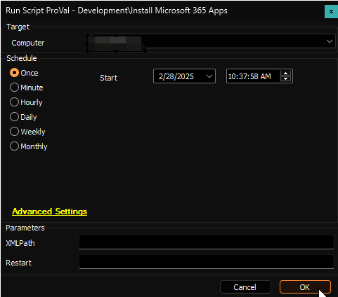

**Example 2:** The configuration file is saved with a different name in the `LTShare\Transfer\configs\Microsoft365` directory:

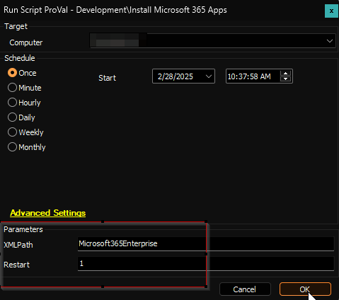

**Note:** *The computer will be automatically rebooted in this example as the `Reboot` parameter is set to `1`.*

**Example 3:** The configuration file is saved at a remote location and is accessible via a public download URL:

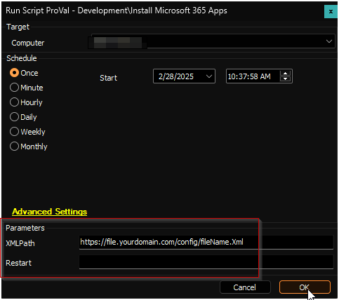

## Variables

| Name  | Description |
| ----- | ----------- |
| ProjectName | Install-Microsoft365 |
| WorkingDirectory | C:\ProgramData\_automation\script\Install-Microsoft365 |
| ScriptPath | C:\ProgramData\_automation\script\Install-Microsoft365\Install-Microsoft365.ps1 |
| PS1Path | C:\ProgramData\_automation\script\Install-Microsoft365\Install-Microsoft365-AI.ps1 |
| PS1Log | C:\ProgramData\_automation\script\Install-Microsoft365\Install-Microsoft365-log.txt |
| PS1ErrorLog | C:\ProgramData\_automation\script\Install-Microsoft365\Install-Microsoft365-error.txt |

## Parameters

| Name    | Example | Required | Description |
| ------- | ------- | -------- | ----------- |
| XMLPath | <ul><li>Microsoft365Enterprise</li><li>https://file.yourdomain.com/config/Microsoft365Enterprise.xml</li></ul> | False | The name of the XML file placed in the `LTShare\Transfer\configs\Microsoft365` directory or the public download URL of the file. Leave this blank if the configuration file is saved as `Microsoft365.xml` in the `LTShare\Transfer\configs\Microsoft365` directory. |
| Reboot  | 1       | False    | Set this parameter to `1` to automatically restart the computer after the installation. It is advisable to reboot the computer after the Microsoft 365 installation. |

## Output

- Script logs