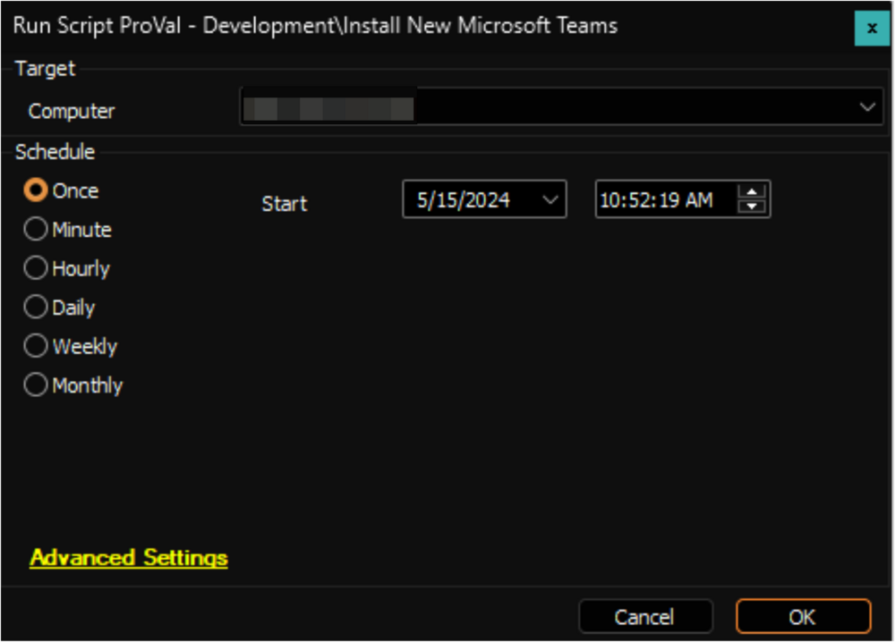

## Summary

This document provides a script for installing the New Microsoft Teams on both Windows and Mac computers. Users will need to log in again to finalize the installation. The script utilizes the [Install-MsTeams](/docs/b1410ff8-58df-45cf-a66a-a727f53cc7af) agnostic script for Windows. Additionally, it attempts to uninstall the existing Microsoft Teams classic installation before reinstalling on Windows.

## Sample Run

## Output

- Script Log

