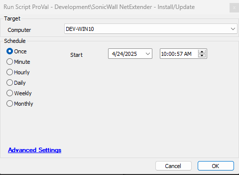

## Summary
This script installs/updates the latest version of the SonicWall NetExtender dynamically.

## Sample Run

## Process

This script installs/updates the latest version of the SonicWall NetExtender dynamically by fetching the latest version from the winget manifest and download that latest version from the URL.
It has proper error handling to report success and failure.

## Output

- Script log