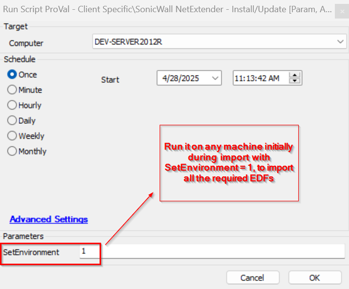
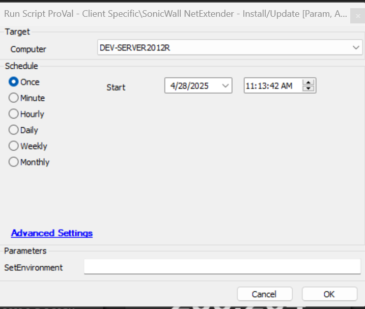

## Summary
This script installs/updates the latest version of the SonicWall NetExtender dynamically.

## Sample Run

## Dependencies

 [Monitor - SonicWall NetExtender - Update](/docs/b0ca57d2-351c-4f1d-9d98-954c1d77777e)  
 [Solution - SonicWall NetExtender - Install/Update](/docs/70d9b103-f73f-4e68-a4aa-d2651e44d09a)

## Process

This script installs/updates the latest version of the SonicWall NetExtender dynamically by Winget using [Script - Winget - Install/Update](/docs/3a2f4004-624d-47c4-a5d0-c3c43e103e25) if the fresh installation is being performed on the agent. If the agent already has the SonicWall NetExtender installed, then it first checks if it is deployed using MSI or EXE. If installed using MSI, then it updates using [Script - Winget - Install/Update](/docs/3a2f4004-624d-47c4-a5d0-c3c43e103e25); else if it is deployed using EXE, then it installs by downloading the latest exe package from the site [VPN-Clients](https://www.sonicwall.com/products/remote-access/vpn-clients) by fetching the latest version from the winget manifest and then downloading and installing it.
It has proper error handling to report success and failure.

## Output

- Script log