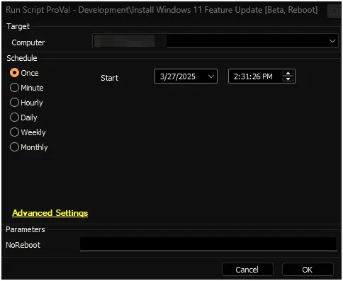

## Summary

This document describes the Automate implementation of the agnostic script [Install-WindowsFeatureUpdate](/docs/837e00a9-4fde-4457-9516-591da7ba4da0).

The script automates the installation of the latest Windows 11 Feature Update. It performs comprehensive pre-checks, maintenance, and validation to ensure a smooth upgrade process.

The script supports both Windows 10 and Windows 11:

- For Windows 10, it attempts to upgrade to the latest available version of Windows 11.  
- For Windows 11, it ensures the system is updated to the latest available feature update.

**Important Notes:**

1. The script does not track progress or results. It simply initiates the agnostic script.
2. The computer may restart up to seven times during the process. The agnostic script re-schedules itself through a startup scheduled task to continue the process after each reboot.
3. The `NoReboot` parameter may not reliably prevent reboots. The script attempts to install missing drivers, firmware, and BIOS updates, which may force a restart regardless of this parameter. Use this parameter with caution.
4. It is recommended to initiate the script after business hours and ensure the computer remains connected to AC power. The entire process may take up to six hours in some cases, though it typically completes within two hours.
5. Be aware of [known issues](https://learn.microsoft.com/en-us/windows/release-health/status-windows-11-24h2) with the feature update 24H2 before using the script.
6. Running this script as an Autofix is not recommended, as it may trigger multiple system reboots. Please use caution when executing it.

## Security Application Guidance

For optimal performance and to minimize potential interference, it is recommended to disable or set any active security applications (such as antivirus, endpoint protection, or EDR tools) to "learning" or "detect-only" mode before executing the script.

This helps ensure that the update process runs smoothly without being blocked or slowed down by real-time protection mechanisms. Once the update is complete, security settings can be reverted to their original state.

## Requirements

- Windows 10 or Windows 11
- Administrative privileges
- Internet connectivity
- At least 64GB of free space on the system drive
- [Windows 11 Compatible Machine](https://www.microsoft.com/en-us/windows/windows-11-specifications)

## Sample Run

## Dependencies

[Install-WindowsFeatureUpdate](/docs/837e00a9-4fde-4457-9516-591da7ba4da0).

## User Parameters

| Name       | Example | Required | Description                                                                                     |
|------------|---------|----------|-------------------------------------------------------------------------------------------------|
| `NoReboot` | 1       | False    | If set to `1`, the script will attempt to suppress reboots. However, reboots may still occur due to driver, firmware, or feature update requirements. Use this parameter judiciously. |

## Output

- Script Logs
