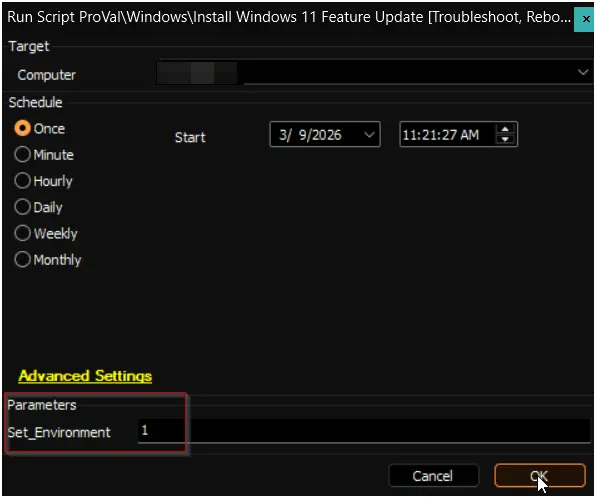
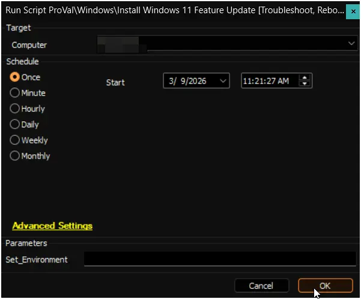

## Summary

This document describes the Automate implementation of the agnostic script [Install-WindowsFeatureUpdate](/docs/837e00a9-4fde-4457-9516-591da7ba4da0).

The script automates the installation of the latest Windows 11 Feature Update. It performs comprehensive pre-checks, maintenance, and validation to ensure a smooth upgrade process.

The script supports both Windows 10 and Windows 11:

- For Windows 10, it attempts to upgrade to the latest available version of Windows 11.  
- For Windows 11, it ensures the system is updated to the latest available feature update.

**Important Notes:**

1. The script does not track progress or results. It simply initiates the [agnostic script](/docs/837e00a9-4fde-4457-9516-591da7ba4da0).
2. The computer may restart up to seven times during the process. The [agnostic script](/docs/837e00a9-4fde-4457-9516-591da7ba4da0)  re-schedules itself through a startup scheduled task to continue the process after each reboot.
3. The `NoReboot` parameter may not reliably prevent reboots. The script attempts to install missing drivers, firmware, and BIOS updates, which may force a restart regardless of this parameter. Use this parameter with caution.
4. It is recommended to initiate the script after business hours and ensure the computer remains connected to **AC power**. The entire process may take up to six hours in some cases, though it typically completes within two hours.
5. Be aware of [known issues](https://learn.microsoft.com/en-us/windows/release-health/status-windows-11-25h2) with the feature update `25H2` before using the script.
6. Running this script as an Autofix is not recommended, as it may trigger multiple system reboots. Please use caution when executing it.

## Security Application Guidance

For optimal performance and to minimize potential interference, it is recommended to disable or set any active security applications (such as antivirus, endpoint protection, or EDR tools) to "learning" or "detect-only" mode before executing the script.

This helps ensure that the update process runs smoothly without being blocked or slowed down by real-time protection mechanisms. Once the update is complete, security settings can be reverted to their original state.

## Requirements

- Windows 10 or Windows 11
- Administrative privileges
- Internet connectivity
- Minimum of 64 GB free space on the system drive (or 24 GB for devices running Windows 11 24H2 or later)
- [Windows 11 Compatible Machine](https://www.microsoft.com/en-us/windows/windows-11-specifications)

## Sample Run

### First Run

Run the script with the `Set_Environment` parameter set to `1` to generate the required EDFs. For further details, refer to the [EDFs section in the solution's document](/docs/00b08a60-f202-42db-9f67-a76ea29289fa#edfs).

### Regular Execution

## Dependencies

- [PowerShell: Install-WindowsFeatureUpdate](/docs/837e00a9-4fde-4457-9516-591da7ba4da0)
- [Solution : Windows 11 Installation and Feature Update](/docs/00b08a60-f202-42db-9f67-a76ea29289fa)

## User Parameters

| Name            | Example | Required                  | Description                                                                                                                                                             |
|-----------------|---------|---------------------------|-------------------------------------------------------------------------------------------------------------------------------------------------------------------------|
| `Set_Environment` | 1       | Yes (first run only)      | Set to `1` on the initial execution to generate the EDFs required by the solution. For further details, refer to the [EDFs section in the solution's document](/docs/00b08a60-f202-42db-9f67-a76ea29289fa#edfs). |

## Output

- Script Logs

## Changelog

### 2026-03-09

- Updated the script name from **`Install Windows 11 Feature Update [Beta, Reboot]`** to **`Install Windows 11 Feature Update [Troubleshoot, Reboot]`**.
- Introduced new EDFs to enhance reporting and alerting capabilities of the solution.
- Added a `Set_Environment` parameter to provision the EDFs required by the solution.
- Removed the `NoReboot` parameter, as a reboot is now mandatory for the troubleshooting workflow.

### 2025-09-08

- Added `Security Application Guidance` section in the document.

### 2025-05-20

- Added step 16 to reset the existing attempt counter on the end machine after re-running the script from RMM.

### 2025-03-27

- Initial version of the document
