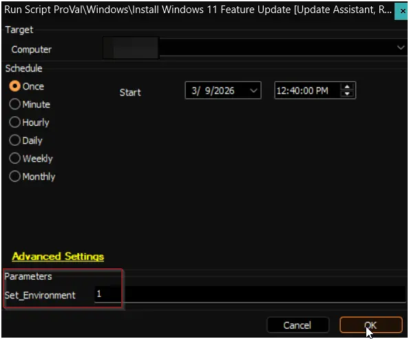
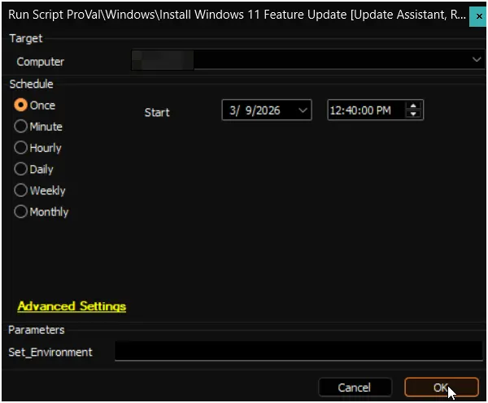

## Summary

This script is an adaptation of the built-in `Windows 11 - Install Latest Feature Update` script developed by **ConnectWise**. It is designed to install the latest available feature update on Windows 11 machines by downloading and installing the update directly from Microsoft to the remote agent using the **MS Upgrade Assistant tool**.

> Executes the [Windows 11 Feature Update [Cleanup]](/docs/e0f9ecf2-eac8-4bd1-a269-0dbf7bd0a645) script after a 150-minute delay to initiate the cleanup process.

> NOTE: This script reboots the computer during the process and reboot can't be excluded.

## Sample Run

### First Run

Run the script with the `Set_Environment` parameter set to `1` to generate the required EDFs. For further details, refer to the [EDFs section in the solution's document](/docs/00b08a60-f202-42db-9f67-a76ea29289fa#edfs).

### Regular Execution

## Dependencies

- [Script: Windows 11 Feature Update [Cleanup]](/docs/e0f9ecf2-eac8-4bd1-a269-0dbf7bd0a645)
- [Solution : Windows 11 Installation and Feature Update](/docs/00b08a60-f202-42db-9f67-a76ea29289fa)

## User Parameters

| Name            | Example | Required                  | Description                                                                                                                                                             |
|-----------------|---------|---------------------------|-------------------------------------------------------------------------------------------------------------------------------------------------------------------------|
| `Set_Environment` | 1       | Yes (first run only)      | Set to `1` on the initial execution to generate the EDFs required by the solution. For further details, refer to the [EDFs section in the solution's document](/docs/00b08a60-f202-42db-9f67-a76ea29289fa#edfs). |

## Output

- Script Logs

## Changelog

### 2026-03-09

- Initial version of the document
