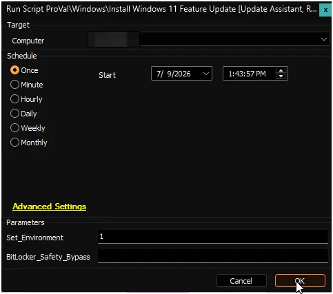
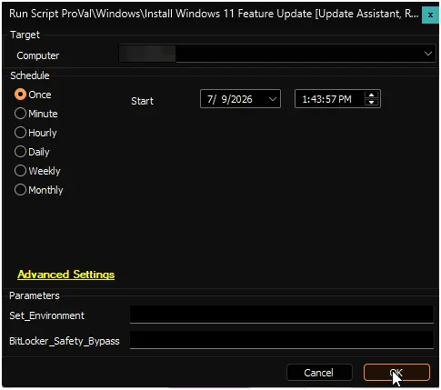

## Summary

This script is an adaptation of the built-in `Windows 11 - Install Latest Feature Update` script developed by **ConnectWise**. It is designed to install the latest available feature update on Windows 11 machines by downloading and installing the update directly from Microsoft to the remote agent using the **MS Upgrade Assistant tool**.

> Executes the [Windows 11 Feature Update [Cleanup]](/docs/e0f9ecf2-eac8-4bd1-a269-0dbf7bd0a645) script after a 150-minute delay to initiate the cleanup process.
> NOTE: This script reboots the computer during the process and reboot can't be excluded.

### BitLocker Pre-Upgrade Checks

Before initiating the upgrade, the script evaluates the BitLocker status on the system drive. If BitLocker is enabled, it validates the TPM status, key protectors, and the presence of a recovery password. If all safety checks pass, BitLocker is temporarily suspended to prevent upgrade interruptions, and the recovery password is outputted for logging or backup purposes. If any safety checks fail (e.g., TPM is disabled or recovery password is missing), the script will halt the upgrade to prevent the machine from being locked out post-reboot.

## Sample Run

### First Run

Run the script with the `Set_Environment` parameter set to `1` to generate the required EDFs. For further details, refer to the [EDFs section in the solution's document](/docs/00b08a60-f202-42db-9f67-a76ea29289fa#edfs).

### Regular Execution

## Dependencies

- [Script: Windows 11 Feature Update [Cleanup]](/docs/e0f9ecf2-eac8-4bd1-a269-0dbf7bd0a645)
- [Solution : Windows 11 Installation and Feature Update](/docs/00b08a60-f202-42db-9f67-a76ea29289fa)

## User Parameters

| Name            | Example | Required                  | Description                                                                                                                                                             |
|-----------------|---------|---------------------------|-------------------------------------------------------------------------------------------------------------------------------------------------------------------------|
| `Set_Environment` | 1       | Yes (first run only)      | Set to `1` on the initial execution to generate the EDFs required by the solution. For further details, refer to the [EDFs section in the solution's document](/docs/00b08a60-f202-42db-9f67-a76ea29289fa#edfs). |
| `BitLocker_Safety_Bypass` | 1       | No                        | Set to `1` to bypass BitLocker safety checks (e.g., TPM not enabled, missing TPM key protector, or missing recovery password). Use with caution, as bypassing these checks may result in BitLocker recovery prompts post-upgrade. |

## Output

- Script Logs

## Changelog

### 2026-07-09

- Added BitLocker pre-upgrade safety checks to validate TPM status, key protectors, and recovery password before initiating the Windows 11 feature update.
- Implemented automatic suspension of BitLocker on the system drive when safety checks pass to prevent upgrade interruptions and lockouts.
- Added a new `BitLocker_Safety_Bypass` user parameter to allow bypassing the BitLocker safety checks when necessary.

### 2026-03-09

- Initial version of the document
