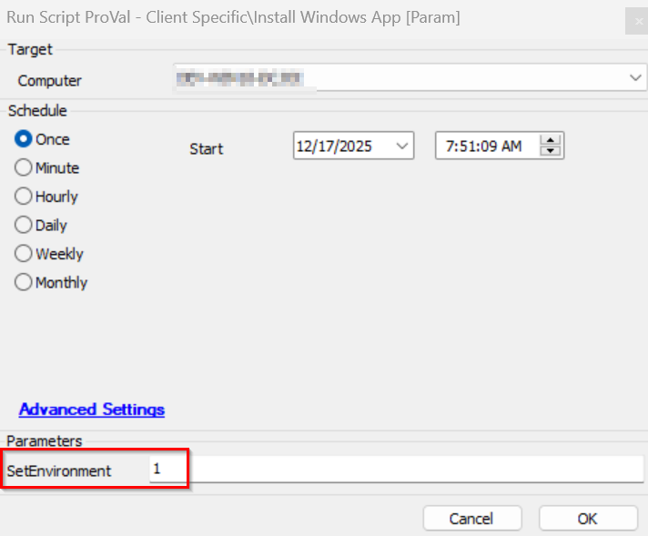
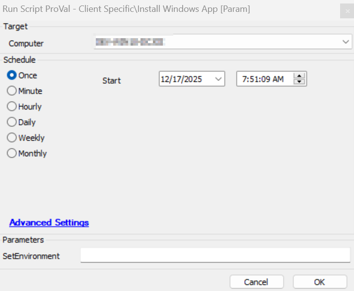
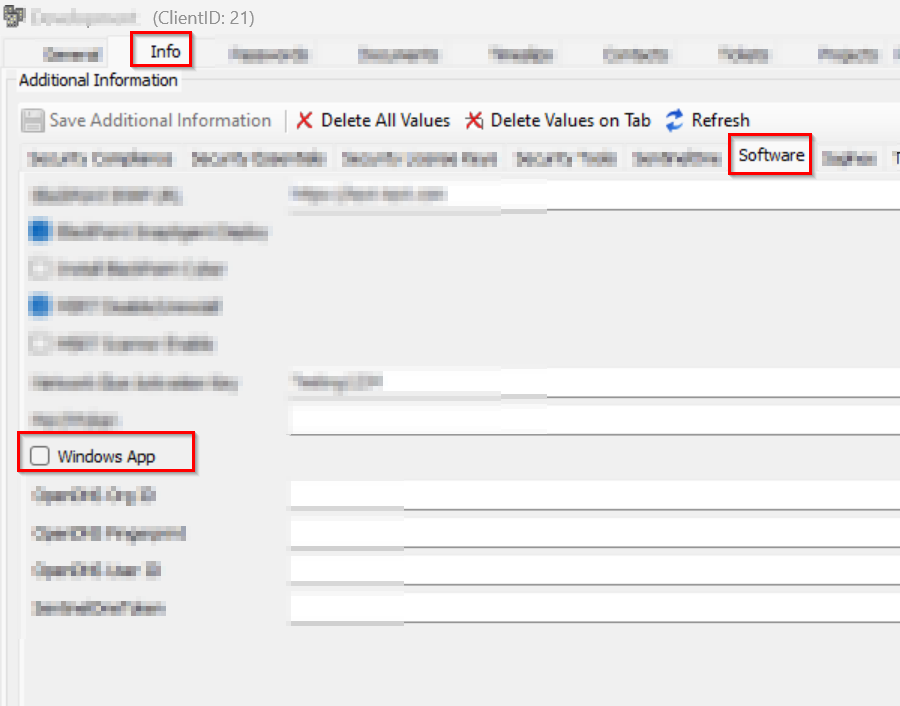
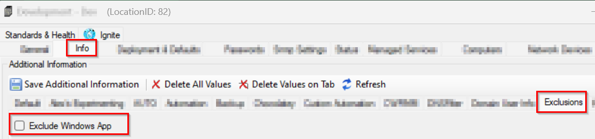
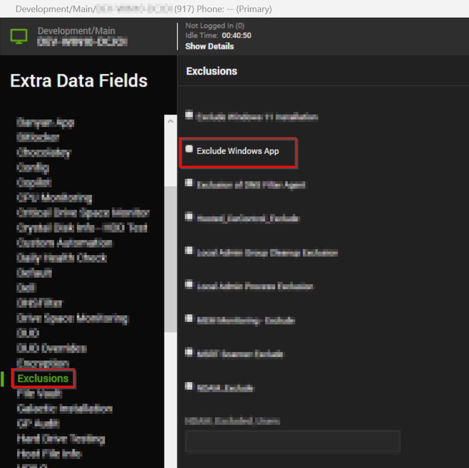

## Summary

- Install Windows App
- Creates a shortcut on desktop
- User must be logged on to the computer to run this script

## Sample Run

Execute the script with SetEnvironment = 1, to import the required EDFs.  
 
Normal execution of the script 

## Dependencies

[Solution - Install Windows App](/docs/0d8c4619-b666-44ec-93b1-2d00e4632865)

## User Parameter

| Name            | Example                                      | Required | Description                                                                                                                                                                |
|-----------------|----------------------------------------------|----------|----------------------------------------------------------------------------------------------------------------------------------------------------------------------------|
| SetEnvironment   | 1 | False    | Set it to 1, to import the required EDFs. It is needed to run with SetEnvironment = 1, just after importing the script. |

## EDFs

| Name           | Level  | Type  | Tab | Description             |
|-----------------|--------|--------|----------|-----------------------------------------------------------------------|
| Windows App | Client | Checkbox | Software | Flag this EDF to enable Auto deployment of Windows App Windows Workstations  |
| Exclude Windows App | Location | Checkbox | Exclusions | Flag this EDF to exclude the location from Windows App auto-deployment solution  |
| Exclude Windows App | Computer | Checkbox | Exclusions | Flag this EDF to exclude the computer from Windows App auto-deployment solution  |

## Output

- Script Log