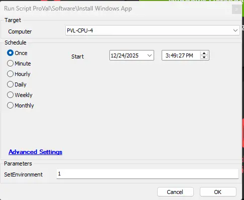
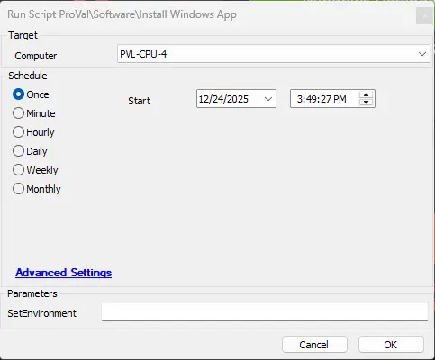
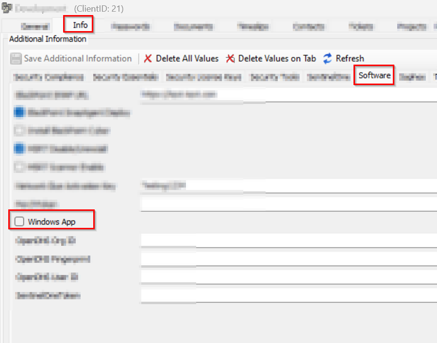
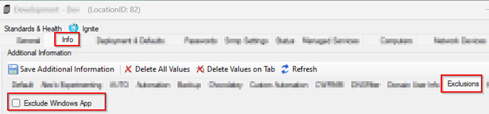
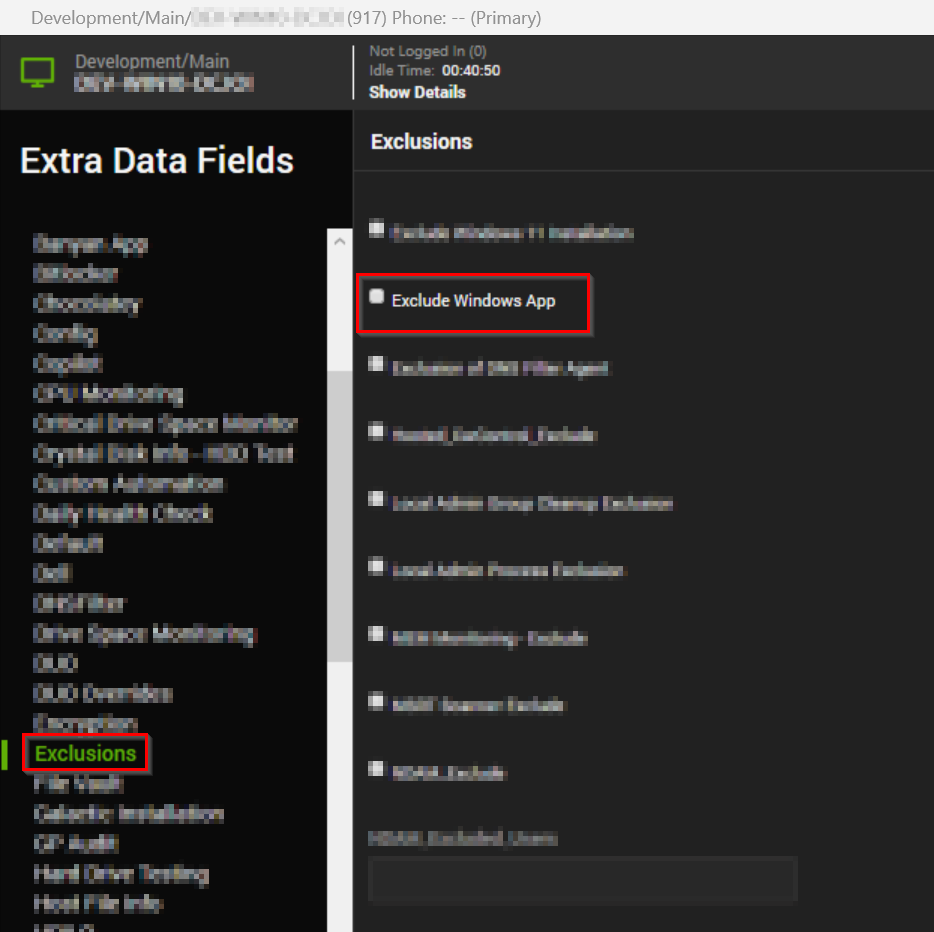

## Summary

This script installs Windows App and creates a shortcut on the Desktop of the logged in user. 

**NOTE:** User must be logged on to the computer to run this script.

## Scripts Path

- `C:\ProgramData\_automation\App\Winget\Install-Winget.ps1`  
- `C:\ProgramData\_Automation\Script\WindowsApp\Create-WindowsAppShortcut.ps1`  

## Sample Run

Execute the script with SetEnvironment = 1, to import the required EDFs.  

Normal execution of the script  

## Dependencies

- [Solution - Install Windows App](/docs/0d8c4619-b666-44ec-93b1-2d00e4632865)

## User Parameter

| Name            | Example                                      | Required | Description                                                                                                                                                                |
|-----------------|----------------------------------------------|----------|----------------------------------------------------------------------------------------------------------------------------------------------------------------------------|
| SetEnvironment   | 1 | False    | Set it to 1, to import the required EDFs. It is needed to run with SetEnvironment = 1, just after importing the script. |

## EDFs

| Name           | Level  | Type  | Tab | Description             |
|-----------------|--------|--------|----------|-----------------------------------------------------------------------|
| Windows App | Client | Checkbox | Software | Flag this EDF to enable Auto deployment of Windows App Windows Workstations  |
| Exclude Windows App | Location | Checkbox | Exclusions | Flag this EDF to exclude the location from Windows App auto-deployment solution  |
| Exclude Windows App | Computer | Checkbox | Exclusions | Flag this EDF to exclude the computer from Windows App auto-deployment solution  |

## Output

- Script Log

## Changelog

### 2026-03-12

- Signed the PowerShell scripts used by this script.

### 2026-01-20

- The agnostic for the script had bugs related to Invoke-webrequest and was throwing incorrect DISM Error When Adding "Provisioned" Package. After the agnostic got fixed, the automate implementation was updated to fix the failures.

### 2025-12-17

- Initial version of the document
