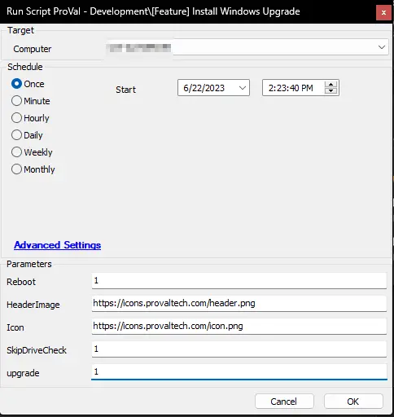
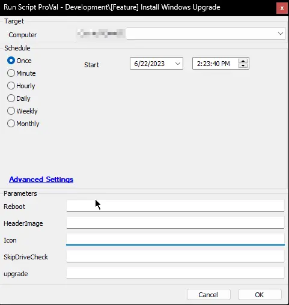
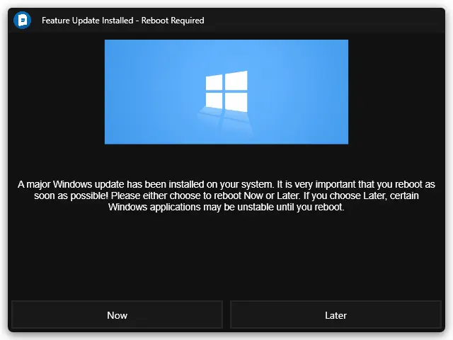

## Summary

This script installs the latest feature update on a Windows 10+ machine and provides an option to upgrade from Windows 10 to Windows 11. The script can be executed from the [ProVal - Production - Patching - Windows 10/11 Build Upgrades EOL Based](/docs/03e04bb6-5087-4e71-9d2f-a3596e9c291f) monitor set or executed manually.

**Note:** The script can create a ticket for failures. If a ticket category is specified in the monitor set, the script will produce a ticket under that category by default. Otherwise, it will create a ticket under the default ticket category.

**File Path:** `C:/ProgramData/_automation/script/Install-FeatureUpdate/Install-FeatureUpdateAI.ps1`

**File Hash:**
- **SHA256:** `FDC149710B3ABB35D5F61218AB658C9C8881FAEB18CC223E0F1666D8E0120CF9`
- **MD5:** `172D4F2C1BD272FEC4CB8568423DEB30`

## Sample Run

To upgrade a computer from Windows 10 to Windows 11, forcefully reboot it, skipping the Free Drive Space Check, and using a custom image/icon in the user's prompt:  

To install the latest available feature pack on a Windows 10+ machine, without restarting and using the default image/icon in the user's prompt:  

### Example Prompt

## Dependencies

- [Install-FeatureUpdate](/docs/b46b5ae2-47fe-43b7-ab91-f6901645b2fd)
- [Get SetupDiag Report](/docs/6042c7c0-dd54-4eda-8889-ef2ff879e5a2)
- [CWM - Automate - Script - Prompter](/docs/d8a124df-ea81-4194-82fc-a082c7a036d8)
- [SEC - Windows Patching - Custom Table - plugin_proval_windows_os_support](/docs/938cd822-f6a3-4ee3-add2-62b407e45622)
- [ProVal - Production - Patching - Windows 10/11 Build Upgrades EOL Based](/docs/03e04bb6-5087-4e71-9d2f-a3596e9c291f)

#### User Parameters

| Name           | Example                                                        | Required | Description                                                                                                                                                                                                 |
|----------------|----------------------------------------------------------------|----------|-------------------------------------------------------------------------------------------------------------------------------------------------------------------------------------------------------------|
| Reboot         | 1                                                              | False    | If set to 1, the script will reboot upon successful installation without prompting any currently logged-in user. Note: A reboot will be performed, ignoring this parameter, if no user is logged in. Set to 0 to disable. |
| HeaderImage    | [Header Image](https://icons.iconarchive.com/icons/martz90/circle-addon2/512/windows-update-icon.webp) | False    | The header image to display in the user prompt. Defaults to: [Default Header Image](https://winaero.com/blog/wp-content/uploads/2015/05/Windows-10-banner-logo-nodevs-01.webp)                         |
| Icon           | [Icon](https://icons.iconarchive.com/icons/martz90/circle-addon2/512/windows-update-icon.webp)            | False    | The icon to use for the user prompt. Defaults to: [Default Icon](https://icons.iconarchive.com/icons/martz90/circle-addon2/512/windows-update-icon.webp)                                                  |
| SkipDriveCheck | 1                                                              | False    | If set to 1, the script will not check the free space available on the computer before performing the update/upgrade. Note: By default, the script does not perform an update/upgrade if free space is less than 20 GB. |
| upgrade        | 1                                                              | False    | If set to 1 for Windows 10 computers, the script will attempt to upgrade the computer to Windows 11.                                                                                                       |

## Output

- Script Logs
- Tickets

## Ticketing

**Subject:**

- **For Windows Upgrade Failure:** `Windows Upgrade Failed for \\<ClientName>/\\<ComputerName>`
- **For Windows Feature Update Failure:** `Windows Feature Update Failed for \\<ClientName>/\\<ComputerName>`

**Body:**

**For any Security Application/AV blocking Script Execution:**  
`The Windows upgrade script was unable to run on the computer because it was blocked by a security application or antivirus program. Please add the necessary exclusions to the program blocking it and re-run the script.`

**For Premature Termination of the script:**  
`The upgrade process appears to have been interrupted because it terminated after %sqlresult% minutes, which is not enough time for an upgrade to be installed. Please review the below logs to determine the root cause.`  
`Further information about troubleshooting Windows upgrade failures can be found here: [Troubleshooting Guide](https://learn.microsoft.com/en-us/windows/deployment/upgrade/resolve-windows-10-upgrade-errors)`

Local Log Files  
----------------  
`\\<Path of log file on Local Computer>`  
`\\<Path of Error Log file on Local Computer>`

Information Log  
----------------  
`\\<Information Logs>`

Error Log  
----------------  
`\\<Error Logs if any>`

Script Output  
----------------  
`\\<PowerShell Script Output>`

**For Pre-Reboot Installation Failure:**  
`The script encountered an error when installing the Feature Update. Please review the below logs to determine the root cause.`  
Further information about troubleshooting Windows upgrade failures can be found here: [Troubleshooting Guide](https://learn.microsoft.com/en-us/windows/deployment/upgrade/resolve-windows-10-upgrade-errors)

Local Log Files  
----------------  
`\\<Path of log file on Local Computer>`  
`\\<Path of Error Log file on Local Computer>`

Information Log  
----------------  
`\\<Information Logs>`

Error Log  
----------------  
`\\<Error Logs if any>`

Script Output  
----------------  
`\\<PowerShell Script Output>`

**PowerShell Execution Failure:**  
`The script encountered an error when installing the Feature Update. It is not able to run PowerShell on the machine: \\<PowerShell Script Output>`

**If Reboot is suppressed and logged-in user misses the reboot prompt:**  
`The active user on the machine has not responded to the reboot prompt after a successful Feature Update installation. Post-reboot log analysis will be skipped. If you would like to perform this analysis at a later time, please execute the "Get SetupDiag Report" script after the machine has rebooted.`

Local Log Files  
----------------  
`\\<Path of log file on Local Computer>`  
`\\<Path of Error Log file on Local Computer>`

**If Reboot is suppressed and user selects to reboot the computer later:**  
`The active user on the machine has chosen to forego rebooting after a successful Feature Update installation. Post-reboot log analysis will be skipped. If you would like to perform this analysis at a later time, please execute the "Get SetupDiag Report" script after the machine has rebooted.`

Local Log Files  
----------------  
`\\<Path of log file on Local Computer>`  
`\\<Path of Error Log file on Local Computer>`

**If computer fails to check back Automate post-reboot:**  
`\\<ScriptName> has attempted Feature Update on %computername% and has pushed a reboot on the machine after installing the updates, but \\<computername> has not come back online after 1 hour. Post-reboot analysis will be unavailable. Please run the "Get SetupDiag Report" script after check-in to perform post-reboot analysis.`

Local Log Files  
----------------  
`\\<Path of log file on Local Computer>`  
`\\<Path of Error Log file on Local Computer>`

**For Post Reboot Update/Upgrade Failures:**  
`The script detected a post-reboot failure from the Feature Update install. Please review the below logs to determine the root cause.`  
Further information about these issues can be found here: [Troubleshooting Guide](https://learn.microsoft.com/en-us/windows/deployment/upgrade/setupdiag#rules)

Local Log Files  
----------------  
`\\<Path of log file on Local Computer>`  
`\\<Path of Error Log file on Local Computer>`

Information Log  
----------------  
`\\<Information Logs>`

Error Log  
----------------  
`\\<Error Logs if any>`

Setup Diag Result  
----------------  
`\\<Outcome of the SetupDiagTool verifying the upgrade process>`
