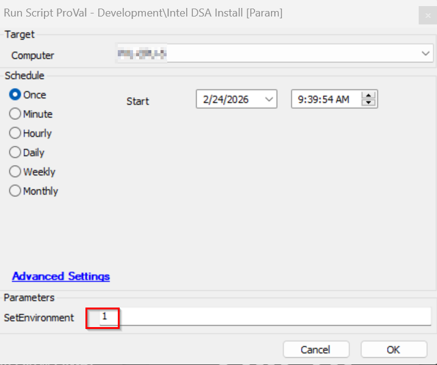
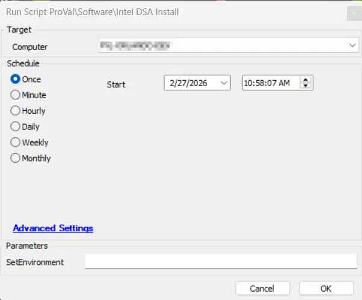

## Summary

Silently installs `Intel® Driver & Support Assistant` (DSA) on eligible Windows Workstations

## File Hash

**Potential File Name:** `C:\ProgramData\_Automation\Script\Intel-DSA\Intel-DSA-Install.ps1`  
**File Hash (Sha256):** `FED5144BDC6418F2CA4AB85F5049377E54F6AB582B3134A5EF5F89C0B16DEBEE`  
**File Hash (MD5):** `37443CA1E579E6B299FDC743FE89BAAD`  

## Dependencies

## Sample Run

- Run the script with the `SetEnvironment` parameter set to 1 after import to get the required EDFs imported for the deployment and exclusions.

- Run without passing the parameter value to perform the deployment

### User Parameters

| **Name**              | **Example**       | **Required** | **Description**                                                                                          |
|-----------------------|-------------------|--------------|----------------------------------------------------------------------------------------------------------|
| `SetEnvironment`            | `1`               | `False`      | If set to `1`, it will import the required EDFs for the deployment and exclusions.           |

## EDFs

| Name | Type | Level | Required | Editable | Description |
| ---------------- | -------- | -------- | ------- | ------- | --------------------------------------------------------------------------- |
| Intel DSA Deploy | Checkbox | Client | True | Yes | This EDF is required to be selected for the automated deployment of the Intel DSA on the Windows workstations that has Intel Processor |
| Exclude Intel DSA Deploy | Checkbox | Location | False | Yes | If this EDF is checked, the agents of the location will be excluded from the Intel DSA deployment |
| Exclude Intel DSA Deploy | Checkbox | Computer | False | Yes | If this EDF is checked, the agent will be excluded from the Intel DSA deployment |

## Process

Silently installs Intel® Driver & Support Assistant (DSA) on eligible endpoints.
  - Skips non-workstations.
  - Skips systems without Intel chipset/devices.
  - Skips if DSA already present.

.NOTES
  Tested with PowerShell 5.1 on Windows 10/11.

Article referred:
https://silentinstallhq.com/intel-driver-support-assistant-silent-install-how-to-guide

## Output

- Script Log