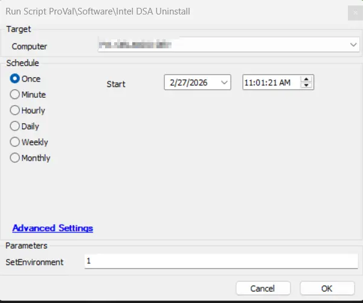
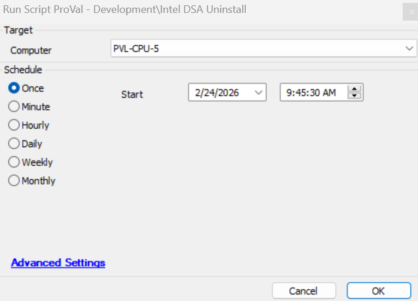

## Summary

Silently uninstalls `Intel® Driver & Support Assistant (DSA)` on eligible Windows Workstations

## File Hash

- **Potential File Name:** `C:\ProgramData\_Automation\Script\Intel-DSA\Intel-DSA-Uninstall.ps1`  
- **File Hash (Sha256):** - `D7FF5B2BC1BE68BFB0C53D7F9992F8BB021C808D50B7EB0AE8AC4BEDA238A82F`  
- **File Hash (MD5):** `9DC6F4DEC9B292F702AC9866E845BB2F`  

## Dependencies

- [Intel® Driver & Support Assistant Solution](/docs/26bda8e8-6bca-46c3-894f-3eb838340982)

## Sample Run

- Run the script with the `SetEnvironment` parameter set to 1 after import to get the required EDFs imported for the uninstallation and exclusions.

- Run without passing the parameter value to perform the uninstallation

### User Parameters

| **Name**              | **Example**       | **Required** | **Description**                                                                                          |
|-----------------------|-------------------|--------------|----------------------------------------------------------------------------------------------------------|
| `SetEnvironment`            | `1`               | `False`      | If set to `1`, it will import the required EDFs for the uninstallation and exclusions.           |

## EDFs

| Name | Type | Level | Section | Required | Editable | Description |
| ---------------- | -------- | -------- | ------- | ------- | ------- | --------------------------------------------------------------------------- |
| Intel DSA Uninstall | Checkbox | Client | Intel DSA  |  True | Yes | This EDF is required to be selected for the automated uninstallation of the Intel DSA on the Windows workstations that has Intel Processor |
| Exclude Intel DSA Uninstall | Checkbox | Location | Exclusions  |   False | Yes | If this EDF is checked, the agents of the location will be excluded from the Intel DSA Uninstallation. |
| Exclude Intel DSA Uninstall | Checkbox | Computer |  Exclusions |   False | Yes | If this EDF is checked, the agent will be excluded from the Intel DSA Uninstallation. |

## Process

Silently uninstalls the Intel® Driver & Support Assistant (DSA) on eligible endpoints.
  - Skips non-workstations.
  - Skips systems without Intel chipset/devices.
  - Skips if DSA not present.

**Article referred:
https://silentinstallhq.com/intel-driver-support-assistant-silent-install-how-to-guide**

## Output

- Script Log