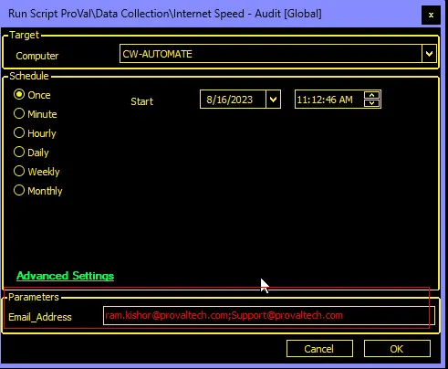

## Summary

This document outlines how to run an internet speed test via the Ookla SpeedTest CLI application.

## File Hash

**File Path:** `C:\ProgramData\_automation\Script\Test-InternetSpeed\Test-InternetSpeed.ps1`  
**File Hash (Sha256):** `2D70C5A612F8C8165FD0A5B47A24239306A83B489C930261C767873E553211E9`  
**File Hash (MD5):** `33998CAE3EA48E30B2045BD1995BF129`  
**File Path:** `C:\ProgramData\_automation\Script\Test-InternetSpeed\Test-InternetSpeedAI.ps1`  
**File Hash (Sha256):** `2279B5673CE633C7CBC5448833473332D02ED33DB3E9A9EFFB6DDBD231E57403`  
**File Hash (MD5):** `5FF7C683388CC6B45875035BC8C4ACD7`  

## Sample Run

Save the result to the database only.  
  
Save the result/output to the database and email it to [ram.kishor@provaltech.com](mailto:ram.kishor@provaltech.com).  
  
Save the result to the database and email it to both [ram.kishor@provaltech.com](mailto:ram.kishor@provaltech.com) and [support@provaltech.com](mailto:support@provaltech.com).  
  

## Dependencies

[Test-InternetSpeed](/docs/12946fed-d74f-4977-b59d-85d5c639b56b)  

## User Parameter

| Name            | Example                                      | Required | Description                                                                                                                                                                |
|-----------------|----------------------------------------------|----------|----------------------------------------------------------------------------------------------------------------------------------------------------------------------------|
| Email_Address   | [support@provaltech.com](mailto:support@provaltech.com) | False    | Emails the result to the provided email address(es). Multiple email addresses should be separated by a semicolon (;). e.g., [ram.kishor@provaltech.com](mailto:ram.kishor@provaltech.com); [support@provaltech.com](mailto:support@provaltech.com) |

## Global Parameters

| Name                | Example | Required | Description                                                                                                           |
|---------------------|---------|----------|-----------------------------------------------------------------------------------------------------------------------|
| Retention            | 60      | True     | This sets the table data retention for each device; if the data is older than the retention value, it will be deleted. |
| Delete_Old_Data     | 1       | False    | If set to 1, then the deletion of data will work; otherwise, it will be skipped. By default, the value is set to 0 to skip. |

## Output

- Script Log
- Local File
- Custom Table
- Dataview
- Email (if an email address is provided in the user parameter)

## Sample Email

