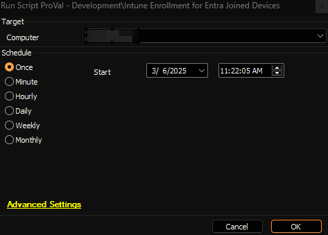

## Summary  

The script automates the Microsoft Intune enrollment process for Entra joined Windows devices.

**Note:** The end machine may require a restart to complete the enrollment process.

### Requirements

- Windows 10/11 device  
- PowerShell 5.1 or later  
- Azure AD joined status

## File Hash

**File Path:** `C:\ProgramData\_Automation\Script\Initialize-IntuneEnrollment\Initialize-IntuneEnrollment.ps1`  
**File Hash (Sha256):** `0750CF212F2BA69DF2A30B4D0215CF57DBAE61E5D7A0FBC96EBDE73B353275C7`  
**File Hash (MD5):** `DFA3C56BBBBF00EC8E4B9D5B42801FB0`

## Sample Run

## Variables

| Name | Description |
| ---- | ----------- |
| projectName | Initialize-IntuneEnrollment |
| workingDirectory | C:\ProgramData\_Automation\Script\Initialize-IntuneEnrollment |
| ps1Path | C:\ProgramData\_Automation\Script\Initialize-IntuneEnrollment\Initialize-IntuneEnrollment.ps1 |

## Output

- Script Log