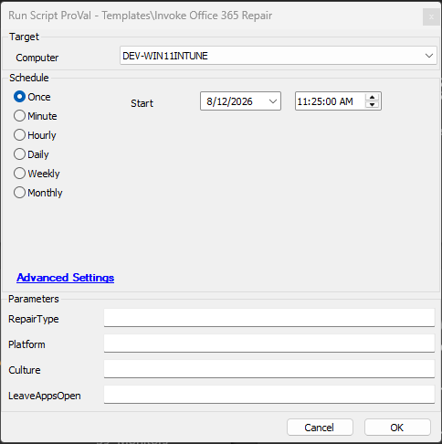
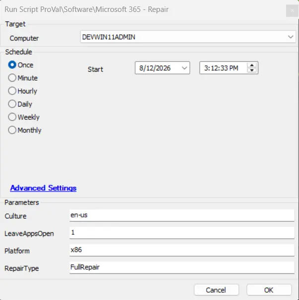

## Summary

 This script contains no repair logic of its own. It is the RMM-side wrapper whose only job is to fetch the real script and prove it is trustworthy before letting it run. The repair itself - the OfficeClickToRun.exe 'scenario=Repair' work, its platform/culture detection and its wait handling - lives entirely in 'Invoke-Office365Repair.ps1'.

## Dependencies

- [Agnostic - Invoke-Office365Repair](/docs/b5cb3a64-95d8-4d68-be9f-a4e978923112)

## Sample Run

Provide the value for the parameters as referred in the screenshot

- **Note**: The available input validate set for the params are:
`RepairType` accepts ('QuickRepair', 'FullRepair')
`Platform` accepts ('', 'x86', 'x64', 'arm64')
`Culture` is a string that accepts language code like 'en-us'
`LeaveAppsOpen` accepts ('', '0', '1', 'True', 'False')

## User Parameters

| Name | Required | Example | Description   |
|---------|---------|---------|---------|
| RepairType | True | 'QuickRepair', 'FullRepair' | This provides option to quick (short) or full (complete) repair for the Office 365 |
| Platform | False | '', 'x86', 'x64', 'arm64' | This provides the option to select the platform that Office 365 uses |
| Culture | False | 'en-us' | The language code used to validate the existing installation binaries in the input language |
| LeaveAppsOpen | True | '', '0', '1', 'True', 'False' | If 1 or true, then ForceAppShutdown is false, and vice versa | 

## Output

- Script Log
- C:\ProgramData\_Automation\Script\Invoke-Office365Repair\Invoke-Office365Repair-Log.txt
- C:\ProgramData\_Automation\Script\Invoke-Office365Repair\Invoke-Office365Repair-error.txt

## Changelog

### 2026-08-12

- Initial version of the document