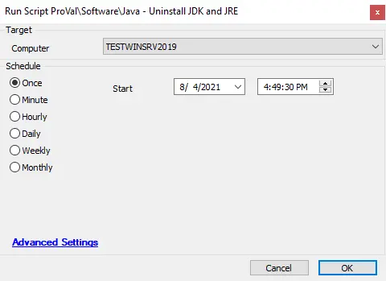

## Summary

This script checks and uninstalls all installed versions of Java from the target machine. It creates a `RemoveJAVA.cmd` file, which is then executed to uninstall Java from the machine.

**Time Saved by Automation:** 5 Minutes

## Sample Run

## Dependencies

- Windows OS
- Java Removal Procedure (Agnostic content)

## Variables

- `@SoftwareCnt@` -> The number of versions of Java installed

## Process

1. The script verifies that Java is installed.
2. It counts how many versions of Java are installed on the machine.
3. It writes the required uninstall `RemoveJAVA.cmd` file and runs it.
4. The script loops through each detected Java installation.
5. It verifies that all versions of Java are removed.
   - Logs a failure in the Automate's script logs if any Java installation is still detected.

## Output

- Script log
