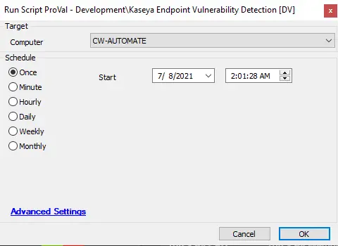

## Summary

This script checks Kaseya endpoints that have been exposed or are vulnerable to the REvil attack.

**Time Saved by Automation:** 10 Minutes

## Sample Run

## Dependencies

[Kaseya Vulnerability Audit](/docs/4c9692d8-b924-4901-a9c6-81b57d95b898)

#### Script States

| Name                     | Example                   | Description                                                                                     |
|--------------------------|---------------------------|-------------------------------------------------------------------------------------------------|
| VSAEndpointDetection      | Safe -- %shellresult%     | This will store the PowerShell output and, using a comparator, will indicate whether the machine is safe or vulnerable. |

## Process

- This script runs a PowerShell command on machines to check for suspicious certificates, suspicious executables, suspicious encryption, and whether the machine is vulnerable or not.
- It logs the complete result and status, indicating whether the agent is vulnerable or safe.

## Output

- Script log
- Script state
- Dataview
