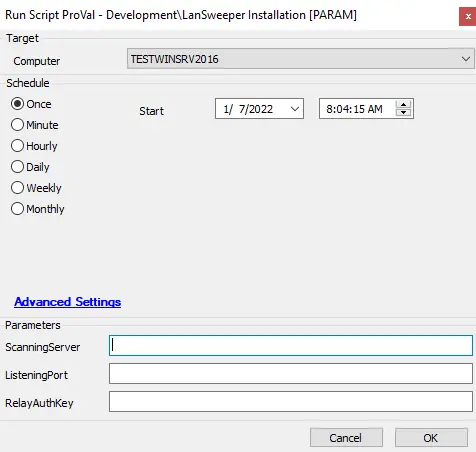
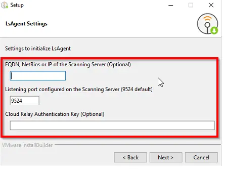

## Summary

Installs the LanSweeper agent.  
[Download LanSweeper Agent](https://www.lansweeper.com/download/lsagent/)

## Sample Run

## Dependencies

[Download LanSweeper Agent](https://www.lansweeper.com/download/lsagent/)

#### User Parameters

| Name            | Example                     | Required | Description                                           |
|-----------------|-----------------------------|----------|-------------------------------------------------------|
| ScanningServer   | FQDN, NetBIOS, or IP       | False    | The FQDN, NetBIOS, or IP of the scanning server      |
| ListeningPort    | 9524                        | False    | Listening port configured for the scanning server     |
| RelayAuthKey     | Key                         | False    | Cloud Relay Authentication Key                         |

## Process

[Silently Installing LanSweeper Agent](https://www.lansweeper.com/knowledgebase/silently-installing-lsagent-on-a-windows-linux-or-mac-computer/)  
The installation depends on three parameters to complete successfully:  
  

Once the values are provided during script execution, the LsAgent will be successfully installed.

## Output

- Script log
