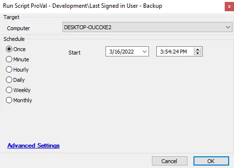

## Summary

This script is used to store the last signed-in user so PRONOC users can run this script prior to logging in, allowing them to restore the computer to the state it was in before logging in after work is completed.

## Sample Run

## Variables

| Name          | Description                                                                                       |
|---------------|---------------------------------------------------------------------------------------------------|
| LogonBackup   | Collects information about whether the backup was taken successfully or not. The registry backup is located at: C:/Temp/Logonbackup/logonexport.reg |

## Process

This script stores the last signed-in user information from the registry as a backup on the local computer. It saves the last logged-in user data to the file "C:/Temp/Logonbackup/logonexport.reg". It then checks the results of the returned script for errors and logs this information.

## Output

- Script log
