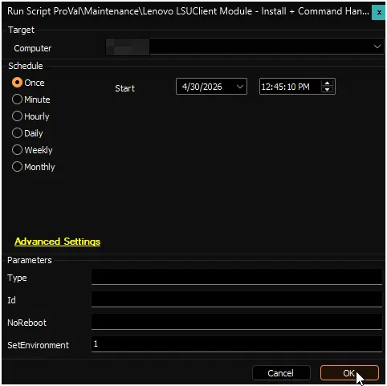
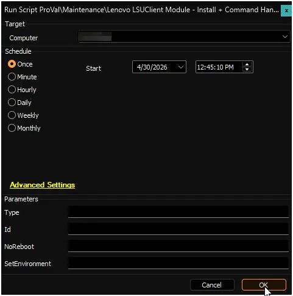
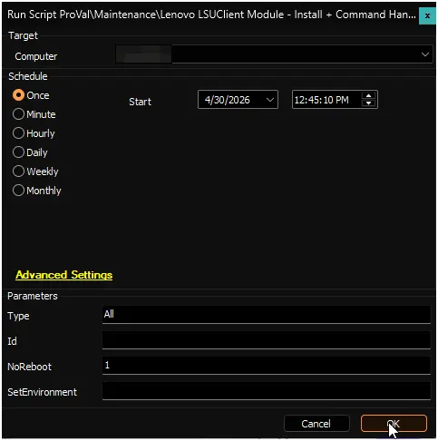
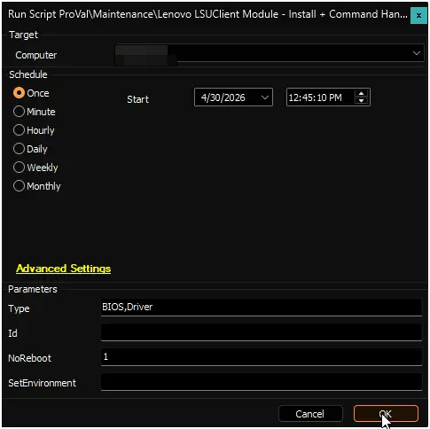
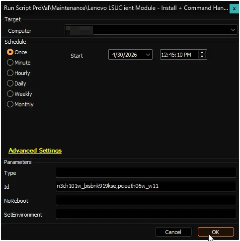

## Summary

The LSUClient module is used by this script to manage and carry out updates on Lenovo Workstations. If the module isn't already installed, it will be automatically installed.
This script provides the feature to perform a Lenovo System Update scanning audit to list available updates if no arguments are passed, or it can execute specific update actions (such as installing drivers, software, or firmware) if parameters are passed.

**Supported OS:** Windows 10, Windows 11

**Note:**

1. The systems must be compatible Lenovo hardware. The script will automatically validate the manufacturer and OS compatibility before proceeding.  
2. ProVal does not recommend performing BIOS updates remotely. ProVal is not responsible for any failed devices due to remote BIOS updates. BIOS updates are performed at the MSP's risk. Critical BIOS/firmware updates may initiate low-level hardware restarts that bypass OS-level controls and trigger immediate reboots regardless of the `NoReboot` parameter.

## Dependencies

- [PowerShell: Install-LenovoUpdates](/docs/3640e534-d089-4304-89ba-68d3bc113978)
- [Custom Table: pvl_lsuclient_audit](/docs/14af3c59-efba-4f62-959a-50ad6e382836)
- [Script: OverFlowedVariable - SQL Insert - Execute](/docs/34cee8fe-1b6b-4558-a890-2face427ceb8)
- [Solution: Lenovo System Update Handler](/docs/d801eded-6c8e-413b-852a-5ff83058667b)

## Sample Run

Run the script with the `SetEnvironment` parameter set to `1` after import to get the required EDFs imported for the HP Image Assistant scanning and exclusions. It will also create the custom table [pvl_lsuclient_audit](/docs/14af3c59-efba-4f62-959a-50ad6e382836).  

**Example 1:**

Running the script without passing arguments to perform a default scan and return the available updates.  
**Type:** `<Blank>`  
**Id:** `<Blank>`  

**Example 2:**

Running the script to silently install all available updates that support unattended installation.  
**Type:** `All`  
**NoReboot:** `1`  

**Example 3:**

Running the script to silently install only BIOS and driver updates while suppressing automatic reboots.  
**Type:** `BIOS,Driver`  
**NoReboot:** `1`  

**Example 4:**

Running the script to install specific updates by their IDs.  
**Id:** `n3ch101w_bisbnk919kse,pcieeth06w_w11`  

## User Parameters

| Name     | Example | Required | Description                                                                                                                                                                                                                                         |
|----------|---------|----------|-----------------------------------------------------------------------------------------------------------------------------------------------------------------------------------------------------------------------------------------------------|
| `SetEnvironment`            | `1`               | `First Run Only`      | If set to `1`, it will import the required EDFs for the HP Image Assistant scanning and exclusions, and it will also create the custom table [pvl_lsuclient_audit](/docs/14af3c59-efba-4f62-959a-50ad6e382836).           |
| `Type`  | <ul><li>`<Blank>`</li><li>`All`</li><li>`Application`</li><li>`BIOS`</li><li>`Driver`</li><li>`Firmware`</li></ul>   | `False`    | Specifies the update type to install. Accepts a single string or comma-separated list. Updates must support unattended installation and be applicable to the system. Use 'All' for every available update. |
| `Id`    | `n3ch101w_bisbnk919kse` | `False` | Specifies the ID(s) of specific update(s) to install. Accepts a single string or comma-separated list. |
| `NoReboot` | <ul><li>`0`</li><li>`1`</li></ul> | `False` | Pass `1` to suppress automatic reboots after installation. |

## Global Variables

| Name  | Example | Required | Description |
| ----- | ------- | -------- | ----------- |
| `Debug` | <ul><li>`False`</li><li>`True`</li></ul>   | False    | When `True`, enables informational logging; when `False` (default), informational logs are suppressed to avoid adding entries to the `h_scripts` table. Set to `True` to assist with troubleshooting. |

## EDFs

| Name | Type | Level | Section | Required | Editable | Description |
| ---------------- | -------- | -------- | ------- | ------- | ------- | --------------------------------------------------------------------------- |
| Lenovo System Update Audit | Checkbox | Client | Lenovo  | True | Yes | This EDF is required to be selected for the automated deployment of the Lenovo System Update scanning on Windows machines. |
| Exclude Lenovo System Update Scan | Checkbox | Location | Exclusions  | False | Yes | If this EDF is checked, the agents of the location will be excluded from the Lenovo System Update scanning. |
| Exclude Lenovo System Update Scan | Checkbox | Computer |  Exclusions | False | Yes | If this EDF is checked, the agent will be excluded from the Lenovo System Update scanning. |

## Output

- Script Log
- [Custom Table: pvl_lsuclient_audit](/docs/14af3c59-efba-4f62-959a-50ad6e382836)
- [Dataview: Lenovo System Update Audit](/docs/537b1c7c-5f38-4915-847f-3682339e9211)

## Changelog

### 2026-04-30

- Initial version of the document.
