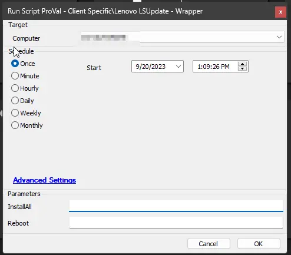
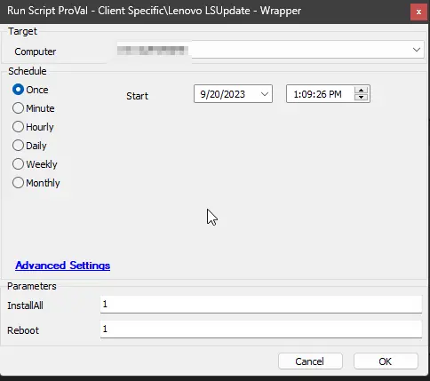

## Summary

This script uses the PowerShell module `LSUClient` to install available BIOS updates for Lenovo machines. The `InstallAll` parameter can be used to install all available vendor updates, including BIOS, firmware, and drivers.

## Warning

It is generally not recommended to automate `driver` and `firmware` updates on machines since they can cause unexpected results. In some rare cases, they may cause machines to stop functioning afterward.

Also, please note that the computer can be restarted even without setting the `Reboot` parameter while installing all available updates. Therefore, the `InstallAll` parameter should be used with caution.

---

## Sample Run

- Install available BIOS updates without restarting the computer:  
  

- Install available BIOS updates and restart the computer immediately:  
  

- Install all available updates without restarting the computer: (This option may not work as desired, because the reboot cannot be fully suppressed while installing `driver` and `firmware` updates.)  
  

- Install all available updates and restart the computer immediately:  
  

---

## Dependencies

PowerShell Version 5+

---

## Variables

| Name        | Description                                                  |
|-------------|--------------------------------------------------------------|
| LogMessage  | The log message to be sent to the script log for the target. |

---

## User Parameters

| Name       | Example | Required | Description                                                                                       |
|------------|---------|----------|---------------------------------------------------------------------------------------------------|
| Reboot     | 1       | False    | Script will restart the computer if this parameter is set to 1 and a restart is required for the update. |
| InstallAll | 1       | False    | Set this parameter to 1 to install all available vendor updates including driver, firmware, and BIOS updates. **USE THIS OPTION WITH CAUTION** |

---

## Output

- Script logs