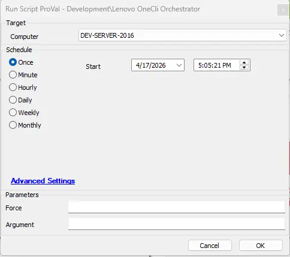
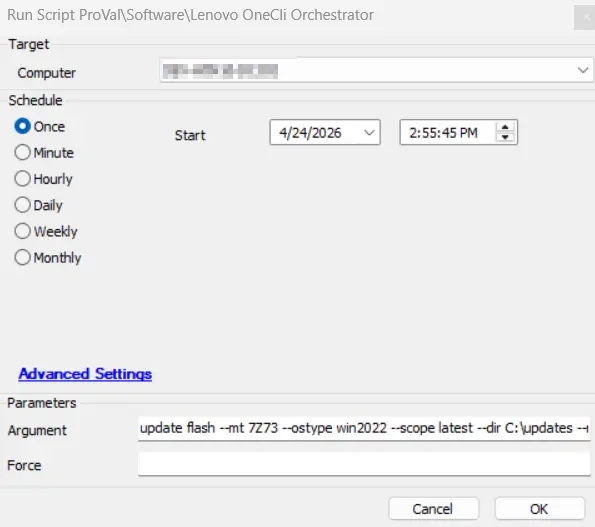
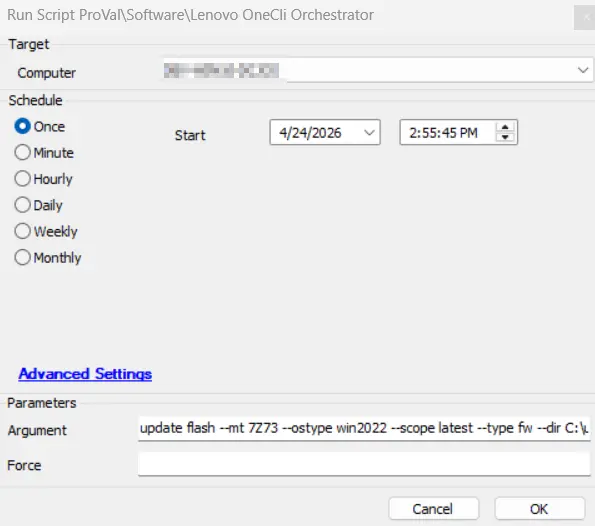
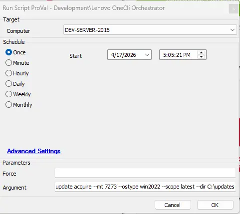
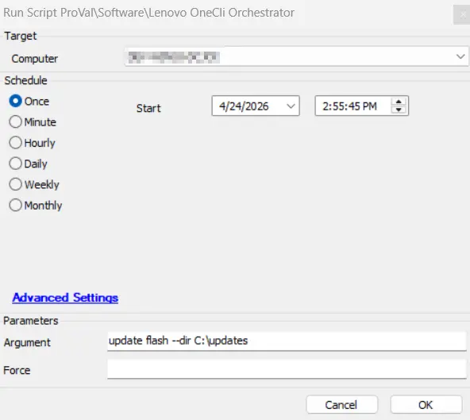

## Summary
Lenovo OneCLI is a comprehensive management utility that enables centralized discovery, inventory, and lifecycle management of firmware and driver updates for supported Lenovo servers and systems. It provides capabilities for scanning systems, downloading updates, and deploying firmware and driver patches across ThinkEdge, ThinkSystem, ThinkServer, and Wentian platforms.

This is an automate implementation of [Invoke-LenovoOneCLI](/docs/b689dc40-1f6d-4a1b-aca8-d5d5e3ccbb6b). It is designed to manage firmware and driver updates on supported Lenovo systems(specially servers) using Lenovo OneCLI.

The script handles the deployment of Lenovo OneCLI on the target machine and enables the execution of OneCLI commands to perform system updates and maintenance tasks.

Supported Lenovo OneCLI commands can be found at https://pubs.lenovo.com/lxce-onecli/onecli_bk.pdf

## Dependencies

- [Invoke-LenovoOneCLI](/docs/b689dc40-1f6d-4a1b-aca8-d5d5e3ccbb6b)

## Sample Run

**Example 1:**

Running the script to return the available updates.   
 

Running the script to Download and immediately apply all updates without any reboot or prompts:  
**Arguments:** `update flash --mt 7Z73 --ostype win2022 --scope latest --dir C:\updates --noreboot --quiet`  
**Notes** `--mt`(machines type) and `ostype` varies as per machine.  
 

Running the script to Download and immediately apply firmware updates without any reboot or prompts:  
**Arguments:** `update flash --mt 7Z73 --ostype win2022 --scope latest --type fw --dir C:\updates --noreboot --quiet`  
**Notes** `--mt`(machines type) and `ostype` varies as per machine.  
 

Running the script to Download and immediately apply driver updates without any reboot or prompts:  
**Arguments:** `update flash --mt 7Z73 --ostype win2022 --scope latest --type dd --dir C:\updates --noreboot --quiet`  
**Notes** `--mt`(machines type) and `ostype` varies as per machine.  

Running the script to Download all latest updates:  
**Arguments:** `update acquire --mt 7Z73 --ostype win2022 --scope latest --dir C:\updates`  
**Notes** `--mt`(machines type) and `ostype` varies as per machine.  
 

Running the script to Apply all downloaded updates:  
**Arguments:** `update flash --dir C:\updates`  
**Notes** `--mt`(machines type) and `ostype` varies as per machine.  

## User Parameters

| Name | Required | Example | Description   |
|---------|---------|---------|---------|
|`Force` | False | <ul><li>`True`</li><li>`False`</li></ul> | Set it to `True` to deploy Lenovo OneCli even if it already exists on the machine. |
|`Argument` | False | <ul><li>`update --mt 7Z73 --ostype win2022 --scope latest --dir C:\updates --noreboot --quiet`</li><li>`update --mt 7Z73 --ostype win2022 --scope latest --dir C:\updates`</li><li>`update acquire --mt 7Z73 --ostype win2022 --scope latest --dir C:\updates`</li><li>`update acquire --mt 7Z73 --ostype win2022 --scope latest --dir C:\updates --type fw`</li><li>`update acquire --mt 7Z73 --ostype win2022 --scope latest --dir C:\updates --type dd`</li><li>`update flash --dir C:\updates`</li><li>`update flash --dir C:\updates --type fw`</li><li>`update flash --dir C:\updates --type dd`</li> </ul><b></b> <ul>`--mt` is machine type which will vary according to the machine type.</ul> <b></b> <ul> `--ostype` ostype will also vary as per machine's OS. Provide it in this format only.</ul><ul>`--fw` is for firmware updates</ul><ul>`--dd` is for driver updates</ul> <b></b><ul> Default Command used with script if no argument is passed. It will scan all the available updates on the machine and will store it in the provided directory. `update scan --output $workingDirectory`</ul><ul>**Notes :** Download directory must be same to download and apply updates separately.</ul> | Custom argument string passed to `Onecli.exe`. If omitted, the script uses the default scan command. |

## Global Parameters

| Name | Required | Example | Description   |
|---------|---------|---------|---------|
| `URL` | True | https://download.lenovo.com/servers/mig/2025/11/10/63602/lnvgy_utl_lxce_onecli01s-5.4.0_windows_indiv.zip | URL for the OneCLI ZIP to download. Available from the Lenovo support website (https://support.lenovo.com/solutions/lnvo-tcli) <b></b>  <B><U>Note</U></B> : This URL must be changed whenever a new Onecli version is released to keep OneCli up to date. |

**Notes:**

- If no `Argument` is specified, the script performs a default scan and lists available updates, storing results in the working directory.
- If `Argument` is provided, the script executes `Onecli.exe` with the specified arguments.
- Supported Lenovo OneCLI commands to be used with Onecli can be found at https://pubs.lenovo.com/lxce-onecli/onecli_bk.pdf
- The OneCLI download URL is version-specific and changes when new releases are published. To obtain the latest URL, visit https://support.lenovo.com/solutions/lnvo-tcli, locate the OneCLI Windows Utility package in the downloads section, and copy the download link from the Payload Files section.

## Output

- Script Logs

## Changelog

### 2026-04-17

- Initial version of the document
