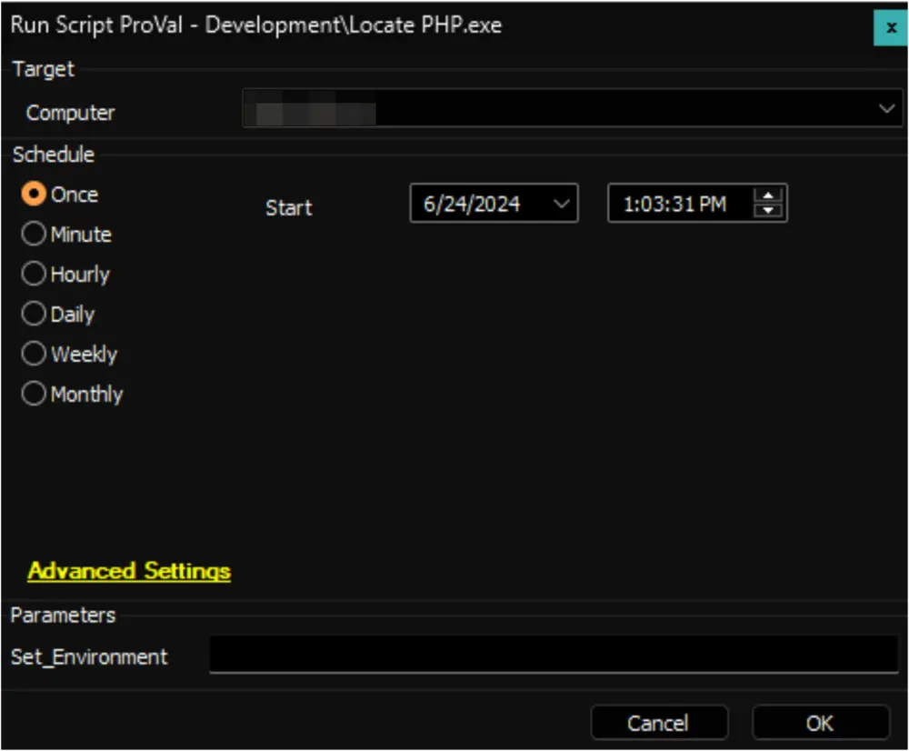

## Summary

The script uses [Everything.exe](https://www.voidtools.com/) to locate `php.exe` present on the machine and stores the data into a [custom table](/docs/10712956-11f1-47f6-ab0a-d063d2ca67d1).

## Sample Run

**First Run**: Run the script with the `Set_Environment` parameter set to `1` after importing it to create the [custom table](/docs/10712956-11f1-47f6-ab0a-d063d2ca67d1) and the EDF being used by the script.  

**Regular Execution**:  

## Variables

| Name                | Description                     |
|---------------------|---------------------------------|
| ProjectName         | Get-EverythingSearch            |
| WorkingDirectory@   | C:/ProgramData/_Automation/Script/Get-EverythingSearch |

## Global Parameters

| Name         | Value         | Required | Description                                        |
|--------------|---------------|----------|----------------------------------------------------|
| SearchString | ^PHP/.exe$    | True     | Regular expression of the file name to look for.  |

## User Parameters

| Name            | Example | Required                | Description                                                                                          |
|-----------------|---------|-------------------------|------------------------------------------------------------------------------------------------------|
| Set_Environment  | 1       | For the First Run       | Run the script with the `Set_Environment` parameter set to `1` after importing it to create the [custom table](/docs/10712956-11f1-47f6-ab0a-d063d2ca67d1) and the EDF being used by the script. |

## Client Level EDF

| Name          | Section  | Required | Description                                              |
|---------------|----------|----------|----------------------------------------------------------|
| Find PHP.exe  | Default  | True     | Mark this EDF to enable the auditing for the client.     |

## Output

- Script Log
- Dataview
