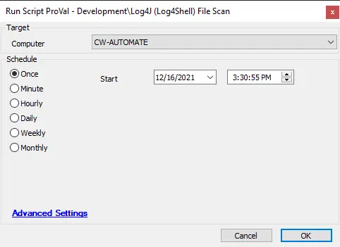

## Summary

This script is used to scan for possible vulnerabilities in a target system, saving information to EDFs for reporting. This script utilizes a fork of the Datto RMM provided script here: [Datto Log4Shell Tool](https://github.com/datto/log4shell-tool). The fork of the script is available here: [ProVal-Tech Log4Shell Tool](https://github.com/ProVal-Tech/log4shell-tool).

## Update Notice: 13 June 2024

The script has been updated to remove the leftovers along with the `Everything` service.

## Sample Run

## Dependencies

Refer to the [ProVal-Tech Log4Shell Tool](https://github.com/ProVal-Tech/log4shell-tool) for dependencies.

## Process

See [ProVal-Tech Log4Shell Tool](https://github.com/ProVal-Tech/log4shell-tool) for detailed processes.

The script will save information to the following EDFs based on the output of the script:

- Log4J_Log4Shell Vulnerable Files Detected
- Log4J_Log4Shell Attack Attempts Detected
- Log4J_Log4Shell Vulnerable Libraries Detected
- Log4J_Log4Shell Log Location
- Log4J_Log4Shell Luna Log Location
- Log4J_Log4Shell YARA Log Location
- Log4J_Log4Shell Last Scan

These EDFs are also presented in the dataview [SEC - Endpoint Protection - Dataview - Log4J - Log4Shell - Detections](/docs/59595d20-d1f8-4406-b574-58a4d32b0384).

The script will also upload the log files to the LTShare, which can be found in the Computer Management screen. Below is a brief video detailing the solution and how to use it.

## Output

- Script log
- Local file on computer
- Dataview
- EDFs