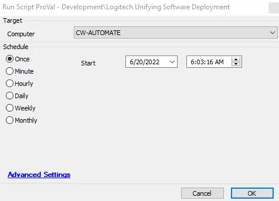

## Summary

This document provides a guide for installing the Logitech Unifying Software.

## Requirements

1. OS version requirements are set by the installer; please refer to the Logitech site for the specific OS requirements.
2. The download URL will depend on the required version and will need to be changed to match the desired version.

## Sample Run

## Global Parameter

| Name         | Example                                                                                                           | Remark | Description                                   |
|--------------|-------------------------------------------------------------------------------------------------------------------|--------|-----------------------------------------------|
| URL_Download | [https://download01.logi.com/web/ftp/pub/techsupport/unifying/unifying252.exe](https://download01.logi.com/web/ftp/pub/techsupport/unifying/unifying252.exe) | True   | The URL to download the Unifying software      |

## Dependencies

The installation depends on the Logitech URL provided above. The URL may vary for different versions.

## Process

This script will install a specified version of the Logitech Unifying Software based on the URL provided in the Global Parameter. It includes error handling to ensure the application installation is completed successfully.

## Output

- Script log