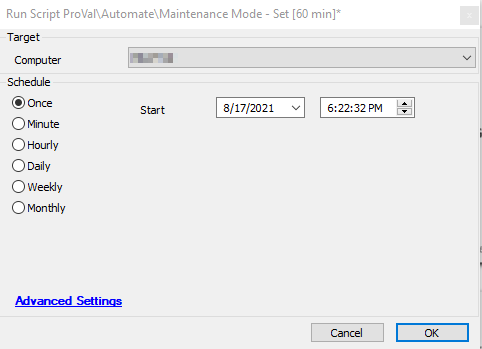

## Summary

The script sets maintenance mode for 60 minutes on the agent.

**Time Saved by Automation:** 5 Minutes

## Sample Run

## Process

- The script runs a default Automate function to set the maintenance mode on the target machine.

