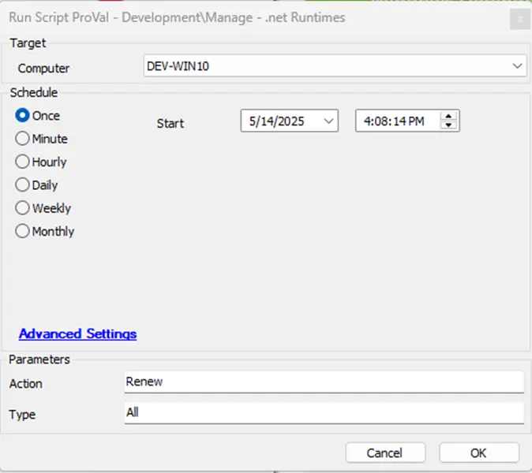

## Summary
This script ensures that the system is running the latest supported versions of .NET runtimes and SDKs while removing unsupported versions to maintain a clean and secure environment. It manages the installation, uninstallation, and listing of .NET runtimes and SDKs on a Windows system.

**NOTE:**
- Uninstalling/Installing SDK will uninstall/Install the associated version of AspNetCoreRuntime, DesktopRuntime and Runtime
- Uninstalling/Installing DesktopRuntime will Uninstall/Install the associated version of Runtime

## Dependencies
- [Agnostic - Optimize-DotNetRunTime](/docs/6ec8fb3c-29ef-4b05-b8fd-546eb07176c7)  

## Sample Run

## User Parameters
| Name     | Example                                      | Mandatory | Description                                                                                                                                                                                                                     |
|----------|----------------------------------------------|-----------|-----------------------------------------------------------------------------------------------------------------------------------------------------------------------------------------|
| `Action` | List  Install  Uninstall  Renew | False     | Specifies the action to perform. Valid values are:    <ul><li>`list`: Lists all installed .NET runtimes and SDKs.</li><li> `install`: Installs the latest supported versions of .NET runtimes and SDKs. </li><li> `uninstall`: Uninstalls unsupported or specific versions of .NET runtimes and SDKs. </li><li> `renew`: Removes all unsupported versions of .NET runtimes and SDKs and installs the latest available version.</li></ul> **Note:** Default Action is `list` |
| `Type`   | Sdk  Runtime  Desktopruntime  aspNetCoreRuntime  all | False     | Specifies the type of .NET component to manage. Valid values are:    <ul><li>`sdk`: Manages .NET SDKs. </li><li> `runtime`: Manages .NET runtimes. </li><li> `desktopRuntime`: Manages .NET desktop runtimes. </li><li>`aspNetCoreRuntime`: Manages ASP.NET Core runtimes. </li><li>`all`: Manages all .NET components. </li></ul> **Note:** Default Type is `desktopRuntime`|

## Output
- Script Logs