## Summary

This Automate implementation helps keep .NET on Windows devices clean, current, and secure. It can list installed .NET components, install the latest supported versions, update patch releases, remove unsupported versions, or perform a full cleanup and refresh.

The script checks Microsoft release data in real time, then uses that information to decide what to install, update, or remove. This reduces manual effort and lowers the risk of keeping outdated .NET versions.

When you run this script, expect software changes on the endpoint. Depending on the selected action, it may download installers, silently install updates, and remove older versions. A stable internet connection and administrator access are required.

**NOTE:**

- Installing or uninstalling `sdk` can also install or remove related `aspNetCoreRuntime`, `desktopRuntime`, and `runtime` components.
- Installing or uninstalling `desktopRuntime` can also install or remove the related `runtime`.
- For actions other than `list`, if `Type` is not provided, the script uses `desktopRuntime` by default.
- Install and update use the machine's native architecture installer (for example, x64 installer on x64 machines).
- If x86 components already exist on a machine, the script can detect and remove outdated x86 components during `uninstall`, `update`, and `renew`.
- Use `Version` carefully:
  - For `list`, `install`, `uninstall`, and `update`, you can target specific major versions (including unsupported versions).
  - For `renew` with `Version`, all specified versions must still be supported. If any are unsupported, the action will stop.
- Set `Force` to `1` to apply force removal behavior. Any other value (or blank) means force is not applied.
- For `uninstall`, `update`, and `renew`, older-version cleanup primarily targets components detected by `dotnet.exe`. With `Force = 1`, cleanup can also remove .NET entries found through uninstall registry data and package metadata, including components that `dotnet.exe` does not list.
- `renew` is the most aggressive option. It can remove versions you are not targeting. Review your required application dependencies before using it.

## Dependencies

- [Optimize-DotNetRunTime](/docs/6ec8fb3c-29ef-4b05-b8fd-546eb07176c7)  

## Sample Run

> **Note:** *You will notice the Force parameter is missing in screenshots for examples 1 to 15. We spared both your eyes and my wrists from updating 15 screenshots for a value that is not used there. Examples 16 and 17 include Force, so those screenshots show the extra field. :)*

### Example 1: List all installed .NET components

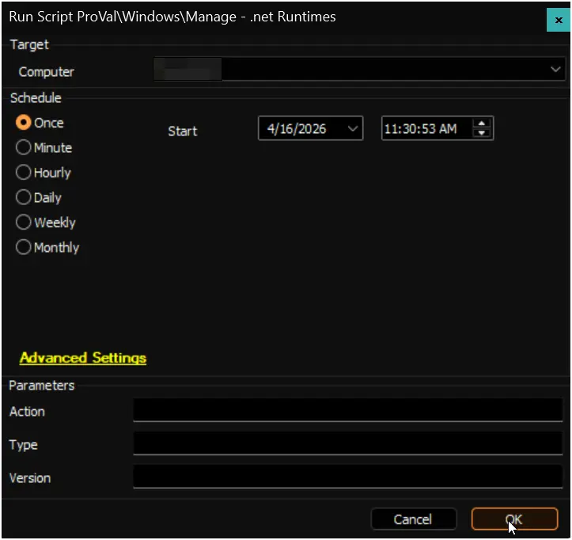

### Example 2: List only .NET SDKs

- **Action:** `list`
- **Type:** `sdk`

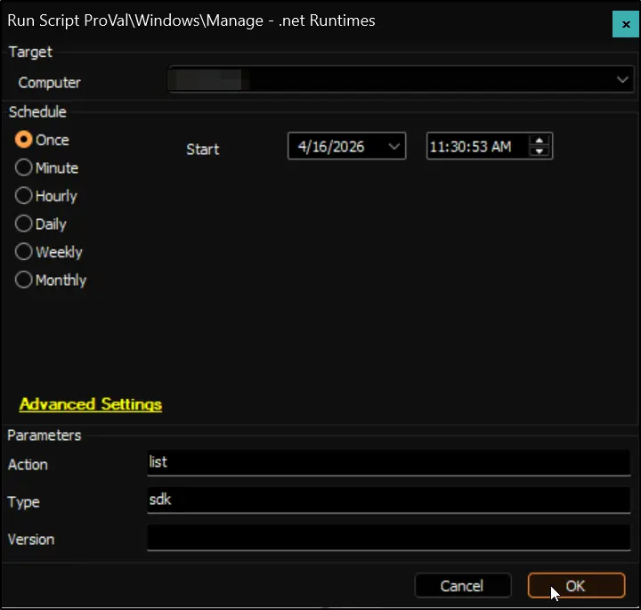

### Example 3: Install the latest versions of all .NET components

- **Action:** `install`
- **Type:** `all`

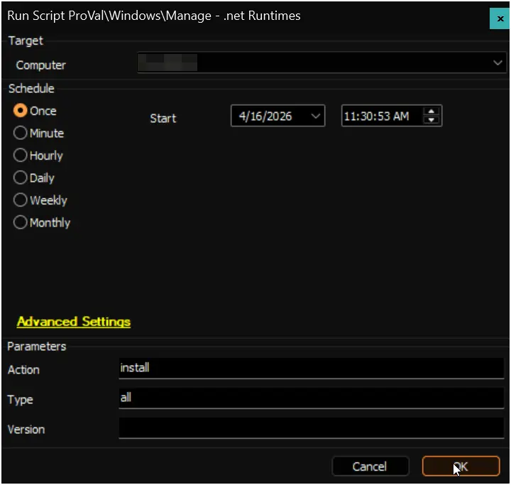

### Example 4: Update SDKs to the latest patch version

- **Action:** `update`
- **Type:** `sdk`

### Example 5: Remove unsupported ASP.NET Core versions

- **Action:** `uninstall`
- **Type:** `aspNetCoreRuntime`

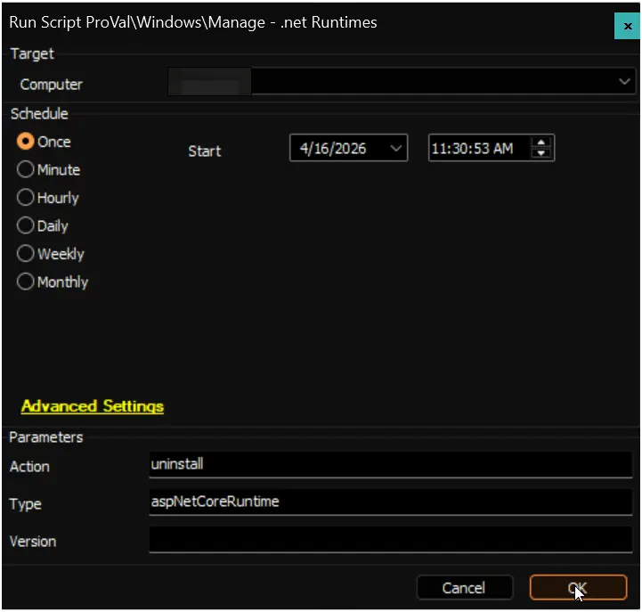

### Example 6: Removes all unsupported versions of .NET runtimes and SDKs and installs the latest available version

- **Action:** `renew`
- **Type:** `all`

### Example 7: Install the latest .NET Desktop Runtime (default type)

- **Action:** `install`

### Example 8: Install .NET 10 Desktop Runtime

- **Action:** `install`
- **Type:** `desktopRuntime`
- **Version:** `10`

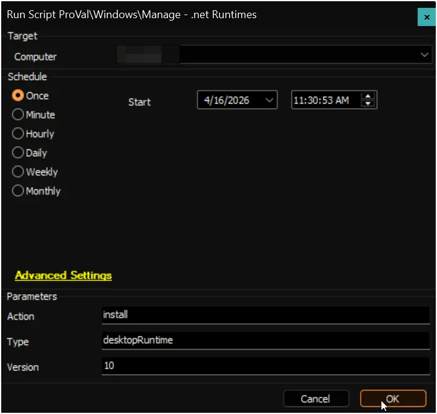

### Example 9: Install multiple specific versions

- **Action:** `install`
- **Type:** `desktopRuntime`
- **Version:** `8, 10`

### Example 10: Update only .NET 8 to the latest patch

- **Action:** `update`
- **Type:** `desktopRuntime`
- **Version:** `8`

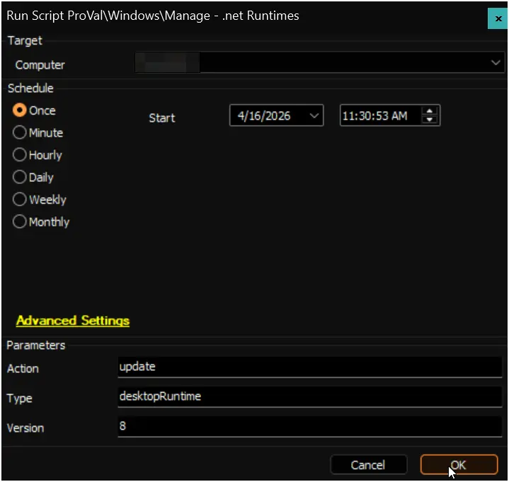

### Example 11: Update multiple versions to their latest patches

- **Action:** `update`
- **Type:** `all`
- **Version:** `6, 7, 8, 9`

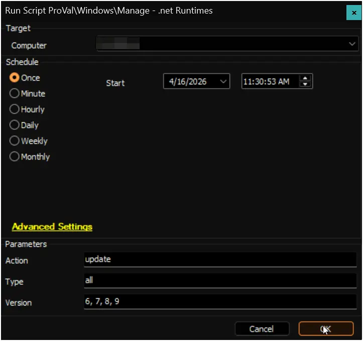

### Example 12: Remove specific .NET versions

- **Action:** `uninstall`
- **Type:** `all`
- **Version:** `6, 9`

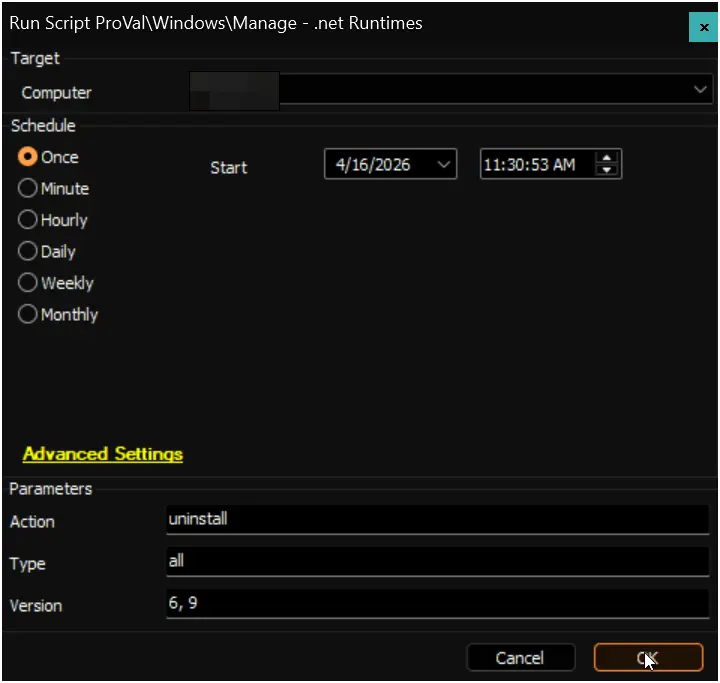

### Example 13: Keep only .NET 8 and .NET 9 and remove all others

- **Action:** `renew`
- **Type:** `all`
- **Version:** `8, 9`

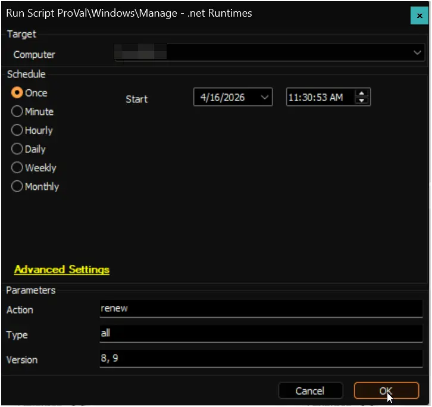

### Example 14: List only .NET 8 and .NET 9 components

- **Action:** `list`
- **Type:** `<Blank>`
- **Version:** `8, 9`

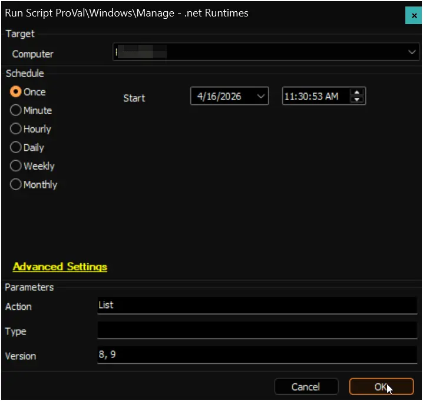

### Example 15: Keep only .NET 10 and remove all others

- **Action:** `renew`
- **Type:** `all`
- **Version:** `10`

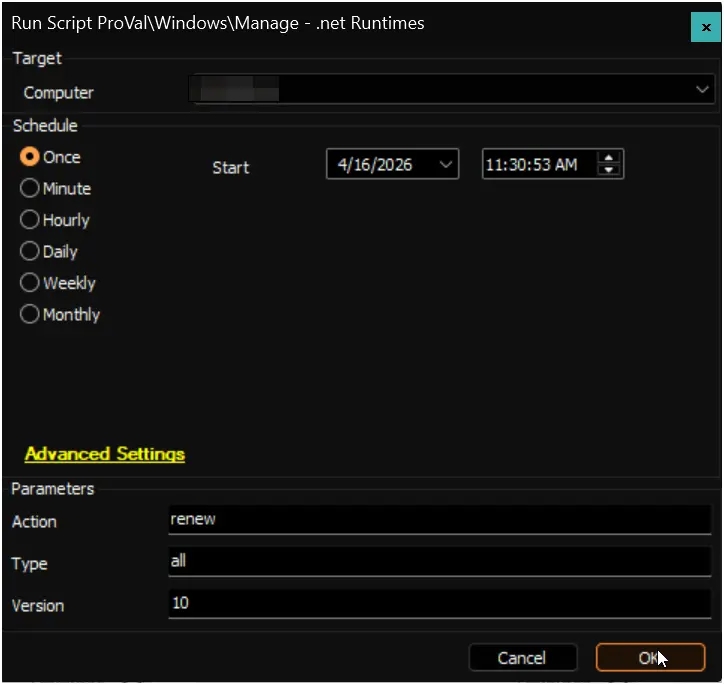

### Example 16: Force renew to .NET 10 only

- **Action:** `renew`
- **Type:** `all`
- **Version:** `10`
- **Force:** `1`

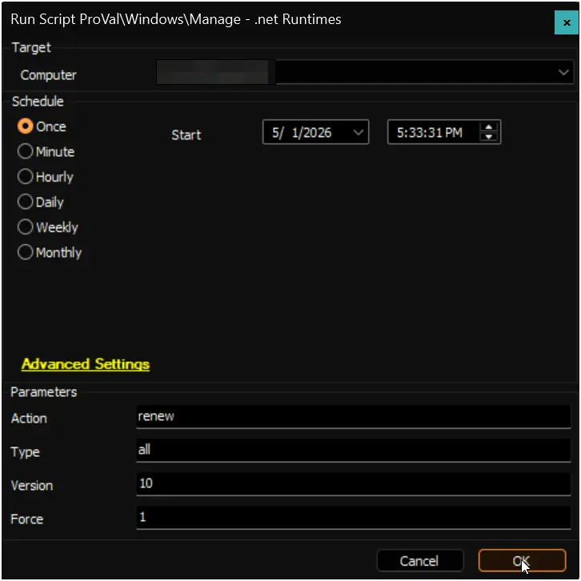

### Example 17: Force uninstall .NET 8

- **Action:** `uninstall`
- **Type:** `all`
- **Version:** `8`
- **Force:** `1`

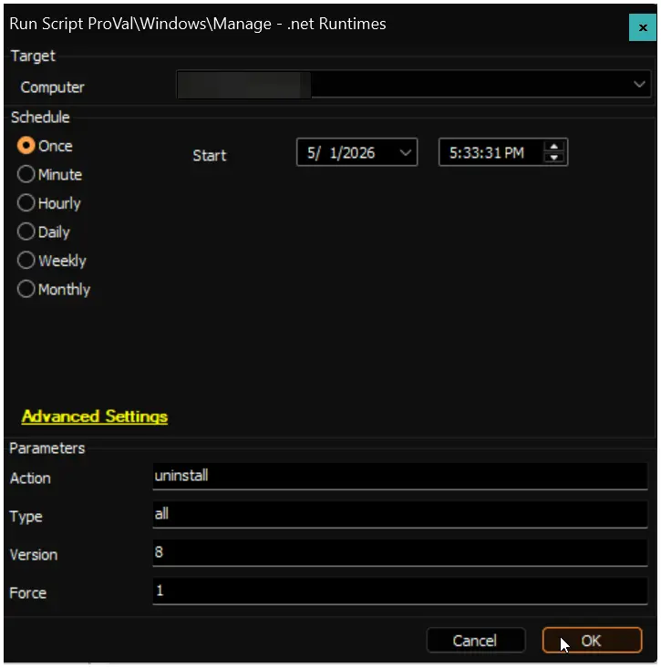

## Global Variables

| Name | Value | Accepted Values | Description |
| ---- | ----- | --------------- | ----------- |
| Debug | `False` | `False`, `True` | When `True`, enables informational logging; when `False` (default), informational logs are suppressed to avoid adding entries to the `h_scripts` table. Set to `True` to assist with troubleshooting. |
| ScriptEngineEnableLogger | `False` | `False`, `True` | When `True`, enables final (success/failure) logging; when `False` (default), these logs are suppressed to avoid adding entries to the `h_scripts` table. Set to `True` to assist with troubleshooting. |

## User Parameters

| Name     | Example                                      | Mandatory | Description                                                                                                                                                                                                                     |
|----------|----------------------------------------------|-----------|-----------------------------------------------------------------------------------------------------------------------------------------------------------------------------------------|
| `Action` | <ul><li>`list`</li><li>`install`</li><li>`uninstall`</li><li>`update`</li><li>`renew`</li></ul> | False     | Specifies the action to perform. Valid values are:    <ul><li>`list`: Lists all installed .NET runtimes and SDKs.</li><li> `install`: Installs the latest supported versions of .NET runtimes and SDKs. </li><li> `uninstall`: Uninstalls unsupported or specific versions of .NET runtimes and SDKs. </li><li> `update`: Updates to latest patches and removes superseded patches. </li><li> `renew`: Removes all unsupported versions of .NET runtimes and SDKs and installs the latest available version.</li></ul> **Note:** Default Action is `list` |
| `Type`   | <ul><li>`sdk`</li><li>`runtime`</li><li>`desktopRuntime`</li><li>`aspNetCoreRuntime`</li><li>`all`</li></ul> | False     | Specifies the type of .NET component to manage. Valid values are:    <ul><li>`sdk`: Manages .NET SDKs. </li><li> `runtime`: Manages .NET runtimes. </li><li> `desktopRuntime`: Manages .NET desktop runtimes. </li><li>`aspNetCoreRuntime`: Manages ASP.NET Core runtimes. </li><li>`all`: Manages all .NET components. </li></ul> **Note:** Default Type is `desktopRuntime`|
| `Version` | <ul><li>`8`</li><li>`9`</li><li>`8, 9`</li></ul> | False     | (Optional) Limit the action to specific .NET versions by major version number (e.g., `8`, `9`, or `8, 9, 10`). When omitted, the script uses its default behavior for each action. Accepts both supported and EOL versions for `list`, `install`, `uninstall`, and `update`. For `renew`, all specified versions must be actively supported. **Note:** Default is not set (all applicable versions are targeted). |
| `Force` | <ul><li>`1`</li><li>`0`</li><li>`<Blank>`</li></ul> | False | Set `Force` to `1` to apply forced MSI dependency bypass during removal. If `Force` is `0` or blank, normal safe behavior is used. |

### Tips for `Version` Behavior

| Action | Without `Version` | With `Version` (e.g., `Version 8, 9`) |
| --- | --- | --- |
| `list` | Shows all installed .NET components | Shows only versions 8 and 9 |
| `install` | Installs the latest supported version | Installs the latest release for each specified version (EOL included with warning) |
| `update` | Updates only supported installed versions | Updates the specified version(s), including EOL |
| `uninstall` | Removes only unsupported/EOL versions | Removes the specified version(s), including supported |
| `renew` | Installs latest supported + removes all unsupported | Keeps only specified version(s), removes everything else. **Aborts if any version is EOL.** |

## `Force` Parameter - Caution

> **⚠️ WARNING:** The `Force` parameter overrides Windows Installer dependency protection. Use only when you fully understand the implications.

Without `Force` (or `Force = 0` or blank), the script respects MSI dependency providers registered by other applications. If software such as Visual Studio, SQL Server, or third-party tools installed a .NET component and registered a dependency on it, the Windows Installer will silently refuse to remove it (returning exit code 0) to protect the dependent application. This is by design.

When `Force = 1`, the script appends `IGNOREDEPENDENCIES=ALL` to all MSI uninstall commands, which:

- Bypasses the dependency provider safety check.
- Forces removal of the .NET component regardless of what other software depends on it.
- May cause dependent applications to malfunction, fail to start, or require repair/reinstallation.

**When to use `Force = 1`:**

- You are certain no critical software depends on the targeted .NET version.
- You are performing a controlled upgrade where a newer version will immediately replace the removed one (e.g., `Action: renew`, `Version: 10`, `Force: 1` installs .NET 10 before removing older versions).
- You need to clean up orphaned registry entries from partially removed installations.

**When NOT to use `Force = 1`:**

- On systems with Visual Studio, SQL Server, or other enterprise software that bundles .NET runtimes.
- On shared or production servers where breaking a dependency could disrupt services.
- When you are unsure which applications depend on the .NET components being removed.

## Output

- Script Logs

## Changelog

### 2026-05-01

- Improved mixed x64/x86 handling: installs follow machine architecture, while cleanup actions can still remove outdated x86 components.
- Updated install, update, and removal logic to be architecture-aware for safer results.
- Improved uninstall reliability by resolving Windows Installer product codes from registry data.
- Added `Force` parameter to allow dependency bypass for advanced cleanup scenarios.
- Improved `renew` cleanup to remove orphaned MSI entries using .NET version parsing from package names.
- Expanded logging for removal operations, including exact uninstall command paths and exit codes.

### 2026-04-16

- Introduced the `Version` parameter.

### 2025-05-14

- Initial version of the document
