## Description

The purpose of this document is to guide technicians in manually troubleshooting the Orange Icon issue with the ScreenConnect client from Automate. The Orange Icon denotes that the ScreenConnect client application is installed on the computer but is either corrupt or that the computer is unable to reach the ScreenConnect Web portal or relay address.

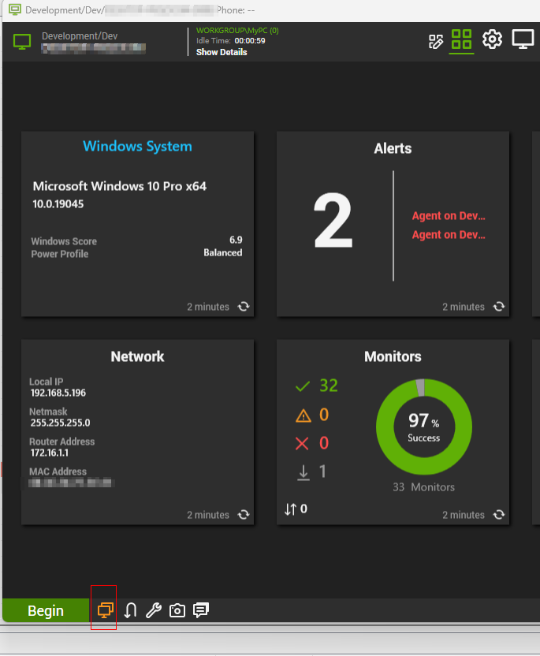

**Note:** The following steps can only solve the problem if it's related to the application, not the network connection.

## Step 1

Log in to the Thick Client and open the Computer Management screen of the concerned computer.

## Step 2

Disable ScreenConnect deployment by right-clicking on the ScreenConnect icon.  
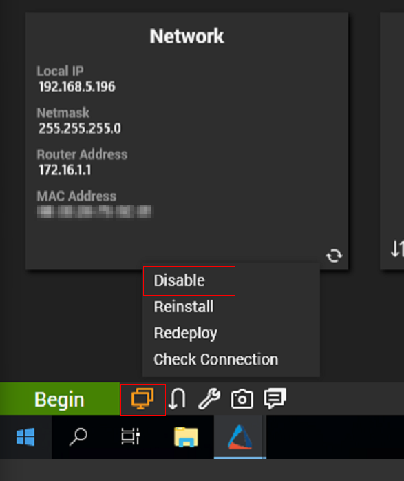  
After disabling:  
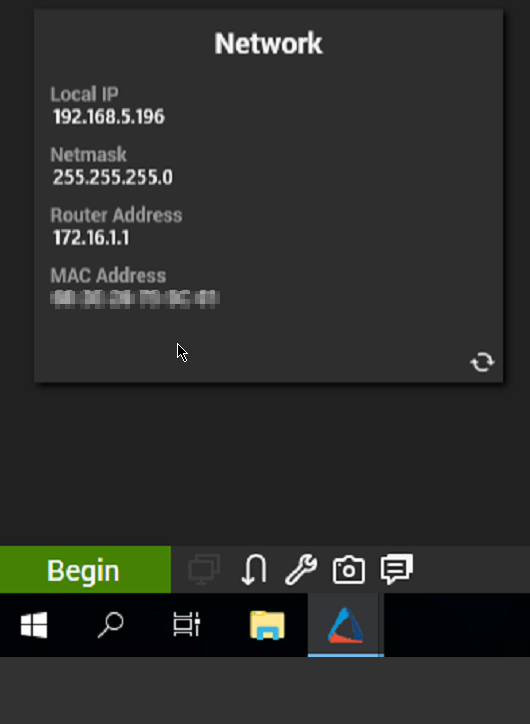

## Step 3

Open the Software tile.  
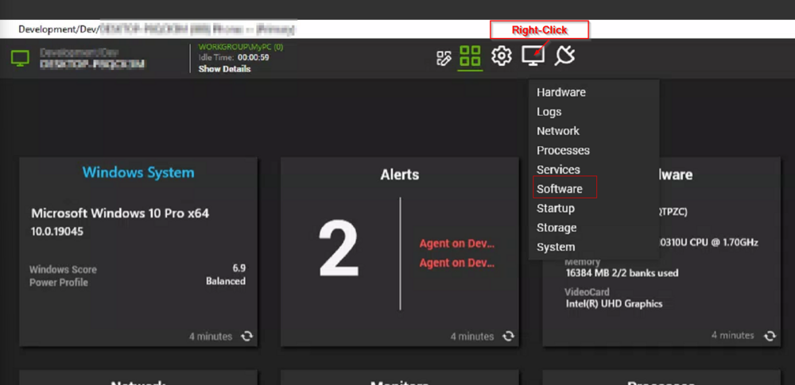

## Step 4

Search for `ScreenConnect Client` and copy the full name of the application.  
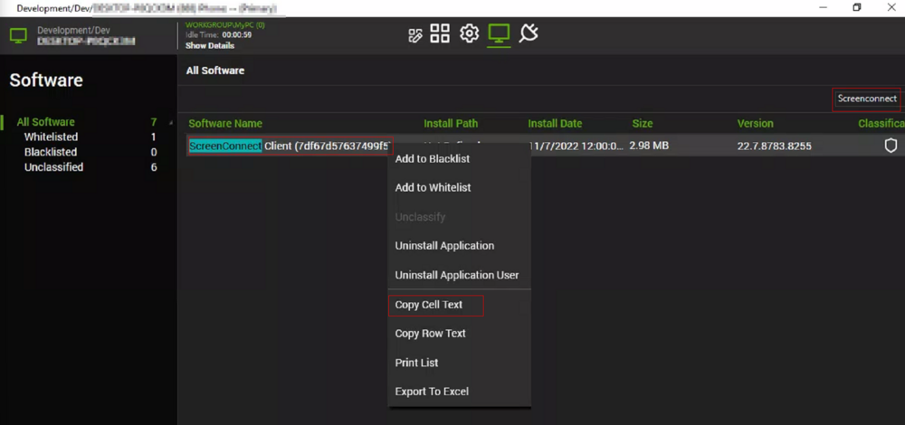

## Step 5

Uninstall the application.  
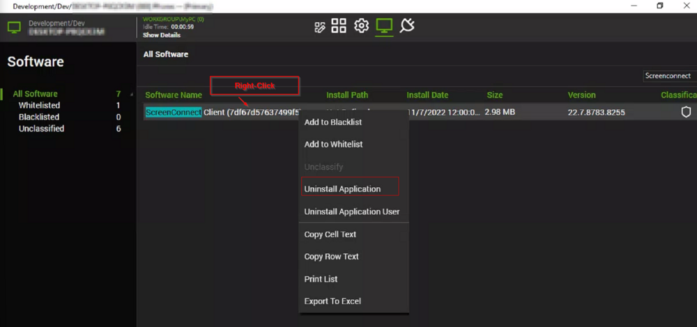  
To make the command run silently, add the following to the end of the uninstall command:

```
/qb+ /norestart
```

For example, the default command would look something like this:

```
MsiExec.exe /X{9B368B57-5FB5-4DEF-9670-511649689C76}
```

That needs to change to this:

```
MsiExec.exe /X{9B368B57-5FB5-4DEF-9670-511649689C76} /qb+ /norestart
```

**Note:** After running the command, you may need to wait for it to succeed before proceeding to the next step.

## Step 6

Resend Software Inventory after uninstalling the application.  
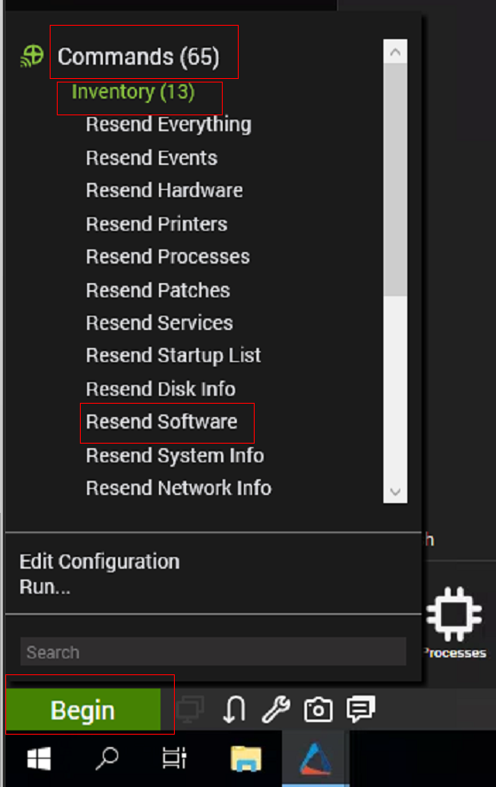

## Step 7

Ensure that the application is removed.  
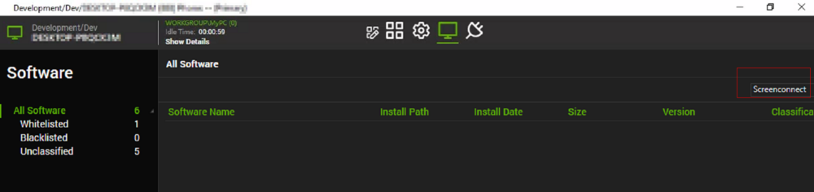

## Step 8

Remove the application traces and the associated registry key from the computer.  

```
C:/Windows/System32/WindowsPowerShell/v1.0/powershell.exe -ExecutionPolicy Bypass -Command "$ErroractionPreference= 'SilentlyContinue';Get-Item 'HKLM:/SYSTEM/CurrentControlSet/Services/@ApplicationName@' | Remove-Item -Force -Confirm:$False; Get-Item -Path 'C:/Program Files (x86)/@ApplicationName@' | Remove-Item -Force -Recurse -Confirm:$False; Stop-service -Name '@ApplicationName@' -Force -Confirm:$False; & SC DELETE '@ApplicationName@'"
```

**Replace @ApplicationName@ in the above command** with the name of the application **copied in Step 4**.

e.g.,  

```
C:/Windows/System32/WindowsPowerShell/v1.0/powershell.exe -ExecutionPolicy Bypass -Command "$ErroractionPreference= 'SilentlyContinue';Get-Item 'HKLM:/SYSTEM/CurrentControlSet/Services/ScreenConnect Client (7df67d57637499f5)' | Remove-Item -Force -Confirm:$False; Get-Item -Path 'C:/Program Files (x86)/ScreenConnect Client (7df67d57637499f5)' | Remove-Item -Force -Recurse -Confirm:$False; Stop-service -Name 'ScreenConnect Client (7df67d57637499f5)' -Force -Confirm:$False; & SC DELETE 'ScreenConnect Client (7df67d57637499f5)'"
```

Run the command on the computer to remove the application traces and registry keys.  
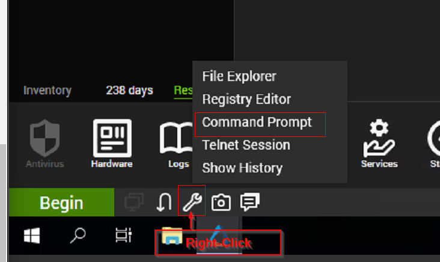  
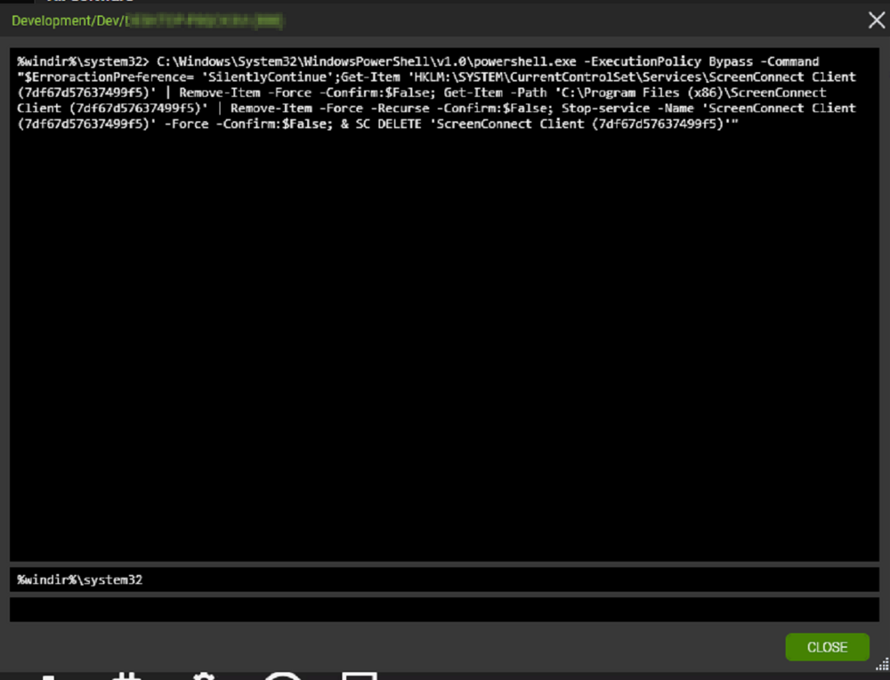

## Step 9

Wait for the command to complete and then restart the computer. It is not mandatory, but the reinstall script might not work sometimes without restarting the computer. This step can be skipped, but if the solution doesn't work, then the computer should be restarted before retrying.

## Step 10

After the computer starts, check back with Automate post-restart; run the [`ScreenConnect - Repair [RMM+, Autofix, Globals]*`](/docs/43225bbe-98a0-4352-8fb2-79e7431dea10) script, and wait for the script to complete.  
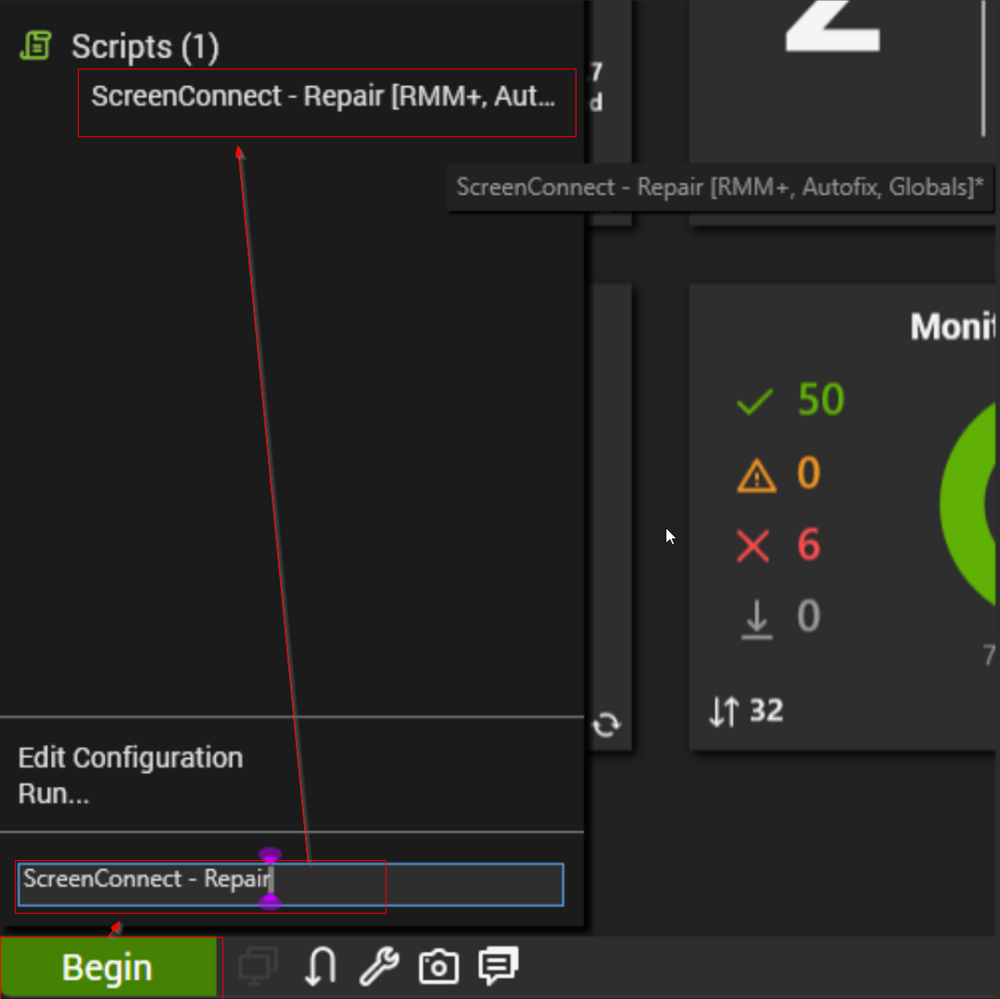  
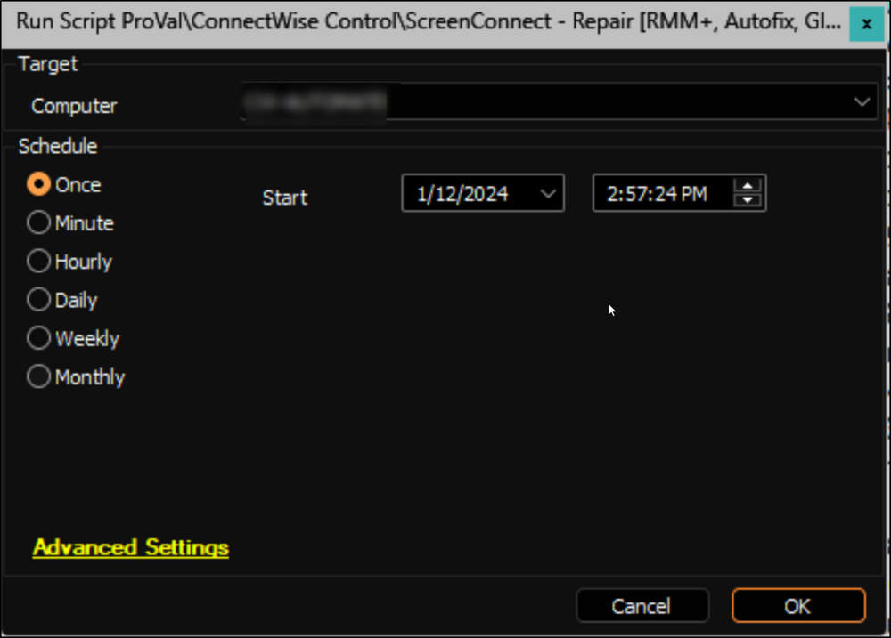

## Step 11

Ensure that the computer starts checking in with the ScreenConnect Web portal.  
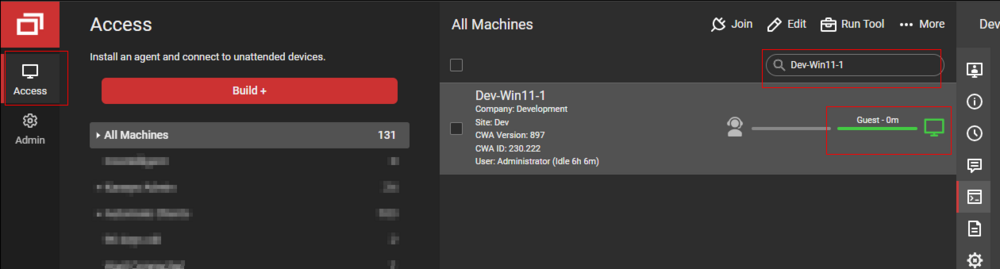

## Step 12

Once it starts checking in with the ScreenConnect Web portal, enable ScreenConnect in Automate as well.  
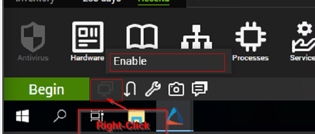  

This should turn the ScreenConnect icon green, thereby resolving the problem.  


## Note

If the above-mentioned steps fail to resolve the problem, then you will have to access the computer manually and ensure that it is able to reach the ScreenConnect Web Portal.

