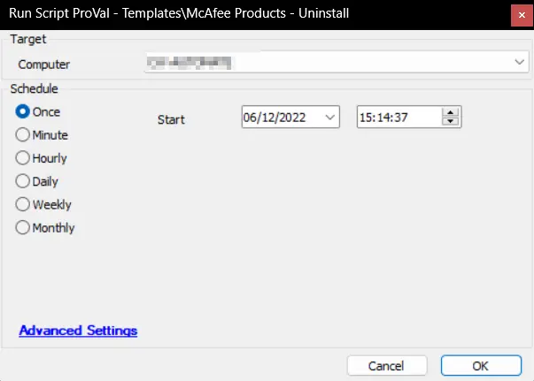

## Summary

This script is an Automate implementation of the agnostic solution [SWM - Software Uninstall - Agnostic - Remove-McAfeeSoftware](/docs/4c93e57c-0959-4f9e-9557-6f5974866782) to remove McAfee products from Windows machines.

## Sample Run

## Dependencies

[SWM - Software Uninstall - Agnostic - Remove-McAfeeSoftware](/docs/4c93e57c-0959-4f9e-9557-6f5974866782)

## Process

- Verify the presence of the script.
- Attempt to remove the application(s).
- Verify the outcome of the uninstallation and generate logs accordingly.

## Output

- Script Log
