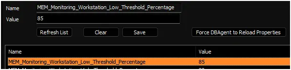
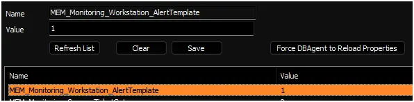
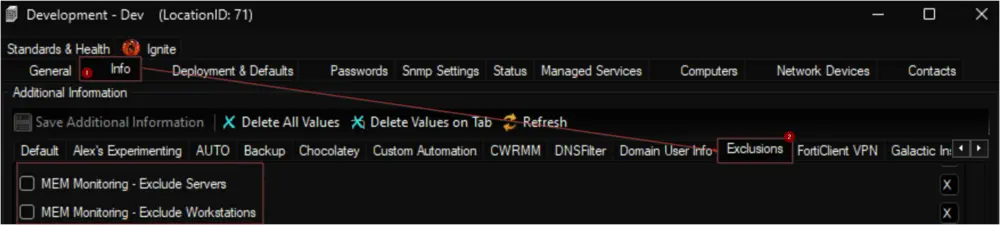

## Purpose

This document outlines the process for creating Remote Monitors for Memory Usage on Windows machines. The creation of these remote monitors is governed by system properties, as well as client-level, location-level, and computer-level Extra Data Fields (EDFs). These elements are further detailed within this document.

The script creates remote monitors that trigger an alert when the memory usage on the target machine exceeds a certain upper threshold percentage and remains above a certain lower threshold percentage for a specified duration. These thresholds can be configured in the system properties, which are elaborated in the **System Properties** section of this document.

**Note of Caution**: The remote monitors created by this script utilize PowerShell for monitoring. Therefore, its functionality is not guaranteed on any computer running a version of PowerShell older than 5. Please ensure your systems are updated to at least PowerShell version 5 for optimal performance.

## Update Notice: 22 April, 2025

New client and computer level override EDFs have been introduced to override the value stored in system properties.  
Execute or debug the script against a single client, with the `Set_Environment` parameter set to `1` to create the new EDFs.  
  


## Before You Proceed

The remote monitor created by this script employs the "/Memory/% Committed Bytes In Use" performance counter, while it should be noted that the default monitor set in Automate utilizes the "Memory/Available MBytes" performance counter.

The choice between "/Memory/Available MBytes" and "/Memory/% Committed Bytes In Use" as a performance counter for memory monitoring depends on your specific monitoring goals and what aspect of memory usage you want to track. Here's a brief explanation of both counters:

1. **/Memory/Available MBytes**:
   - This counter measures the amount of physical memory (RAM) available, in megabytes, at a given moment. It represents the memory that the operating system can allocate to applications without causing excessive paging (swapping data to disk).
   - Useful when you want to monitor the immediate availability of free memory for applications to use.
   - Includes the memory allocated by idle processes that can be released to accommodate new processes.

2. **/Memory/% Committed Bytes In Use**:
   - This counter represents the percentage of the total virtual address space that is currently committed to physical memory. In simpler terms, it shows how much of the memory allocated for running processes is in use.
   - Useful when you want to monitor the overall system memory load and understand how much of the allocated memory is currently in use.
   - Monitoring this counter can help you gauge memory utilization across all running processes and detect potential memory bottlenecks.
   - Excludes the memory allocated by idle processes that can be released to accommodate new processes.

- If you want to keep an eye on the available physical memory to ensure that your applications have enough memory to operate smoothly, "/Memory/Available MBytes" is a suitable choice.
- If you're interested in understanding the overall memory utilization of your system and identifying situations where memory is being highly committed, then "/Memory/% Committed Bytes In Use" is more appropriate.

## Implementation

1. **Remove Existing Monitors**
   - Remove the existing `ProVal - Production - Memory Threshold Violation Monitor` monitor set from the groups it's already applied to.
     - Execute this SQL query from a RAWSQL monitor set to get rid of the existing monitors:

       ```sql
       DELETE FROM Groupagents WHERE `Name` = 'ProVal - Production - Memory Threshold Violation Monitor'
       ```

   - Open the `Server Status` tool by navigating to Help > Server Status.  
        
   - Click the `Do Group Refresh` button to refresh and apply the changes made.  
        
   - Click `OK` to the popup message and wait for a minute to allow the changes to take effect.
        

2. Import the `△ Custom - Ticket Creation - Computer` alert template from the `ProSync` plugin if it's missing in the environment.

3. Import the [Memory Threshold Violation Monitor - Create](/docs/28530e35-7416-48c4-b56d-897c7d4727f6) script from the `ProSync` plugin.

4. **Run/Debug the Script**
   - Execute or debug the script against a single client, with the `Set_Environment` parameter set to `1`. This action will generate the necessary system properties and Extra Data Fields (EDFs) for managing the remote monitors.

     
   

5. **Reload System Cache**
   - Refresh the system cache to ensure all changes are updated.  
        

6. **Configure System Properties and EDFs**
   - Navigate to the **System Dashboard --> Config --> Configurations --> Properties**.  
   - Find the properties beginning with `MEM_Monitoring`.  
        
      - The consultant should have provided you with any customizations that are required. Please read through the detailed System Properties and EDF explanations to understand how to configure any customizations.

7. **Schedule the Script**
   - Schedule the script to run once per day, preferably around midnight, from the dashboard for optimal results.  
       

## User Parameters

| Name | Example | Required | Description |
|------|---------|----------|-------------|
| Set_Environment | 1 | True (for first run only) | Set it to 1 during the first run of the script to generate the necessary system properties and EDFs for managing the generated remote monitors. |

## System Properties

| Name | Example | Required | Description |
|------|---------|----------|-------------|
| MEM_Monitoring_Group_Ids | 2,3,855,856 | True | The script will create remote monitors for the machines that belong to the groups identified by the group IDs specified in this system property. The monitor set will not be associated with the groups themselves but with the individual machines. Multiple IDs can be included by separating them with a comma. The default value is `0`. **Note:** If this property is set to `0`, the monitoring will be disabled and the script will remove the existing monitor set. Therefore, the creation of the monitor set will not commence unless the group IDs are defined in the system properties. <br />  |
| MEM_Monitoring_Server_Only | 0 | False | Setting this system property to `1` will limit the monitor set creation to Windows Servers only. The default value is `0`. The script will remove the monitor set created for the Windows Workstations after setting this property to `1`. <br /> |
| MEM_Monitoring_Workstation_Only | 0 | False | Setting this system property to `1` will limit the monitor set creation to Windows Workstations only. The default value is `0`. The script will remove the monitor set created for the Windows Servers after setting this property to `1`. <br /> |
| MEM_Monitoring_Exclude_Virtual_Machines | 0 | False | Setting this system property to `1` will limit the monitor set creation to Physical Windows Machines only. The default value is `0`. The script will remove the monitor set created for the Virtual Machines after setting this property to `1`. <br /> |
| MEM_Monitoring_Interval | 300 | True | Controls the generated Remote Monitor run time interval. The default is 300 seconds. <br />   <br /> |
| MEM_Monitoring_Server_Continuous_Usage_Threshold_Minutes | 30 | True | This property determines the duration in minutes during which servers must consistently exhibit high Memory usage before triggering an alert. By default, this duration is set to `30` minutes. <br /> |
| MEM_Monitoring_Workstation_Continuous_Usage_Threshold_Minutes | 30 | True | This property determines the duration in minutes during which workstations must consistently exhibit high Memory usage before triggering an alert. By default, this duration is set to `30` minutes. <br /> |
| MEM_Monitoring_Server_High_Threshold_Percentage | 95 | True | This property stores the upper threshold, expressed as a percentage, for Memory usage on servers. The default value is `95`. <br /> |
| MEM_Monitoring_Workstation_High_Threshold_Percentage | 90 | True | This property stores the upper threshold, expressed as a percentage, for Memory usage on workstations. The default value is `90`. <br /> |
| MEM_Monitoring_Server_Low_Threshold_Percentage | 90 | True | This property stores the lower threshold, expressed as a percentage, for Memory usage on servers. The default value is `90`. <br /> |
| MEM_Monitoring_Workstation_Low_Threshold_Percentage | 85 | True | This property stores the lower threshold, expressed as a percentage, for Memory usage on workstations. The default value is `90`. <br /> |
| MEM_Monitoring_Server_AlertTemplate | 1 | True | This system property stores the id of the `Alert Template` to apply to the remote monitors created for the servers. The default value is the TemplateID of the `△ Custom - Ticket Creation - Computer` alert template. <br />  <br /> <br />Navigate to the **System Dashboard --> Management --> Alert Templates** to find the Id of the required alert template. <br /> <br /><br />It is suggested to use the `△ Custom - Ticket Creation - Computer` alert for better alerting. The alert template should not be running the very same script for the Warning action as well unless you want to create a ticket for the PowerShell errors too. <br />|
| MEM_Monitoring_Workstation_AlertTemplate | 1 | True | This system property stores the id of the `Alert Template` to apply to the remote monitors created for the workstations. The default value is the TemplateID of the `△ Custom - Ticket Creation - Computer` alert template.  <br /> <br /><br />It is suggested to use the `△ Custom - Ticket Creation - Computer` alert for better alerting. The alert template should not be running the very same script for the Warning action as well unless you want to create a ticket for the PowerShell errors too. |
| MEM_Monitoring_Server_TicketCategory | 124 | False | This system property stores the id of the `Ticket Category` to apply to the remote monitors created for the Servers. The default value is `0`.  i.e., `<Not Specifed>`. <br /> <br /><br /> Ticket Categories are used to control the CW Manage service board of the tickets generated by Automate. <br /> <br /><br /> Navigate to the **System Dashboard --> Config--> Information Base Categories** to find the Id of the required ticket category. <br />|
| MEM_Monitoring_Workstation_TicketCategory | 125 | False | This system property stores the id of the `Ticket Category` to apply to the remote monitors created for the Workstations. The default value is `0`. <br />|


## Client-Level EDF

| Name | Type | Section | Description |
|------|------|---------|-------------|
| MEM Monitoring - Exclude VM | Check Box | Exclusions | Selecting this Extra Data Field (EDF) will exclude the virtual machines of the client from the Memory Usage monitoring. The script will not create any remote monitors for the virtual machines under this client. Furthermore, upon marking this EDF, the script will also remove any previously created remote monitors for the virtual machines of this client.|
| MEM Monitoring - Exclude Servers | Check Box | Exclusions | Selecting this Extra Data Field (EDF) will exclude the servers of the client from the Memory Usage monitoring. The script will not create any remote monitors for the servers under this client. Furthermore, upon marking this EDF, the script will also remove any previously created remote monitors for the servers of this client.|
| MEM Monitoring - Exclude Workstations | Check Box | Exclusions | Selecting this Extra Data Field (EDF) will exclude the workstations of the client from the Memory Usage monitoring. The script will not create any remote monitors for the workstations under this client. Furthermore, upon marking this EDF, the script will also remove any previously created remote monitors for the workstations of this client.|
| MEMM Svr AlertTemplate | Text | Memory Monitoring | Set this EDF to override the value set in the system property `MEM_Monitoring_Server_AlertTemplate` |
| MEMM Svr Usage Threshold Minutes | Text | Memory Monitoring | Set this EDF to override the value set in the system property MEM_Monitoring_Server_Continuous_Usage_Threshold_Minutes |
| MEMM Svr High Threshold Percent | Text | Memory Monitoring | Set this EDF to override the value set in the system property `MEM_Monitoring_Server_High_Threshold_Percentage` |
| MEMM Svr Low Threshold Percent | Text | Memory Monitoring | Set this EDF to override the value set in the system property `MEM_Monitoring_Server_Low_Threshold_Percentage` |
| MEMM Svr TicketCategory | Text | Memory Monitoring | Set this EDF to override the value set in the system property `MEM_Monitoring_Server_TicketCategory` |
| MEMM Wks AlertTemplate | Text | Memory Monitoring | Set this EDF to override the value set in the system property `MEM_Monitoring_Workstation_AlertTemplate` |
| MEMM Wks Usage Threshold Minutes | Text | Memory Monitoring | Set this EDF to override the value set in the system property `MEM_Monitoring_Workstation_Continuous_Usage_Threshold_Minutes` |
| MEMM Wks High Threshold Percent | Text | Memory Monitoring | Set this EDF to override the value set in the system property `MEM_Monitoring_Workstation_High_Threshold_Percentage` |
| MEMM Wks Low Threshold Percent | Text | Memory Monitoring | Set this EDF to override the value set in the system property `MEM_Monitoring_Workstation_Low_Threshold_Percentage` |
| MEMM Wks TicketCategory | Text | Memory Monitoring | Set this EDF to override the value set in the system property `MEM_Monitoring_Workstation_TicketCategory` |

  


**Note:** Mark all three `Exclusion` EDFs to exclude the client from the monitoring.

## Location-Level EDF

| Name | Type | Section | Description |
|------|------|---------|-------------|
| MEM Monitoring - Exclude Servers | Check Box | Exclusions | Selecting this Extra Data Field (EDF) will exclude the servers of the client from the Memory Usage monitoring. The script will not create any remote monitors for the servers under this location. |
| MEM Monitoring - Exclude Workstations | Check Box | Exclusions | Selecting this Extra Data Field (EDF) will exclude the workstations of the client from the Memory Usage monitoring. The script will not create any remote monitors for the workstations under this location. |



**Note:** Mark both EDFs to exclude the location from the monitoring.

## Computer-Level EDF

| Name | Type | Section | Description |
|------|------|---------|-------------|
| MEM Monitoring - Exclude | Check Box | Exclusions | Selecting this Extra Data Field (EDF) will exclude the computer from the Memory Usage monitoring. The script will not create any remote monitor for this computer. |
| MEMM AlertTemplate | Text | Memory Monitoring | Setting this EDF will replace the value stored in the system property `MEM_Monitoring_Server_AlertTemplate` for servers or `MEM_Monitoring_Workstation_AlertTemplate` for workstations, as well as the value stored in the client-level EDFs `MEMM Svr AlertTemplate` for servers or `MEMM Wks AlertTemplate` for workstations. |
| MEMM Usage Threshold Minutes | Text | Memory Monitoring | Setting this EDF will replace the value stored in the system property `MEM_Monitoring_Server_Continuous_Usage_Threshold_Minutes` for servers or `MEM_Monitoring_Workstation_Continuous_Usage_Threshold_Minutes` for workstations, as well as the value stored in the client-level EDFs `MEMM Svr Usage Threshold Minutes` for servers or `MEMM Wks Usage Threshold Minutes` for workstations. |
| MEMM High Threshold Percent | Text | Memory Monitoring | Setting this EDF will replace the value stored in the system property `MEM_Monitoring_Server_High_Threshold_Percentage` for servers or `MEM_Monitoring_Workstation_High_Threshold_Percentage` for workstations, as well as the value stored in the client-level EDFs `MEMM Svr High Threshold Percent` for servers or `MEMM Wks High Threshold Percent` for workstations. |
| MEMM Low Threshold Percent | Text | Memory Monitoring | Setting this EDF will replace the value stored in the system property `MEM_Monitoring_Server_Low_Threshold_Percentage` for servers or `MEM_Monitoring_Workstation_Low_Threshold_Percentage` for workstations, as well as the value stored in the client-level EDFs `MEMM Svr Low Threshold Percent` for servers or `MEMM Wks Low Threshold Percent` for workstations. |
| MEMM TicketCategory | Text | Memory Monitoring | Setting this EDF will replace the value stored in the system property `MEM_Monitoring_Server_TicketCategory` for servers or `MEM_Monitoring_Workstation_TicketCategory` for workstations, as well as the value stored in the client-level EDFs `MEMM Svr TicketCategory` for servers or `MEMM Wks TicketCategory` for workstations. |

  


## Remote Monitor Example

**Name:** `ProVal - Production - Memory Threshold Violation Monitor`

**Ticket Subject:** `Memory Usage High on %COMPUTERNAME% at %LOCATIONNAME%`

**Alert Message on Success:** `This is an automated update to inform you that the high Memory utilization issue reported earlier has now been resolved. The system has detected that the Memory usage has returned to normal and the performance has improved.`

**Alert Message on Failure:** `The Memory usage on the machine %COMPUTERNAME% located at %CLIENTNAME%/%LOCATIONNAME% is currently reporting high Memory usage. Please investigate the issue and take appropriate actions to address the root cause. As per the severity of the issue, it is recommended to prioritize this ticket accordingly.`

**Sample Ticket:** The ticket illustrated here was created by setting the upper threshold value to `30` and the lower threshold value to `20`. However, it's important to note that this example is purely for demonstration purposes. It does not advocate for or encourage the creation of Memory usage tickets for machines where the Memory usage exceeds `30%`.

  


**Sample Remote Monitor:**

  
  
  
  

## Output

- Remote Monitors

## Tips

- [Set Computer Level EDFs by Group ID](/docs/95e85dc0-6420-42fe-8d2a-aeb9dac683b0) script can be used to set overrides on multiple machines.