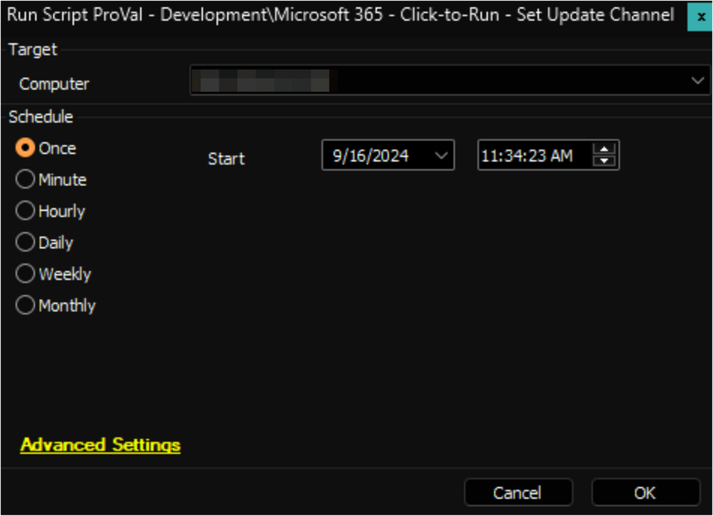
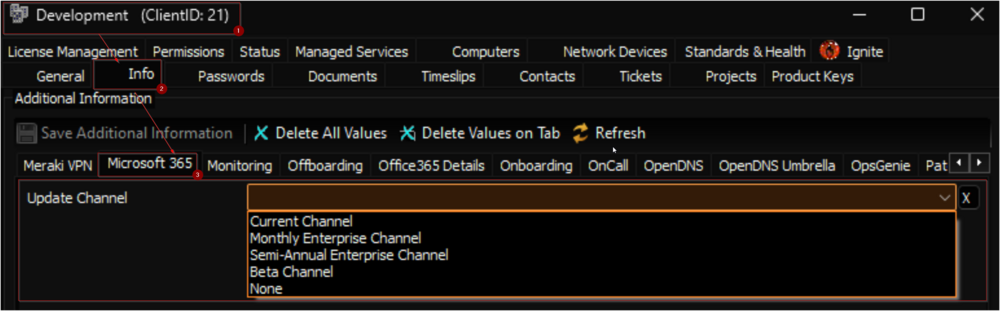
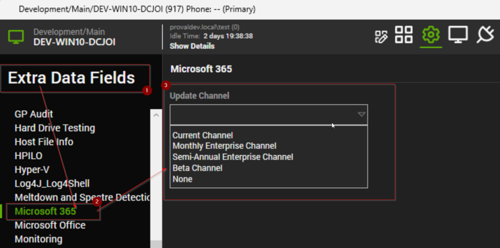

## Summary

This script will make changes in the registry to set the update channel for Microsoft 365 products to the value set in the Client or Computer level EDF `Update Channel`.

**File Path:** `C:/ProgramData/_Automation/Script/Get-M365UpdateChannel/Get-M365UpdateChannel.ps1`

**File Hash (SHA256):** `1CAED911E914A8F8C9EBA29D244459F4DA2B09780EB8ED720FB55F2519E06D19`

**File Hash (MD5):** `327EA97B42E953417FD6C7BAFC02B5F`

## Sample Run

## Dependencies

[SWM - Data Collection - Script - Microsoft 365 - Click-to-Run - Get Details](/docs/ce16526d-84b5-4e58-928b-13a29195056e)

## Client Level EDF

| Name            | Example          | Type      | Section       | Details                                                                                                                                                                                                                                          |
|-----------------|------------------|-----------|---------------|--------------------------------------------------------------------------------------------------------------------------------------------------------------------------------------------------------------------------------------------------|
| Update Channel   | Current Channel  | DropDown  | Microsoft 365 | Select the Update Channel from the drop-down menu to set for the client's computers. Available options are:  - Current Channel  - Monthly Enterprise Channel  - Semi-Annual Enterprise Channel  - Beta Channel  - None  Leave it blank or set it to `None` to disable the Automation for the client. |

## Computer Level EDF

| Name            | Example          | Type      | Section       | Details                                                                                                                                                                                                                                          |
|-----------------|------------------|-----------|---------------|--------------------------------------------------------------------------------------------------------------------------------------------------------------------------------------------------------------------------------------------------|
| Update Channel   | Current Channel  | DropDown  | Microsoft 365 | Select the Update Channel from the drop-down menu to set for the computer. Available options are:  - Current Channel  - Monthly Enterprise Channel  - Semi-Annual Enterprise Channel  - Beta Channel  - None  Set it to `None` to disable the Automation for the computer. Computer Level EDF can be used to override the value set in the Client Level EDF. |

## Output

- Script Log
- Custom Table
- Dataview

