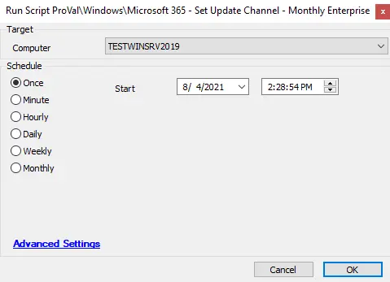

## Summary

This script will make changes in the registry and allow Microsoft 365 products to update on a monthly basis as per current channel updates.

It will execute the [SWM - Script - Microsoft Office - Click-to-Run - Get Details](/docs/ce16526d-84b5-4e58-928b-13a29195056e) script at the end of the successful run to update the information in the [CWM - Automate - Dataview - C2R Office Version Audit](/docs/d48f4966-b281-4aaa-8bf0-5059221b7ff3) Dataview.

**Time Saved by Automation:** 5 Minutes

## Sample Run

## Dependencies

- Office installed on the target machine
- [SWM - Script - Microsoft Office - Click-to-Run - Get Details](/docs/ce16526d-84b5-4e58-928b-13a29195056e)

## Process

1. Logs a message in Automate stating that we're updating the channel to Monthly.
2. Changes the appropriate registry keys.
3. Checks to ensure the registry key was successfully changed.

## Output

- Script log

