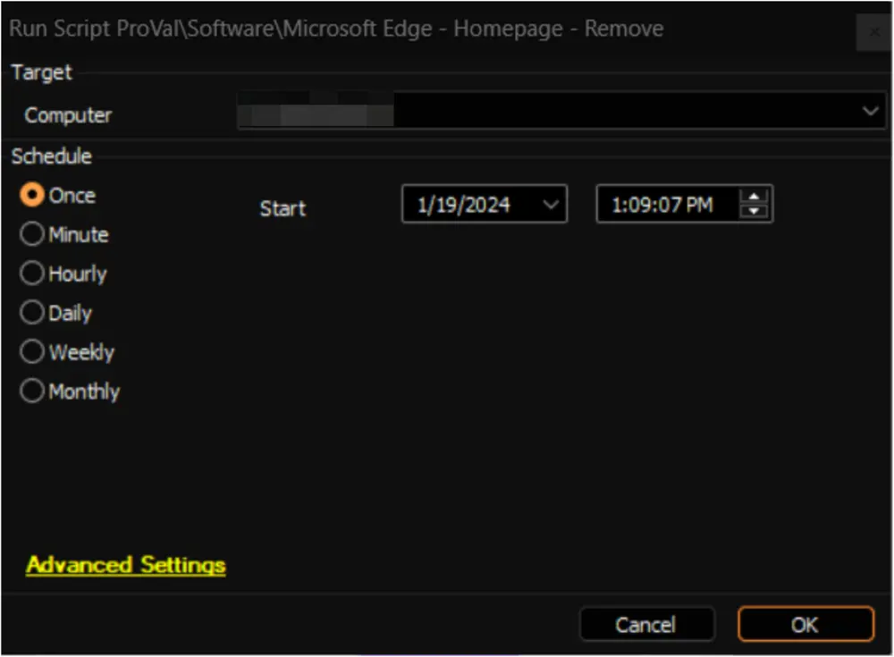

## Summary

This document outlines an Automate implementation of the agnostic script [SWM - Software Configuration - Remove-ChromiumHomepage](/docs/38674bcd-8b19-4072-a58f-314efad2e856  ) to remove the registry policy for an enforced homepage in Microsoft Edge (Chromium).

## Sample Run

## Dependencies

[SWM - Software Configuration - Remove-ChromiumHomepage](/docs/38674bcd-8b19-4072-a58f-314efad2e856  )

## Output

- Script Log