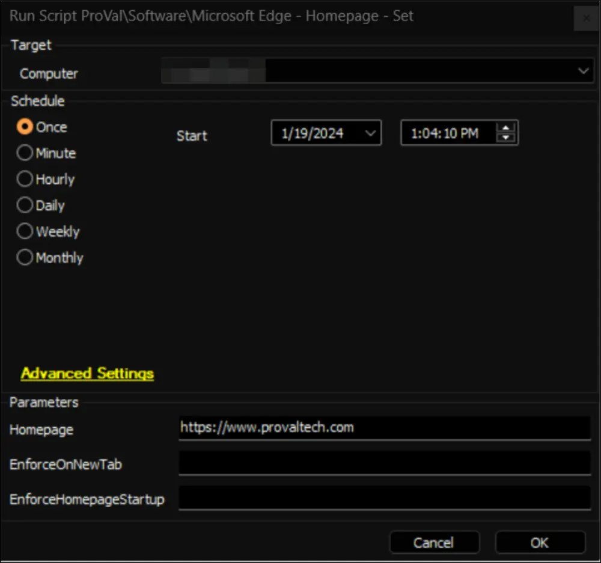

## Summary

This document describes the Automate implementation of the agnostic script [SWM - Software Configuration - Set-ChromiumHomepage](/docs/f07dd124-b64e-4906-8f33-5a2109ac73ab), which enforces a homepage for the Microsoft Edge (Chromium) browser.

## Sample Run

## Dependencies

[SWM - Software Configuration - Set-ChromiumHomepage](/docs/f07dd124-b64e-4906-8f33-5a2109ac73ab)

#### User Parameters

| Name                     | Example                             | Required | Description                                                               |
|--------------------------|-------------------------------------|----------|---------------------------------------------------------------------------|
| Homepage                 | [https://www.provaltech.com](https://www.provaltech.com) | True     | String value of the homepage to set in the browser.                      |
| EnforceOnNewTab         | 1                                   | False    | Set to 1 to force the homepage on each new tab instead of the new tab page. |
| EnforceHomepageStartup    | 1                                   | False    | Set to 1 to force the homepage to be the only open tab at startup of the browser. |

## Output

- Script Logs
