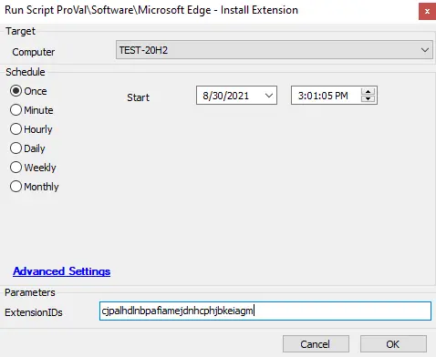

## Summary

This script is used to enforce the installation of an extension or a list of extensions in the Chromium version of the Microsoft Edge browser.

**Time Saved by Automation:** 10 Minutes

## Sample Run

## Dependencies

- [Send-BitlockerADRecovery.ps1](https://file.provaltech.com/repo/script/Send-BitlockerADRecovery.ps1)
- [Register-EdgeExtension.ps1](https://file.provaltech.com/repo/script/Register-EdgeExtension.ps1)

## Variables

| Variable        | Description                                                                 |
|------------------|-----------------------------------------------------------------------------|
| BaseURL          | Contains the file server address                                            |
| WorkingDirectory  | Contains the destination path where the file server file is kept           |
| PS1URL           | Contains the complete path in the file server for direct download          |
| PS1Path          | Denotes the complete path where the file is stored on the local machine after downloading from the file server |
| PS1TempPath      | Stores the downloaded file temporarily in the local system directory        |
| PS1Log           | Stores the complete PowerShell execution log                               |
| PS1DataLog       | Stores the PowerShell data log                                             |
| PS1ErrorLog      | Stores the PowerShell error log                                            |

## User Parameters

| Name           | Example                                | Required | Description                                                |
|----------------|----------------------------------------|----------|------------------------------------------------------------|
| ExtensionIDs   | `cjpalhdlnbpafiamejdnhcphjbkeiagm`    | True     | Stores the required extension to be installed in Microsoft Edge. |

## Process

The script takes a single parameter, which is an array of ExtensionIDs to install that can be found on the [Chrome Web Store](https://chrome.google.com/webstore/category/extensions). The script will then check if the machine is domain-joined. The Edge browser does not allow registry policies to be applied to non-domain managed machines, so a dummy MDM-Enrollment registry set will be put in place to circumvent this restriction. The list of extensions is then cycled through. Existing blocking entries for the extensions will be removed. A registry key is created for each installation. Any extensions that are detected to be already managed will be skipped, and a registry entry will not be created for them.

## Output

- Script log
