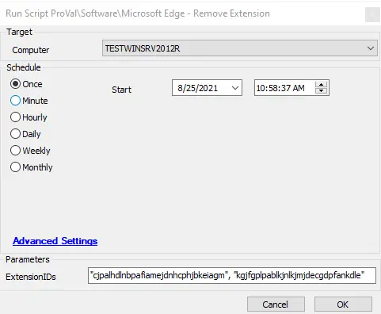

## Summary

This script is used to remove the enforcement of the installation of an extension or list of extensions in the Chromium version of the Microsoft Edge browser.

**Time Saved by Automation:** 10 Minutes

## Sample Run



## Dependencies

- Windows 10 1703+
- Chromium Version of Microsoft Edge Installed


## Variables

| Variable Name     | Description                                                                                      |
|-------------------|--------------------------------------------------------------------------------------------------|
| ProjectName       | The name of the project; in this case, it would be Unregister-EdgeExtension.                   |
| Parameters        | This will take the ExtensionIDs.                                                                 |
| BaseURL           | The base URL here will be [https://file.provaltech.com/repo](https://file.provaltech.com/repo).|
| WorkingDirectory   | C:/ProgramData/provaltech/script/@ProjectName@.                                               |
| PS1URL            | @BaseURL@/script/@ProjectName@.ps1.                                                            |
| PS1Path           | @WorkingDirectory@/@ProjectName@.ps1.                                                          |
| PS1TempPath       | @WorkingDirectory@/@ProjectName@-temp.ps1.                                                    |
| PS1Log            | @WorkingDirectory@/@ProjectName@-log.txt.                                                      |
| PS1DataLog        | @WorkingDirectory@/@ProjectName@-data.txt.                                                    |
| PS1ErrorLog       | @WorkingDirectory@/@ProjectName@-errors.txt.                                                  |
| LogContent         | @PS1Log@                                                                                        |
| DataLogContent     | @PS1DataLog@                                                                                    |

#### Global Parameters

| Name              | Example                                          | Required | Description                                                                                     |
|-------------------|--------------------------------------------------|----------|-------------------------------------------------------------------------------------------------|
| ExtensionIDs      | cjpalhdlnbpafiamejdnhcphjbkeiagm                 | True     | The Extension ID or list of Extension IDs to remove from managed status.                       |


**Example:**

```
# UBlock Origin
# Extension Page URL: https://chrome.google.com/webstore/detail/ublock-origin/cjpalhdlnbpafiamejdnhcphjbkeiagm
# ExtensionID: cjpalhdlnbpafiamejdnhcphjbkeiagm
```

## Output

- **Script log**
- The results of the script can be found in the `-log.txt` file generated by the script, located in the same directory as the script.

```
./Unregister-EdgeExtension-log.txt
```