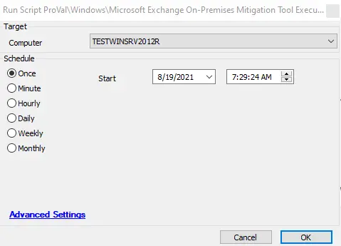

## Summary

This script helps to run the Exchange on-premise mitigation tool provided by Microsoft Exchange to detect the Hafnium CVE. If found, it will create a ticket and run a full scan to implement the necessary mitigation. The script must be run against Windows Exchange servers only.

**Time Saved by Automation:** 30 Minutes

## Sample Run

#### Global Parameters

| Name            | Example                                          | Required | Description                                                                                   |
|-----------------|--------------------------------------------------|----------|-----------------------------------------------------------------------------------------------|
| TicketCreation   | Set the value to 1 for ticket creation           | 0 or 1   | Change the value from 0 to 1 to create a ticket for threat detection.                       |

## Process

This script helps to run the Exchange on-premise mitigation tool provided by Microsoft Exchange to detect the Hafnium CVE. If found, it will create a ticket and run a full scan to implement the necessary mitigation. The script will execute a full scan when a threat is detected to address it. It will also create tickets depending on the global parameter value set and will attach the log file to the ticket.

## Output

- Script log
- Log file named `msert.log`
